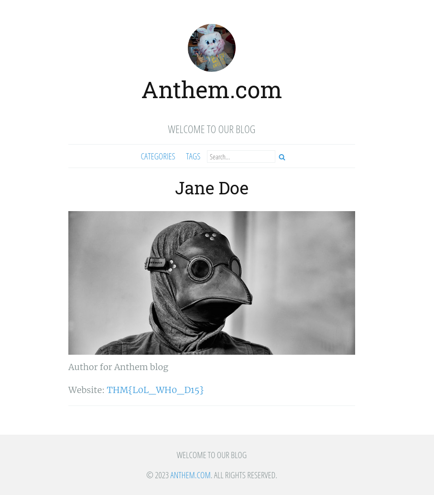
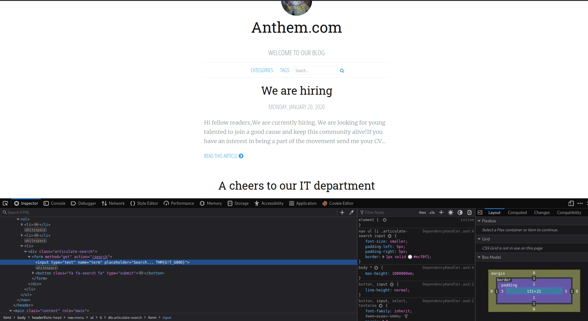
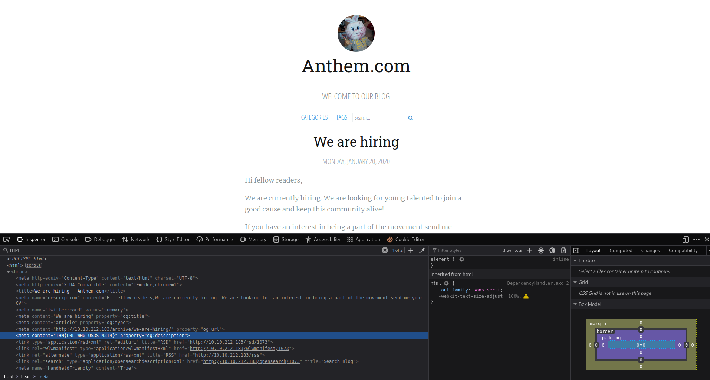
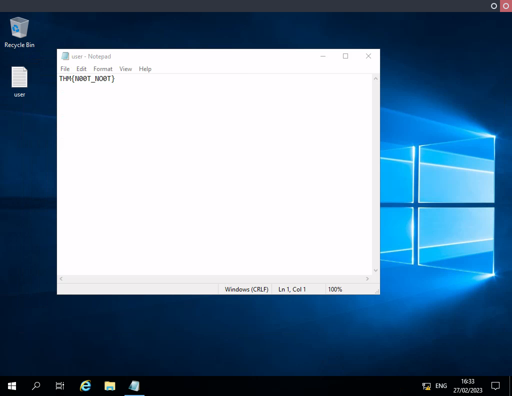

## Index

1. [Setup](#setup)
2. [Reconnaissance](#reconnaissance)
3. [Gaining Access](#gaining-access)
4. [Privilege Escalation](#privilege-escalation)

## Setup 

We first need to connect to the tryhackme VPN server. You can get more information regarding this by visiting the [Access](https://tryhackme.com/access) page.

I'll be using `openvpn` to connect to the server. Here's the command:

```
$ sudo openvpn --config NovusEdge.ovpn
```

## Reconnaissance

```shell-session
$ rustscan -a TARGET_IP -- -oN rustscan_ports.txt
PORT     STATE SERVICE       REASON
80/tcp   open  http          syn-ack
3389/tcp open  ms-wbt-server syn-ack


$ rustscan -a TARGET_IP --ulimit 5000 -p80,3389 -t 2000 -- -sV -oN rustscan_service_scan.txt
PORT     STATE SERVICE       REASON  VERSION
80/tcp   open  http          syn-ack Microsoft HTTPAPI httpd 2.0 (SSDP/UPnP)
3389/tcp open  ms-wbt-server syn-ack Microsoft Terminal Services
Service Info: OS: Windows; CPE: cpe:/o:microsoft:windows


$ nmap -sC --script=vuln -vv -Pn -oN nmap_vuln_scan.txt TARGET_IP
PORT     STATE SERVICE       REASON
80/tcp   open  http          syn-ack ttl 127
| http-enum: 
|_  /blog/: Blog
|_http-stored-xss: Couldn't find any stored XSS vulnerabilities.
|_http-aspnet-debug: ERROR: Script execution failed (use -d to debug)
|_http-litespeed-sourcecode-download: Request with null byte did not work. This web server might not be vulnerable
|_http-jsonp-detection: Couldn't find any JSONP endpoints.
|_http-dombased-xss: Couldn't find any DOM based XSS.
| http-csrf: 
| Spidering limited to: maxdepth=3; maxpagecount=20; withinhost=TARGET_IP
|   Found the following possible CSRF vulnerabilities: 
|     
|     Path: http://TARGET_IP:80/
|     Form id: 
|     Form action: /search
|     
|     Path: http://TARGET_IP:80/search
|     Form id: 
|     Form action: /search
|     
|     Path: http://TARGET_IP:80/archive/a-cheers-to-our-it-department/
|     Form id: 
|     Form action: /search
|     
|     Path: http://TARGET_IP:80/tags
|     Form id: 
|     Form action: /search
|     
|     Path: http://TARGET_IP:80/archive/we-are-hiring/
|     Form id: 
|     Form action: /search
|     
|     Path: http://TARGET_IP:80/categories
|     Form id: 
|_    Form action: /search
|_http-wordpress-users: [Error] Wordpress installation was not found. We couldn't find wp-login.php
3389/tcp open  ms-wbt-server syn-ack ttl 127
```

Time for some directory enumeration:
```shell-session
$ gobuster dir -t 64 -x txt,xml,php -u http://TARGET_IP/ -w /usr/share/seclists/Discovery/Web-Content/common.txt -o gobuster_common.txt 
/Archive              (Status: 301) [Size: 118] [--> /]
/Blog                 (Status: 200) [Size: 5399]
/RSS                  (Status: 200) [Size: 1867]
/Search               (Status: 200) [Size: 3472]
/SiteMap              (Status: 200) [Size: 1047]
/archive              (Status: 301) [Size: 123] [--> /blog/]
/authors              (Status: 200) [Size: 4120]
/blog                 (Status: 200) [Size: 5399]
/categories           (Status: 200) [Size: 3546]
/install              (Status: 302) [Size: 126] [--> /umbraco/]

$ gobuster dir -t 64 -u http://TARGET_IP -w /usr/share/seclists/Discovery/Web-Content/directory-list-2.3-small.txt -o gobuster_dirlist2_3_small.txt
/sitemap              (Status: 200) [Size: 1042]
/search               (Status: 200) [Size: 3422]
/archive              (Status: 301) [Size: 118] [--> /]
/blog                 (Status: 200) [Size: 5399]
/rss                  (Status: 200) [Size: 1867]
/categories           (Status: 200) [Size: 3546]
/authors              (Status: 200) [Size: 4120]
/tags                 (Status: 200) [Size: 3599]
/install              (Status: 302) [Size: 126] [--> /umbraco/]
/RSS                  (Status: 200) [Size: 1867]
/Blog                 (Status: 200) [Size: 5399]
/SiteMap              (Status: 200) [Size: 1042]
/Archive              (Status: 301) [Size: 118] [--> /]
/siteMap              (Status: 200) [Size: 1042]
/INSTALL              (Status: 302) [Size: 126] [--> /umbraco/]
/Sitemap              (Status: 200) [Size: 1047]
/1073                 (Status: 200) [Size: 5399]
/Rss                  (Status: 200) [Size: 1867]
/Categories           (Status: 200) [Size: 3546]
/1074                 (Status: 301) [Size: 123] [--> /blog/]
/*checkout*           (Status: 400) [Size: 3420]
/1078                 (Status: 200) [Size: 6208]
/Authors              (Status: 200) [Size: 4120]
/Install              (Status: 302) [Size: 126] [--> /umbraco/]
```

Interesting... let's check some of these directories before proceeding:
```shell-session
$ curl http://TARGET_IP/robots.txt
UmbracoIsTheBest!

# Use for all search robots
User-agent: *

# Define the directories not to crawl
Disallow: /bin/
Disallow: /config/
Disallow: /umbraco/
Disallow: /umbraco_client/
```

Visiting the page: `http://TARGET_IP/sitemap` shows the following content on the page:
```txt
 http://TARGET_IP/ 2020-04-05T20:37:17+00:00 http://TARGET_IP/archive/ 2020-04-05T19:11:38+00:00 http://TARGET_IP/archive/we-are-hiring/ 2020-04-05T21:01:02+00:00 http://TARGET_IP/archive/a-cheers-to-our-it-department/ 2020-04-05T21:02:29+00:00 http://TARGET_IP/authors/ 2020-04-05T23:13:00+00:00 http://TARGET_IP/authors/jane-doe/ 2020-04-05T21:11:16+00:00 
```
Meanwhile, using `curl` on `http://TARGTE_IP/sitemap` gives us the following:
```xml
$ curl http://TARGET_IP/sitemap   
<?xml version='1.0' encoding='UTF-8' ?>
<urlset xmlns="http://www.sitemaps.org/schemas/sitemap/0.9"
        xmlns:xsi="http://www.w3.org/2001/XMLSchema-instance"
        xsi:schemalocation="http://www.sitemaps.org/schemas/sitemap/0.9 http://www.sitemaps.org/schemas/sitemap/0.9/sitemap.xsd">
  <url>
    <loc>http://TARGET_IP/</loc>
    <lastmod>2020-04-05T20:37:17+00:00</lastmod>
  </url>
  <url>
    <loc>http://TARGET_IP/archive/</loc>
    <lastmod>2020-04-05T19:11:38+00:00</lastmod>
  </url>
  <url>
    <loc>http://TARGET_IP/archive/we-are-hiring/</loc>
    <lastmod>2020-04-05T21:01:02+00:00</lastmod>
  </url>
  <url>
    <loc>http://TARGET_IP/archive/a-cheers-to-our-it-department/</loc>
    <lastmod>2020-04-05T21:02:29+00:00</lastmod>
  </url>
  <url>
    <loc>http://TARGET_IP/authors/</loc>
    <lastmod>2020-04-05T23:13:00+00:00</lastmod>
  </url>
  <url>
    <loc>http://TARGET_IP/authors/jane-doe/</loc>
    <lastmod>2020-04-05T21:11:16+00:00</lastmod>
  </url>
</urlset>
```

Also, visiting the `http://TARGET_IP/AUTHORS` gives us one of the flags for task 2!



> What is flag 3?
> 
> Answer: `THM{L0L_WH0_D15}`


On one of the blog posts, we find a nice old nursery rhyme, if we google the lyrics for it, we get the name of the admin:

> What's the name of the Administrator
> 
> Answer: `Solomon Grundy`

Visiting the `We are hiring!` blog page on the same site, we find an email mentioned: _JD@anthem.com_. Looking at the author's name: Jane Doe, we can guess the email for the admin must be their initials followed by a `@anthem.com`

> What is the admin's email?
> 
> Answer: `SG@anthem.com`

Upon inspecting the page for details, we come across a flag:


_Also_, when we inspect the headers for the website, we find yet another flag:



> What is flag 1?
> 
> Answer: `THM{L0L_WH0_US3S_M3T4}`


> What is flag 2?
> 
> Answer: `THM{G!T_G00D}`


Inspecting the page at: `http://TARGET_IP/archive/a-cheers-to-our-it-department/`

> What is flag 4?
> 
> Answer: `THM{AN0TH3R_M3TA}`


Now, we move onto checking the service running on port 3389 using the credentials `sg:UmbracoIsTheBest!`:
```shell-session
$ xfreerdp -u sg -p UmbracoIsTheBest! -v TARGET_IP:3389
```

Once logged into the machine using these credentials, we find a text file with the user flag:


If we try and look for hidden files in `C:` we find a `backup` folder with a file: `restore` inside it that contains the password for admin: `ChangeMeBaby1MoreTime`. Using this to access the Administrator's Desktop, we can quickly get the root flag:

> Can we spot the admin password?
> 
> Answer: `ChangeMeBaby1MoreTime`

> Escalate your privileges to root, what is the contents of `root.txt`?
> 
> Answer: `THM{Y0U_4R3_1337}`


## Conclusion
If this writeup helps, please consider following me on github (https://github.com/NovusEdge) and/or dropping a star on the repository: https://github.com/NovusEdge/thm-writeups

---

- Author: Aliasgar Khimani
- Room: [Anthem by Chevalier](https://tryhackme.com/room/anthem)
 
