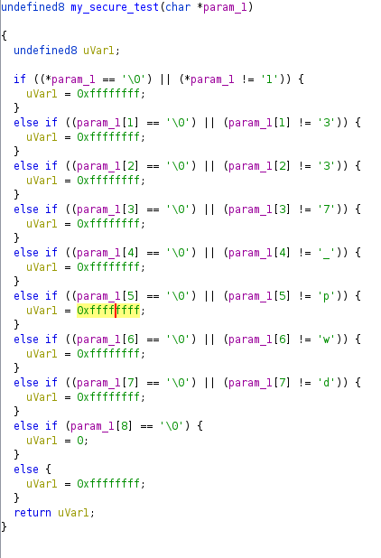
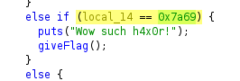
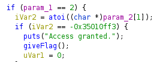

## Index

1. [Task 1 Crackme 1](#crackme1)
2. [Task 2 Crackme 2](#crackme2)
3. [Task 3 Crackme 3](#crackme3)
4. [Task 4 Crackme 4](#crackme4)
5. [Task 5 Crackme 5](#crackme5)
6. [Task 6 Crackme 6](#crackme6)
7. [Task 7 Crackme 7](#crackme7)
8. [Task 7 Crackme 8](#crackme8)

## Crackme 1
After downloading the task file(s), let's check what's in store for us:
```shell-session
$ file index.crackme1      
index.crackme1: ELF 64-bit LSB executable, x86-64, version 1 (SYSV), dynamically linked, interpreter /lib64/ld-linux-x86-64.so.2, for GNU/Linux 2.6.32, BuildID[sha1]=672f525a7ad3c33f190c060c09b11e9ffd007f34, not stripped
```

I played around with the file until I just ran it and got the flag (haha _very risky_)...
```shell-session
$ ./index.crackme1                         
flag{not_that_kind_of_elf}
```

> What is the flag (flag1)??
> 
> Answer: `flag{not_that_kind_of_elf}`

## Crackme 2
The task description says: _Find the super-secret password! and use it to obtain the flag_

The task file is yet another ELF file:
```shell-session
$ file index.crackme2
index.crackme2: ELF 32-bit LSB executable, Intel 80386, version 1 (SYSV), dynamically linked, interpreter /lib/ld-linux.so.2, for GNU/Linux 2.6.32, BuildID[sha1]=b799eb348f3df15f6b08b3c37f8feb269a60aba7, not stripped

$ strings index.crackme2
...
Usage: %s password
super_secret_password
Access denied.
Access granted.
;*2$"(
...
```

Seems like we found the _super_secret_password_

Let's see if it works:
```shell-session
$ ./index.crackme2 super_secret_password
Access granted.
flag{if_i_submit_this_flag_then_i_will_get_points}
```

> What is the super secret password ?
> 
> Answer: `super_secret_password`

> What is the flag (flag2)?
> 
> Answer: `flag{if_i_submit_this_flag_then_i_will_get_points}`

## Crackme 3
```shell-session
$ strings index.crackme3 
...
Usage: %s PASSWORD
malloc failed
ZjByX3kwdXJfNWVjMG5kX2xlNTVvbl91bmJhc2U2NF80bGxfN2gzXzdoMW5nNQ==
Correct password!
Come on, even my aunt Mildred got this one!
ABCDEFGHIJKLMNOPQRSTUVWXYZabcdefghijklmnopqrstuvwxyz0123456789+/
...

### Hmmm, seems like a base64 string
$ echo "ZjByX3kwdXJfNWVjMG5kX2xlNTVvbl91bmJhc2U2NF80bGxfN2gzXzdoMW5nNQ==" | base64 -d                                                          
f0r_y0ur_5ec0nd_le55on_unbase64_4ll_7h3_7h1ng5
```

> What is the flag? (flag3)
> 
> Answer: `f0r_y0ur_5ec0nd_le55on_unbase64_4ll_7h3_7h1ng5`

## Crackme 4
```shell-session
$ strings index.crackme4
...
password OK
password "%s" not OK
Usage : %s password
This time the string is hidden and we used strcmp
...

$ ltrace ./index.crackme4 thmbest
__libc_start_main(0x400716, 2, 0x7ffd2961db78, 0x400760 <unfinished ...>
strcmp("my_m0r3_secur3_pwd", "thmbest")                                                                              = -7
printf("password "%s" not OK\n", "thmbest"password "thmbest" not OK
)                                                                          = 26
+++ exited (status 0) +++
```

> What is the password?
> 
> Answer: `my_m0r3_secur3_pwd`

## Crackme 5
```shell-session
─$ ltrace ./index.crackme5        
__libc_start_main(0x400773, 1, 0x7ffc593536f8, 0x4008d0 <unfinished ...>
puts("Enter your input:"Enter your input:
)                                                                                            = 18
__isoc99_scanf(0x400966, 0x7ffc59353590, 1, 0x7f5eba900190Always dig deeper
)                                                          = 1
strlen("Always")                                                                                                     = 6
strlen("Always")                                                                                                     = 6
strlen("Always")                                                                                                     = 6
strlen("Always")                                                                                                     = 6
strlen("Always")                                                                                                     = 6
strlen("Always")                                                                                                     = 6
strlen("Always")                                                                                                     = 6
strncmp("Always", "OfdlDSA|3tXb32~X3tX@sX`4tXtz", 28)                                                                = -14
puts("Always dig deeper"Always dig deeper
)                                                                                            = 18
+++ exited (status 0) +++

$ ./index.crackme5       
Enter your input:
OfdlDSA|3tXb32~X3tX@sX`4tXtz
Good game
```

> What is the input ?
> 
> Answer: <code>OfdlDSA|3tXb32~X3tX@sX`4tXtz</code>

## Crackme 6
```shell-session
$ strings ./index.crackme6
...
GLIBC_2.2.5
UH-H
UH-H
[]A\A]A^A_
password OK
password "%s" not OK
Usage : %s password
Good luck, read the source
```

Loading the executable into Ghidra, we quickly find a function called: `my_secure_test`:

Analyzing the source code, we can piece together the password quite easily...

> What is the password ?
> 
> Answer: `1337_pwd`

## Crackme 7

Same as before, loading the executable in ghidra shows the following logic in the function:


Following the logic, we can quickly provide the decimal value for _0x7a69_ and get the flag:
```shell-session
$ ./index.crackme7 
Menu:

[1] Say hello
[2] Add numbers
[3] Quit

[>] 31337
Wow such h4x0r!
flag{much_reversing_very_ida_wow}
```

> What is the flag?
> 
> Answer: `flag{much_reversing_very_ida_wow}`

## Crackme 8
Loading the executable in ghidra and analyzing it gives us insight to the following program logic:

It's simple enough to exploit this, simply convert the hex value `iVar2` is compared to in the nested if statement and supply it to the program...
```shell-session
$ ./index.crackme8  -889262067       
Access granted.
flag{at_least_this_cafe_wont_leak_your_credit_card_numbers}
```

> What is the flag?
> 
> Answer: `flag{at_least_this_cafe_wont_leak_your_credit_card_numbers}`

## Conclusion
If this writeup helps, please consider following me on github (https://github.com/NovusEdge) and/or dropping a star on the repository: https://github.com/NovusEdge/thm-writeups

---

- Author: Aliasgar Khimani
- Room: [Reversing Elf](https://tryhackme.com/room/reverselfiles) by [mrpvr](https://tryhackme.com/p/mrpvr)